## Prérequis techniques

| Élément      | Valeur                |
| ------------ | --------------------- |
| Machine      | SRVWIN01              |
| OS           | Windows Server 2022   |
| RAM          | 4 Go                  |
| CPU          | 2                     |
| Stockage     | 50 Go                 |
| Réseau       | LAN en Réseau interne |
| IP           | 192.168.10.5/24       |
| Passerelle   | 192.168.10.254        |
| Compte       | Administrator         |
| Mot de passe | Azerty1*              |

---

## Configuration

### Paramètres à configurer

| Paramètre     | Valeur   |
| ------------- | -------- |
| Domaine AD DS | tssr.lan |
| Nom NetBIOS   | TSSR     |

---

## Étapes d'installation et configuration

### Configuration IP statique

1. Clic droit sur l'icône réseau dans la barre des tâches
2. Cliquer sur **Open Network & Internet settings**
3. Cliquer sur **Change adapter options**
4. Clic droit sur la carte réseau → **Properties**
5. Double-clic sur **Internet Protocol Version 4 (TCP/IPv4)**
6. Sélectionner **Use the following IP address**
7. Configurer :
   - **IP address** : 192.168.10.5
   - **Subnet mask** : 255.255.255.0
   - **Default gateway** : 192.168.10.254
   - **Preferred DNS server** : 127.0.0.1

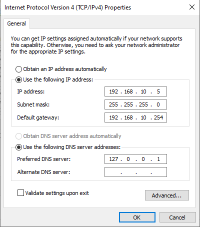

8. Cliquer sur **OK** puis **Close**

---

### Renommer le serveur

1. Clic droit sur **This PC** → **Properties**
2. Cliquer sur **Rename this PC**
3. Entrer : SRVWIN01
4. Cliquer sur **Next** puis **Restart now**

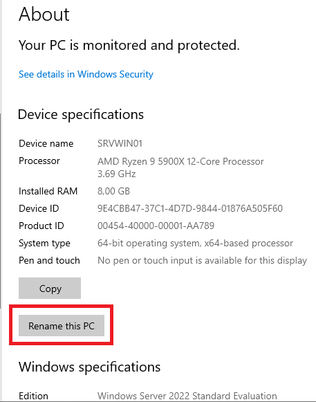

---

### Installation du rôle AD-DS

1. Ouvrir **Server Manager**
2. Cliquer sur **Manage** → **Add Roles and Features**

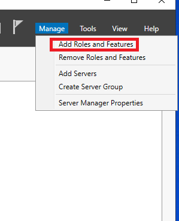

3. Cliquer sur **Next** jusqu'à **Server Roles**
4. Cocher **Active Directory Domain Services**
5. Cliquer sur **Add Features** dans la popup
6. Cliquer sur **Next** jusqu'à la fin
7. Cliquer sur **Install**
8. Attendre la fin de l'installation puis Close

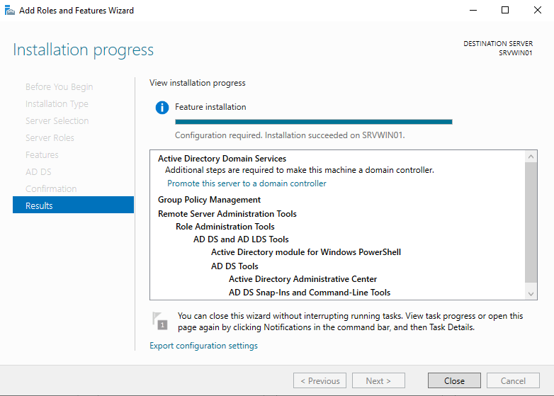

---

### Promotion en contrôleur de domaine

1. Cliquer sur le drapeau jaune en haut du Server Manager
2. Cliquer sur **Promote this server to a domain controller**

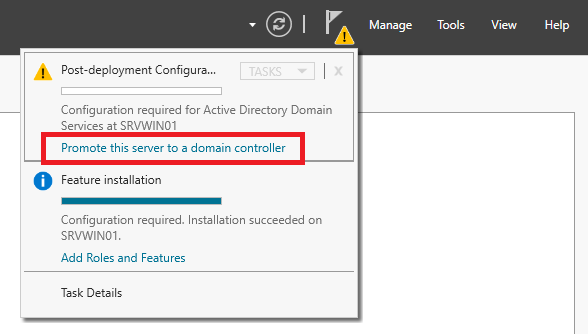

3. Sélectionner **Add a new forest**
4. **Root domain name** : tssr.lan
5. Cliquer sur **Next**

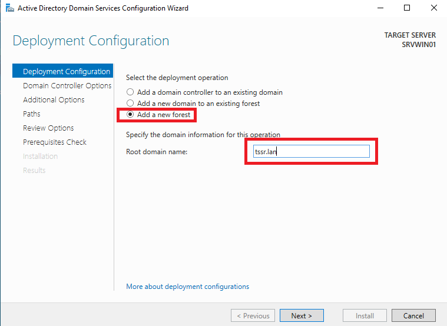

6. **Forest functional level** : **Windows Server 2016**
7. **Domain functional level** : **Windows Server 2016**
8. Cocher **Domain Name System (DNS) server** si pas cocher 
9. **Password** : Azerty1*
10. Cliquer sur **Next**

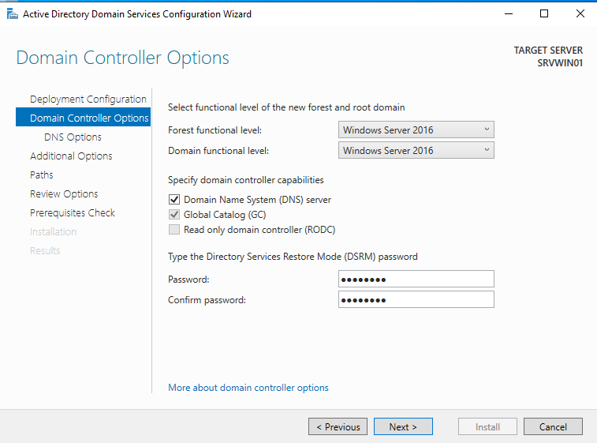

11. Cliquer sur **Next**
12. **NetBIOS domain name** : laisser TSSR
13. Cliquer sur **Next** jusqu'à la fin
14. Cliquer sur **Install**

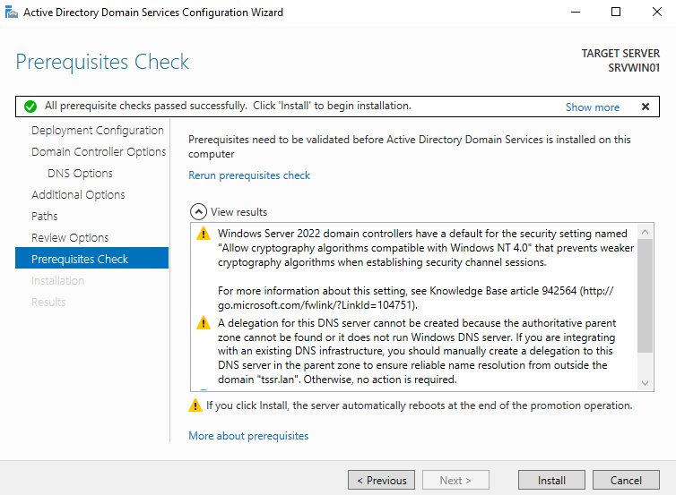

15. Le serveur redémarre automatiquement

---

### Vérifier configuration DNS

**Après le redémarrage, vérifier ou modifier le DNS du serveur :**

1. Clic droit sur l'icône réseau dans la barre des tâches
2. **Open Network & Internet settings**
3. **Change adapter options**
4. Clic droit sur la carte réseau → **Properties**
5. Double-clic sur **Internet Protocol Version 4 (TCP/IPv4)**
6. Modifier **Preferred DNS server** : 127.0.0.1
7. Cliquer sur **OK**

---

### Création des OU

**OU à créer :** 10 OU correspondant aux départements

| OU                                 |
| ---------------------------------- |
| Communication                      |
| Direction_Financiere               |
| Direction_Generale                 |
| Direction_Marketing                |
| DSI                                |
| RD                                 |
| RH                                 |
| Services_Generaux                  |
| Service_Juridique                  |
| Ventes_et_Developpement_Commercial |

1. Ouvrir **Server Manager**
2. Cliquer sur **Tools** → **Active Directory Users and Computers**

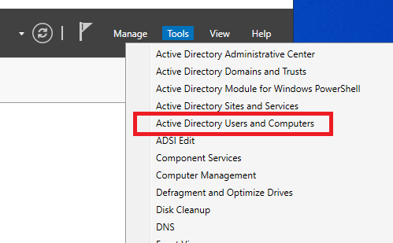

3. Clic droit sur **tssr.lan**
4. Cliquer sur **New** → **Organizational Unit**

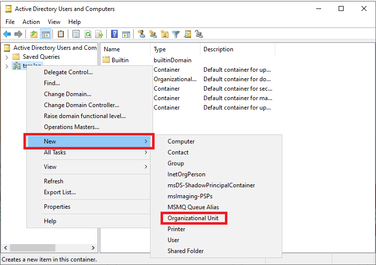

5. **Name** : Communication
6. Cliquer sur **OK**

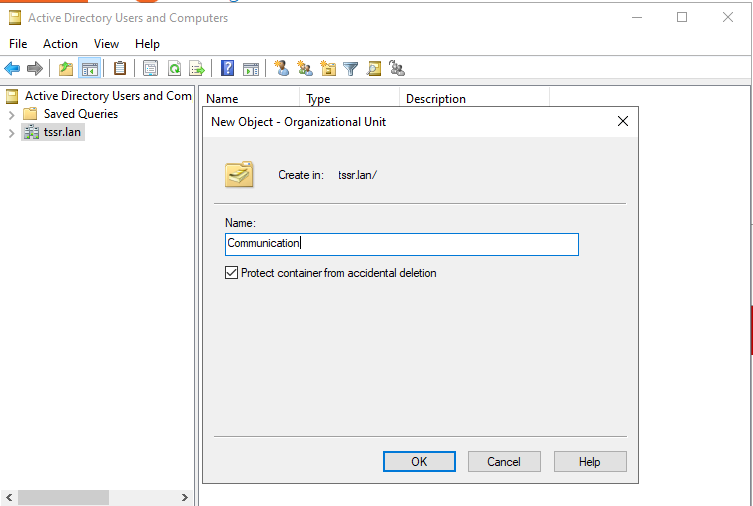

7.  Faire les étapes  pour chaque OU :
   - Direction_Financiere
   - Direction_Generale
   - Direction_Marketing
   - DSI
   - RD
   - RH
   - Services_Generaux
   - Service_Juridique
   - Ventes_et_Developpement_Commercial

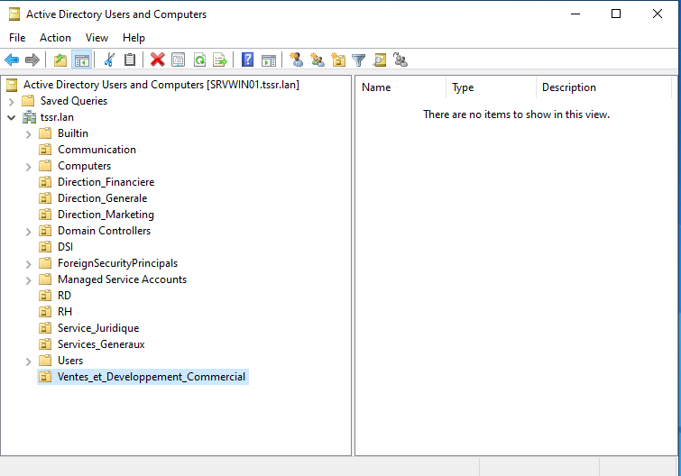

---

## Création des groupes (AGDLP)

**Groupes à créer :** Pour chaque département, il faut créer :
- 1 groupe Global → Grp_NomDepartement
- 1 groupe Domain Local → DL_NomDepartement

| Groupe Global                          | Groupe Domain Local                   |
| -------------------------------------- | ------------------------------------- |
| Grp_Communication                      | DL_Communication                      |
| Grp_Direction_Financiere               | DL_Direction_Financiere               |
| Grp_Direction_Generale                 | DL_Direction_Generale                 |
| Grp_Direction_Marketing                | DL_Direction_Marketing                |
| Grp_DSI                                | DL_DSI                                |
| Grp_RD                                 | DL_RD                                 |
| Grp_RH                                 | DL_RH                                 |
| Grp_Services_Generaux                  | DL_Services_Generaux                  |
| Grp_Service_Juridique                  | DL_Service_Juridique                  |
| Grp_Ventes_et_Developpement_Commercial | DL_Ventes_et_Developpement_Commercial |

Dans Active Directory Users and Computers

1. Clic droit sur l'OU Communication
2. Cliquer sur **New** → **Group**

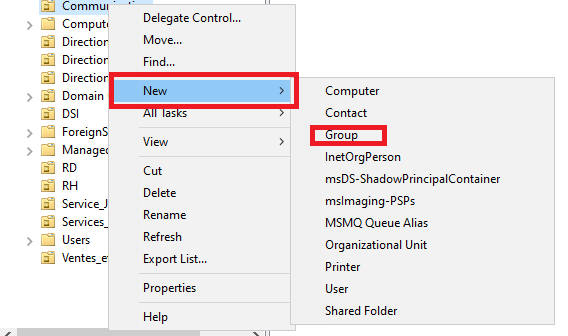

- **Group name** : Grp_Communication
- **Group scope** : Global
- **Group type** : Security
- Cliquer sur **OK**

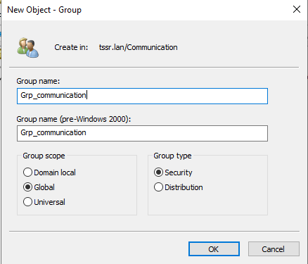

3. Clic droit sur l'OU Communication
4. Cliquer sur **New** → **Group**

- **Group name** : DL_Communication
- **Group scope** : Domain local
- **Group type** : Security

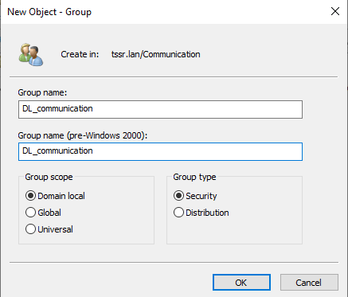

5. Cliquer sur **OK**
6. Le faire  pour tous les départements

---

## Configuration AGDLP

1. Double-clic sur le groupe DL_Communication
2. Aller dans l'onglet **Members**

3. Cliquer sur **Add**
4. Entrer : Grp_Communication
5. Cliquer sur **OK**

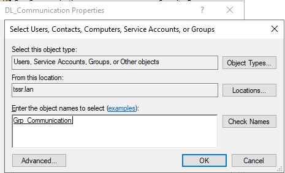

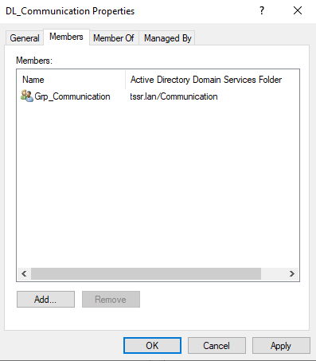

6. Répéter pour tous les groupes DL (ajouter le groupe Grp_ correspondant)

---

## Création des utilisateurs

**Utilisateurs à créer :** 6

| Utilisateur     | Prénom | Nom       | Département        | Fonction               | Groupe                 |
| --------------- | ------ | --------- | ------------------ | ---------------------- | ---------------------- |
| petra.rossi     | Petra  | Rossi     | DSI                | DSI (Manager)          | Grp_DSI                |
| josef.karam     | Josef  | Karam     | Direction_Generale | Directeur adjoint      | Grp_Direction_Generale |
| rami.sato       | Rami   | Sato      | DSI                | Développeur            | Grp_DSI                |
| rayan.schneider | Rayan  | Schneider | DSI                | Développeur            | Grp_DSI                |
| kian.kowalski   | Kian   | Kowalski  | Direction_Generale | Secrétaire             | Grp_Direction_Generale |
| kira.kumar      | Kira   | Kumar     | Direction_Generale | Assistant de direction | Grp_Direction_Generale |

Dans Active Directory Users and Computers

1. Clic droit sur l'OU DSI
2. Cliquer sur **New** → **User**

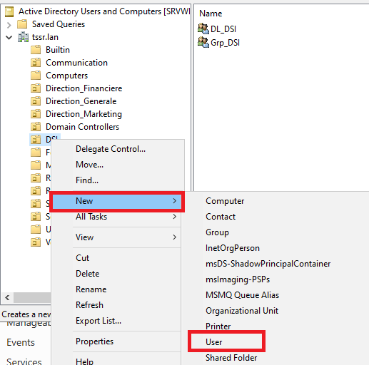

3. Configurer :
   - **First name** : Petra
   - **Last name** : ROSSI
   - **User logon name** : petra.rossi
4. Cliquer sur **Next**

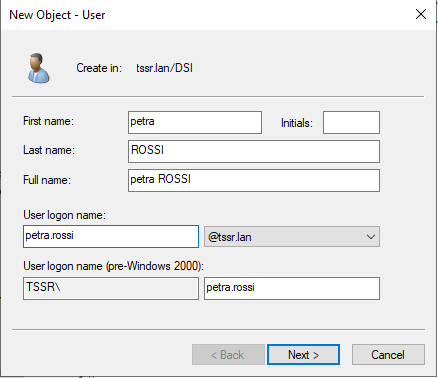

5. Configurer :
   - **Password** : Azerty1*
   - Décocher **User must change password at next logon**
   - Cocher **Password never expires**
6. Cliquer sur **Next** puis **Finish**

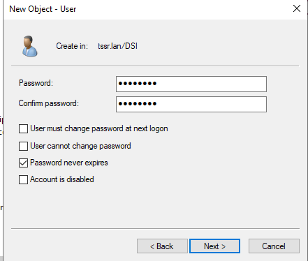

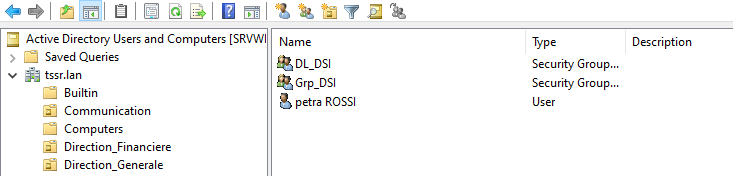

7. Double-clic sur l'utilisateur petra.rossi
8. Aller dans l'onglet **Member Of**
9. Cliquer sur **Add**
10. Entrer : Grp_DSI
11. Cliquer sur **OK**

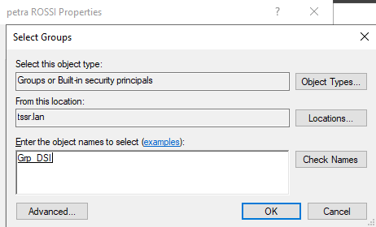

12. Le faire  pour tous les utilisateurs

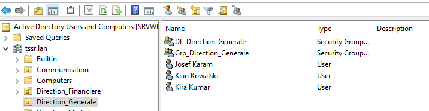

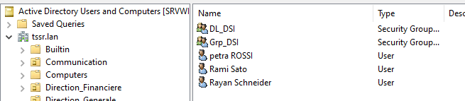

---

## Définir les managers (hiérarchie)

Pour les utilisateurs standard, définir leur manager :

1. Double-clic sur l'utilisateur rami.sato
2. Aller dans l'onglet **Organization**
3. Dans le champ **Manager**, cliquer sur **Change**
4. Entrer : petra.rossi
5. Cliquer sur **OK**

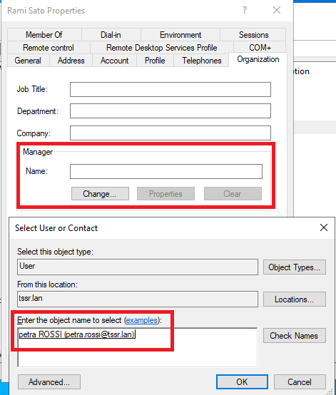

6. Vérification

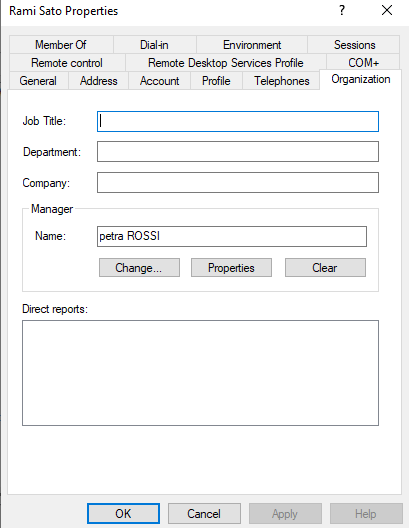

Répéter pour :
- rayan.schneider → Manager : petra.rossi
- kian.kowalski → Manager : josef.karam
- kira.kumar → Manager : josef.karam

---