## Prérequis techniques

| Élément      | Valeur                |
| ------------ | --------------------- |
| Machine      | SRVWIN01              |
| OS           | Windows Server 2022   |
| RAM          | 4 Go                  |
| CPU          | 2                     |
| Stockage     | 50 Go                 |
| Réseau       | LAN en Réseau interne |
| IP           | 192.168.10.5/24       |
| Passerelle   | 192.168.10.254        |
| Compte       | Administrator         |
| Mot de passe | Azerty1*              |

---

## Configuration

### Paramètres à configurer

| Paramètre     | Valeur   |
| ------------- | -------- |
| Domaine AD DS | tssr.lan |
| Nom NetBIOS   | TSSR     |

---

## Étapes d'installation et configuration

### Configuration IP statique

1. Clic droit sur l'icône réseau dans la barre des tâches
2. Cliquer sur **Open Network & Internet settings**
3. Cliquer sur **Change adapter options**
4. Clic droit sur la carte réseau → **Properties**
5. Double-clic sur **Internet Protocol Version 4 (TCP/IPv4)**
6. Sélectionner **Use the following IP address**
7. Configurer :
   - **IP address** : 192.168.10.5
   - **Subnet mask** : 255.255.255.0
   - **Default gateway** : 192.168.10.254
   - **Preferred DNS server** : 127.0.0.1

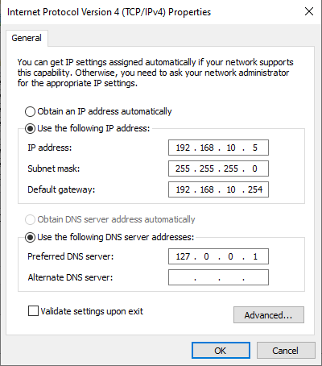

8. Cliquer sur **OK** puis **Close**

---

### Renommer le serveur

1. Clic droit sur **This PC** → **Properties**
2. Cliquer sur **Rename this PC**
3. Entrer : SRVWIN01
4. Cliquer sur **Next** puis **Restart now**

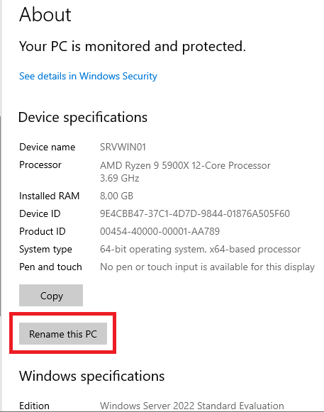

---

### Installation du rôle AD-DS

1. Ouvrir **Server Manager**
2. Cliquer sur **Manage** → **Add Roles and Features**

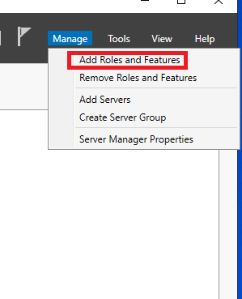

3. Cliquer sur **Next** jusqu'à **Server Roles**
4. Cocher **Active Directory Domain Services**
5. Cliquer sur **Add Features** dans la popup
6. Cliquer sur **Next** jusqu'à la fin
7. Cliquer sur **Install**
8. Attendre la fin de l'installation puis Close

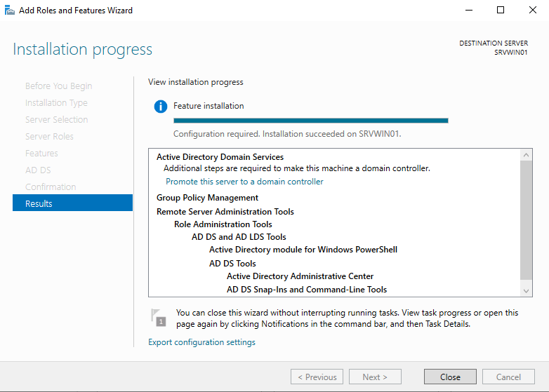

---

### Promotion en contrôleur de domaine

1. Cliquer sur le drapeau jaune en haut du Server Manager
2. Cliquer sur **Promote this server to a domain controller**

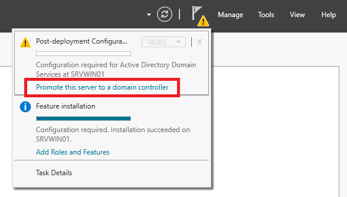

3. Sélectionner **Add a new forest**
4. **Root domain name** : tssr.lan
5. Cliquer sur **Next**

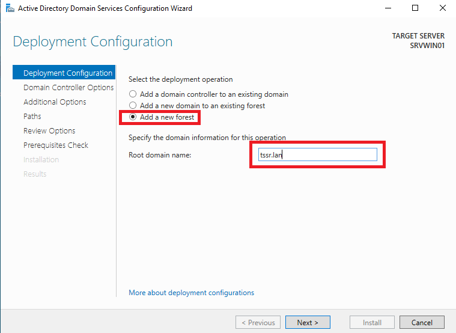

6. **Forest functional level** : **Windows Server 2016**
7. **Domain functional level** : **Windows Server 2016**
8. Cocher **Domain Name System (DNS) server** si pas coché
9. **Password** : Azerty1*
10. Cliquer sur **Next**

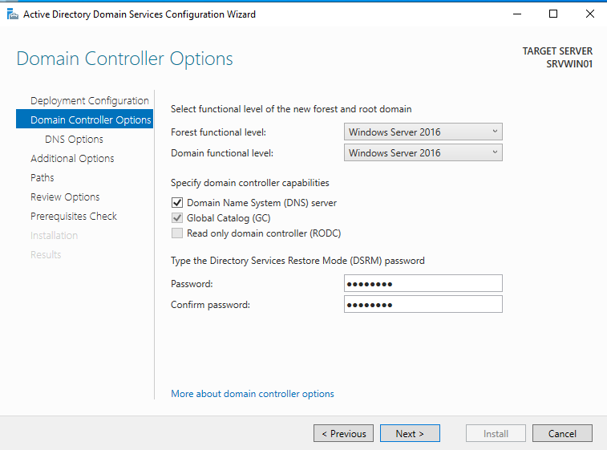

11. Cliquer sur **Next**
12. **NetBIOS domain name** : laisser TSSR
13. Cliquer sur **Next** jusqu'à la fin
14. Cliquer sur **Install**

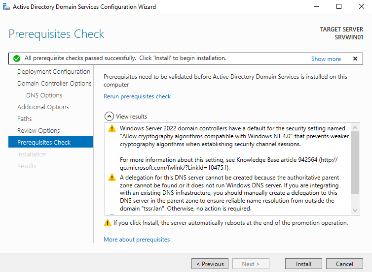

15. Le serveur redémarre automatiquement

---

### Vérifier configuration DNS

**Après le redémarrage, vérifier ou modifier le DNS du serveur :**

1. Clic droit sur l'icône réseau dans la barre des tâches
2. **Open Network & Internet settings**
3. **Change adapter options**
4. Clic droit sur la carte réseau → **Properties**
5. Double-clic sur **Internet Protocol Version 4 (TCP/IPv4)**
6. Modifier **Preferred DNS server** : 127.0.0.1
7. Cliquer sur **OK**

---

### Création des OU

**OU à créer :** 10 OU correspondant aux départements

| OU                                 |
| ---------------------------------- |
| Communication                      |
| Direction_Financiere               |
| Direction_Generale                 |
| Direction_Marketing                |
| DSI                                |
| RD                                 |
| RH                                 |
| Services_Generaux                  |
| Service_Juridique                  |
| Ventes_et_Developpement_Commercial |

1. Ouvrir **Server Manager**
2. Cliquer sur **Tools** → **Active Directory Users and Computers**

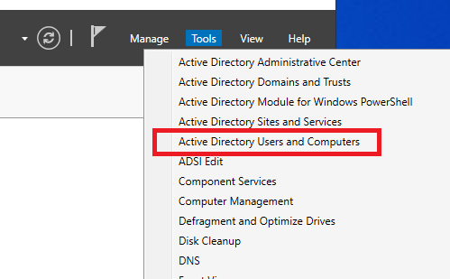

3. Clic droit sur **tssr.lan**
4. Cliquer sur **New** → **Organizational Unit**

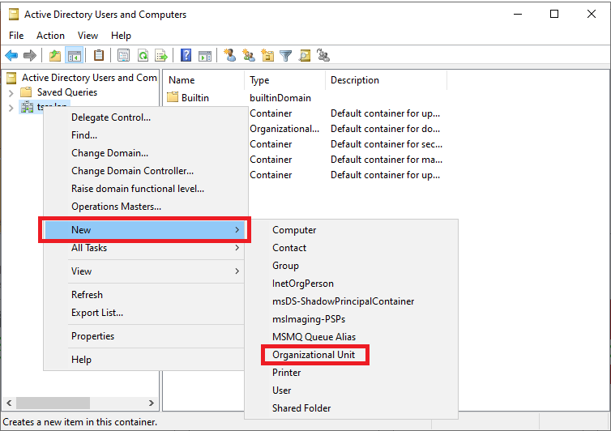

5. **Name** : Communication
6. Cliquer sur **OK**

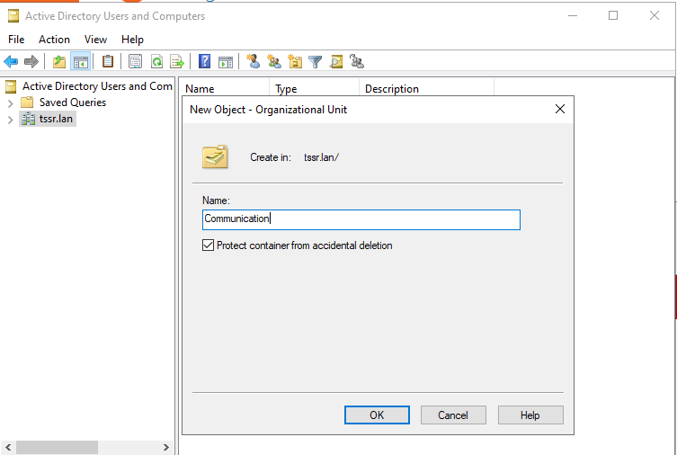

7. Faire les étapes pour chaque OU :
   - Direction_Financiere
   - Direction_Generale
   - Direction_Marketing
   - DSI
   - RD
   - RH
   - Services_Generaux
   - Service_Juridique
   - Ventes_et_Developpement_Commercial

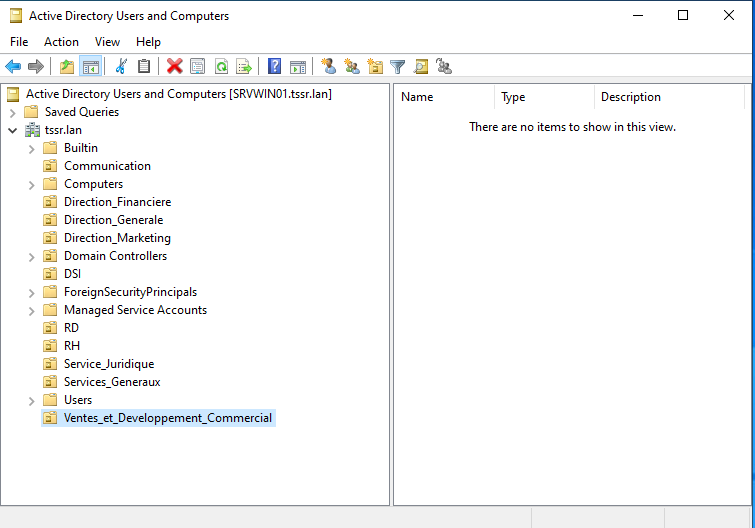

---

## Création des groupes (AGDLP)

**Groupes à créer :** Pour chaque département, il faut créer :
- 1 groupe Global → Grp_NomDepartement
- 1 groupe Domain Local → DL_NomDepartement

| Groupe Global                          | Groupe Domain Local                   |
| -------------------------------------- | ------------------------------------- |
| Grp_Communication                      | DL_Communication                      |
| Grp_Direction_Financiere               | DL_Direction_Financiere               |
| Grp_Direction_Generale                 | DL_Direction_Generale                 |
| Grp_Direction_Marketing                | DL_Direction_Marketing                |
| Grp_DSI                                | DL_DSI                                |
| Grp_RD                                 | DL_RD                                 |
| Grp_RH                                 | DL_RH                                 |
| Grp_Services_Generaux                  | DL_Services_Generaux                  |
| Grp_Service_Juridique                  | DL_Service_Juridique                  |
| Grp_Ventes_et_Developpement_Commercial | DL_Ventes_et_Developpement_Commercial |

Dans Active Directory Users and Computers

1. Clic droit sur l'OU Communication
2. Cliquer sur **New** → **Group**

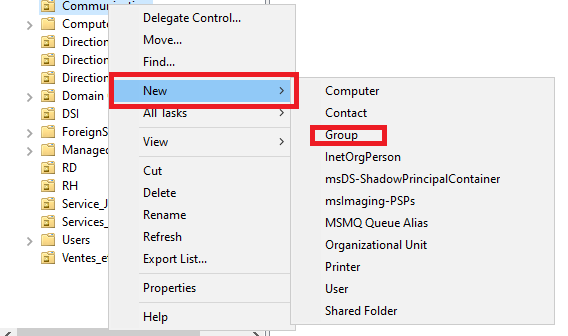

- **Group name** : Grp_Communication
- **Group scope** : Global
- **Group type** : Security
- Cliquer sur **OK**

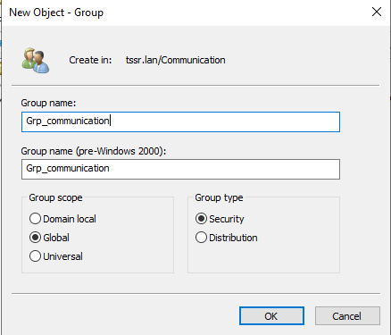

3. Clic droit sur l'OU Communication
4. Cliquer sur **New** → **Group**

- **Group name** : DL_Communication
- **Group scope** : Domain local
- **Group type** : Security

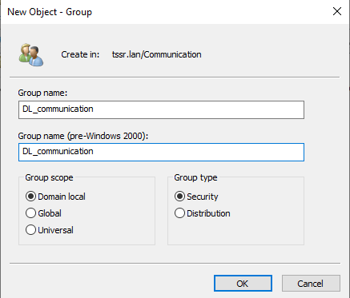

5. Cliquer sur **OK**
6. Le faire pour tous les départements

---

## Configuration AGDLP

1. Double-clic sur le groupe DL_Communication
2. Aller dans l'onglet **Members**

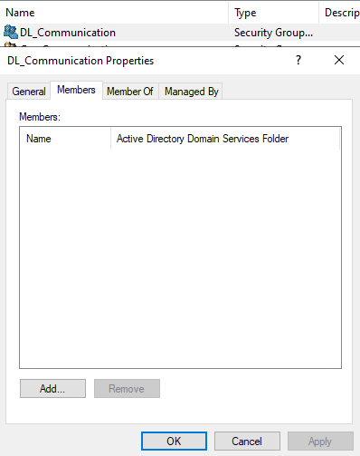

3. Cliquer sur **Add**
4. Entrer : Grp_Communication
5. Cliquer sur **OK**

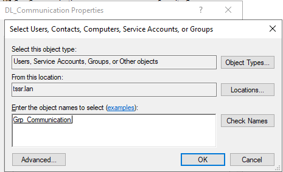

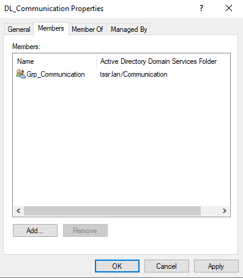

6. Répéter pour tous les groupes DL (ajouter le groupe Grp_ correspondant)

**Résumé de la chaîne AGDLP :**

| Utilisateur     | Membre de (Global)     | Imbriqué dans (Domain Local) | Ciblé par GPO via DL |
| --------------- | ---------------------- | ---------------------------- | -------------------- |
| petra.rossi     | Grp_DSI                | DL_DSI                       | Oui                  |
| josef.karam     | Grp_Direction_Generale | DL_Direction_Generale        | Oui                  |
| rami.sato       | Grp_DSI                | DL_DSI                       | Oui                  |
| rayan.schneider | Grp_DSI                | DL_DSI                       | Oui                  |
| kian.kowalski   | Grp_Direction_Generale | DL_Direction_Generale        | Oui                  |
| kira.kumar      | Grp_Direction_Generale | DL_Direction_Generale        | Oui                  |
| abel.abe        | Grp_Communication      | DL_Communication             | Oui                  |

---

## Création des utilisateurs

**Utilisateurs à créer :** 7

| Utilisateur     | Prénom | Nom       | Département        | Fonction               | Groupe                 |
| --------------- | ------ | --------- | ------------------ | ---------------------- | ---------------------- |
| petra.rossi     | Petra  | Rossi     | DSI                | DSI (Manager)          | Grp_DSI                |
| josef.karam     | Josef  | Karam     | Direction_Generale | Directeur adjoint      | Grp_Direction_Generale |
| rami.sato       | Rami   | Sato      | DSI                | Développeur            | Grp_DSI                |
| rayan.schneider | Rayan  | Schneider | DSI                | Développeur            | Grp_DSI                |
| kian.kowalski   | Kian   | Kowalski  | Direction_Generale | Secrétaire             | Grp_Direction_Generale |
| kira.kumar      | Kira   | Kumar     | Direction_Generale | Assistant de direction | Grp_Direction_Generale |
| abel.abe        | Abel   | Abe       | Communication      | Employé                | Grp_Communication      |

Dans Active Directory Users and Computers

1. Clic droit sur l'OU DSI
2. Cliquer sur **New** → **User**

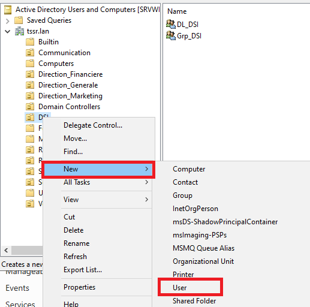

3. Configurer :
   - **First name** : Petra
   - **Last name** : ROSSI
   - **User logon name** : petra.rossi
4. Cliquer sur **Next**

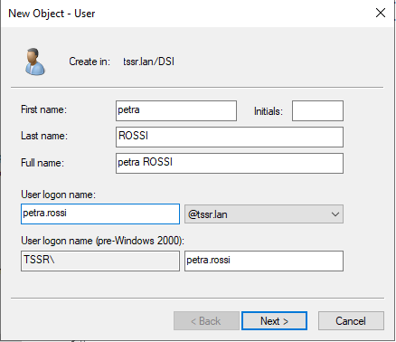

5. Configurer :
   - **Password** : Azerty1*
   - Décocher **User must change password at next logon**
   - Cocher **Password never expires**
6. Cliquer sur **Next** puis **Finish**

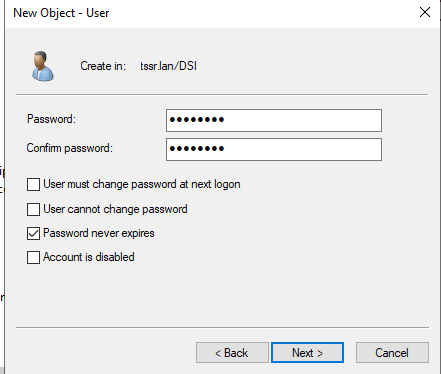

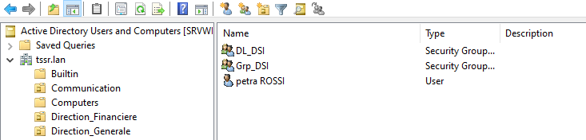

7. Double-clic sur l'utilisateur petra.rossi
8. Aller dans l'onglet **Member Of**
9. Cliquer sur **Add**
10. Entrer : Grp_DSI
11. Cliquer sur **OK**

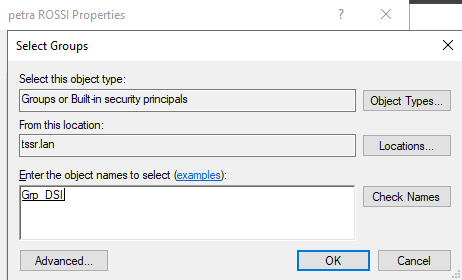

12. Le faire pour tous les utilisateurs

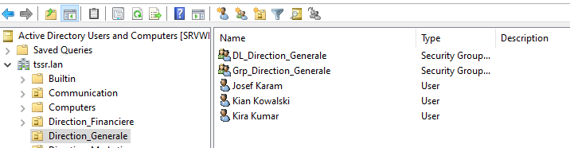

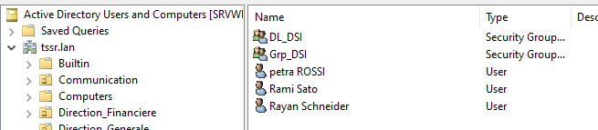

---

## Définir les managers (hiérarchie)

Pour les utilisateurs standard, définir leur manager :

1. Double-clic sur l'utilisateur rami.sato
2. Aller dans l'onglet **Organization**
3. Dans le champ **Manager**, cliquer sur **Change**
4. Entrer : petra.rossi
5. Cliquer sur **OK**

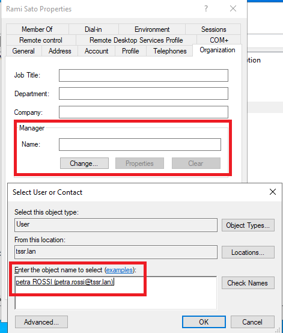

6. Vérification

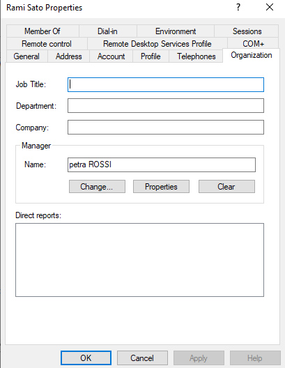

Répéter pour :
- rayan.schneider → Manager : petra.rossi
- kian.kowalski → Manager : josef.karam
- kira.kumar → Manager : josef.karam

---

## Création des GPO

### Bonnes pratiques GPO

**Règles obligatoires :**

1. **Ne JAMAIS modifier les GPO par défaut** (Default Domain Policy, Default Domain Controllers Policy)
2. Ne pas utiliser le blocage d'héritage
3. Ne pas utiliser le forçage d'application
4. Placer les GPO au plus haut (racine) et utiliser les filtres
5. Supprimer les GPO au lieu de les désactiver
6. Créer des petites GPO ciblées

Nomenclature

| Préfixe | Usage |
|---------|-------|
| USER- | GPO appliquée aux utilisateurs |
| COMPUTER- | GPO appliquée aux ordinateurs |

**Format :** TYPE-Thématique-Action

**Liste des GPO du projet :**

| N°  | Nom GPO                     | Type     | Fonction                         |
| --- | --------------------------- | -------- | -------------------------------- |
| 1   | COMPUTER-SEC-PasswordPolicy | Computer | Politique de mot de passe        |
| 2   | COMPUTER-SEC-AccountLockout | Computer | Verrouillage de compte           |
| 3   | USER-ControlPanel-Deny      | User     | Blocage panneau de configuration |
| 4   | COMPUTER-SEC-LocalAdmin     | Computer | Admin local domaine              |
| 5   | COMPUTER-SEC-PowerShell     | Computer | Sécurité PowerShell              |
| 6   | USER-CMD-Deny               | User     | Désactiver invite de commandes   |
| 7   | USER-ScreenLock-Enable      | User     | Verrouillage automatique écran   |

**Procédure standard pour chaque GPO :**

1. **Créer** la GPO dans le conteneur "Group Policy Objects"
2. **Configurer** les paramètres de la GPO
3. **Configurer le Security Filtering** :
   - Retirer "Authenticated Users" du Security Filtering
   - Ajouter le(s) groupe(s) cible(s)
   - Ajouter "Domain Computers" avec permission Read dans Delegation
4. **Lier** la GPO aux OU avec "Link an Existing GPO"

---

### GPO 1 : Politique de mot de passe (COMPUTER-SEC-PasswordPolicy)

| Paramètre | Valeur |
|-----------|--------|
| Longueur minimale | 8 caractères |
| Complexité | Activée |
| Durée de vie maximale | 90 jours |
| Historique | 5 mots de passe |

#### Étape 1 : Créer la GPO

1. Ouvrir **Server Manager**
2. Cliquer sur **Tools** → **Group Policy Management**

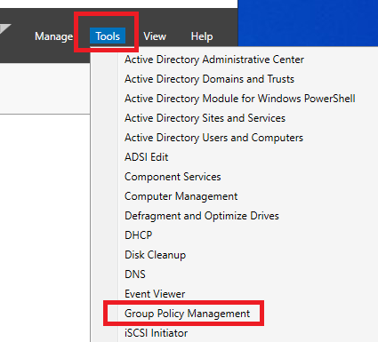

3. Développer **Forest** → **Domains** → **tssr.lan**
4. Clic droit sur **Group Policy Objects**
5. Cliquer sur **New**
   - **Name** : COMPUTER-SEC-PasswordPolicy
   - Cliquer sur **OK**

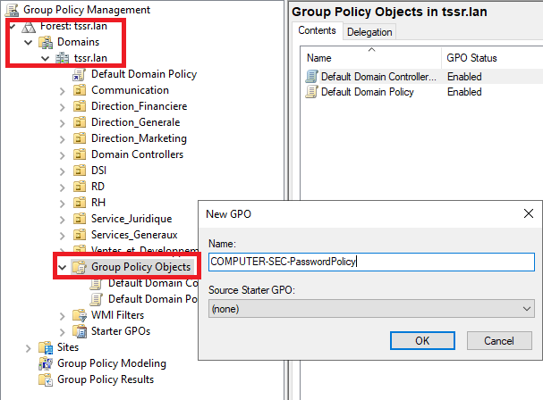

#### Étape 2 : Configurer la GPO

1. Clic droit sur **COMPUTER-SEC-PasswordPolicy**
2. Cliquer sur **Edit**

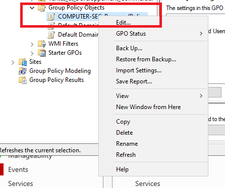

3. Aller dans **Computer Configuration** → **Policies** → **Windows Settings** → **Security Settings** → **Account Policies** → **Password Policy**

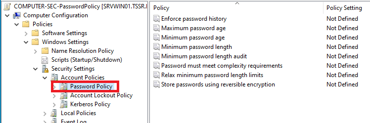

4. Double-clic sur **Minimum password length**
   - Cocher **Define this policy setting**
   - Entrer : 8
   - Cliquer sur **OK**

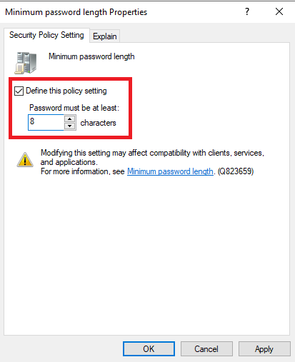

5. Double-clic sur **Password must meet complexity requirements**
   - Sélectionner **Enabled**
   - Cliquer sur **OK**

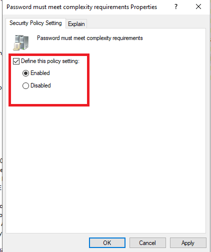

6. Double-clic sur **Maximum password age**
   - Entrer : 90
   - Cliquer sur **OK**

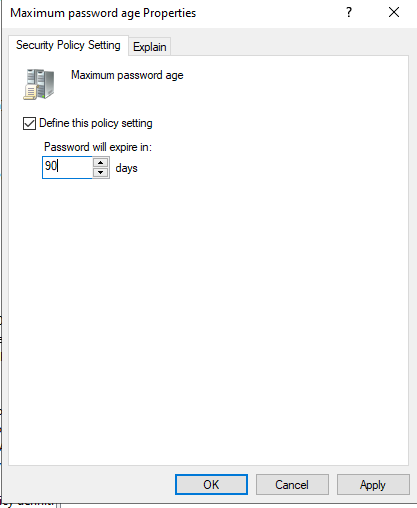

7. Double-clic sur **Enforce password history**
   - Entrer : 5
   - Cliquer sur **OK**

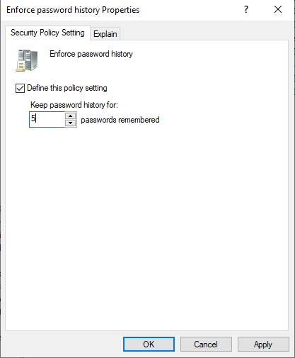

8. Fermer l'éditeur de GPO

#### Étape 3 : Configurer le Security Filtering

1. Cliquer sur **COMPUTER-SEC-PasswordPolicy**
2. Dans **Security Filtering**, sélectionner **Authenticated Users** → **Remove**

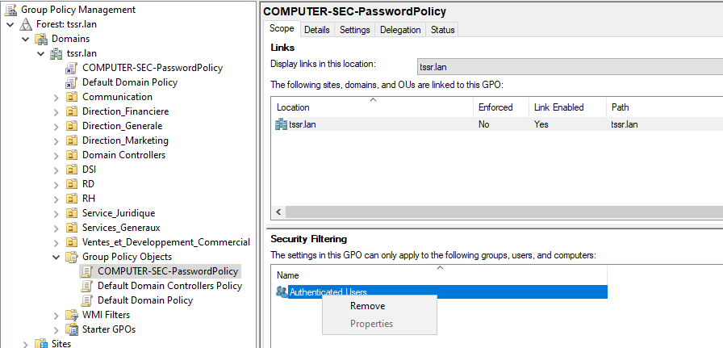

3. Cliquer sur **Add** → Entrer : **Domain Computers** → **OK**

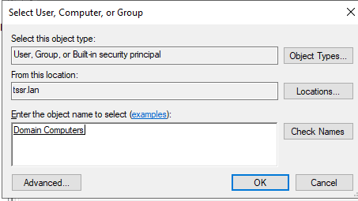

4. Aller dans l'onglet **Delegation**
5. Vérifier que **Domain Computers** a les permissions **Read** et **Apply Group Policy**

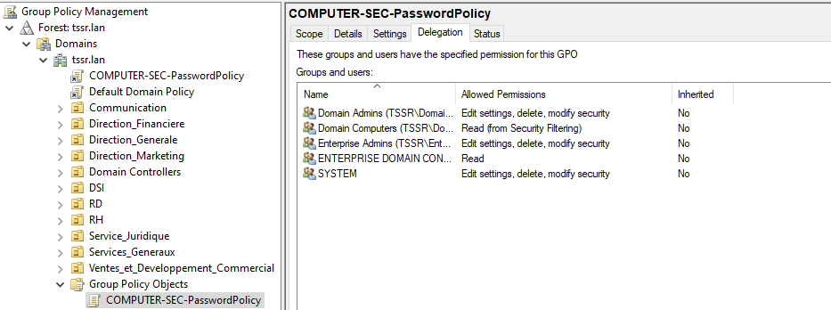

#### Étape 4 : Lier la GPO

1. Clic droit sur **tssr.lan** (racine du domaine)
2. Cliquer sur **Link an Existing GPO**

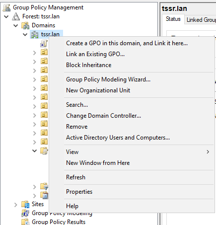

3. Sélectionner **COMPUTER-SEC-PasswordPolicy**
4. Cliquer sur **OK**

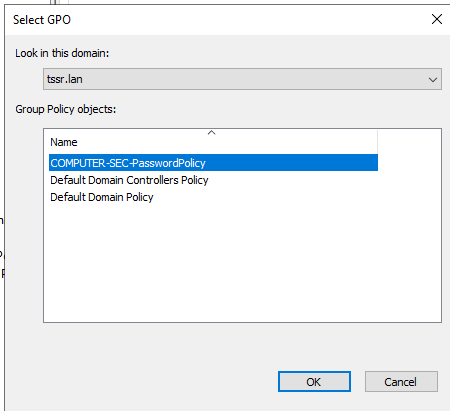

**Note :** Les politiques de mot de passe doivent être liées à la racine du domaine pour s'appliquer.

---

### GPO 2 : Verrouillage de compte (COMPUTER-SEC-AccountLockout)

| Paramètre | Valeur |
|-----------|--------|
| Seuil de verrouillage | 5 tentatives |
| Durée de verrouillage | 10 minutes |
| Réinitialisation compteur | 10 minutes |

#### Étape 1 : Créer la GPO

1. Dans Group Policy Management
2. Clic droit sur **Group Policy Objects**
3. Cliquer sur **New**
   - **Name** : COMPUTER-SEC-AccountLockout
   - Cliquer sur **OK**

#### Étape 2 : Configurer la GPO

1. Clic droit sur **COMPUTER-SEC-AccountLockout** → **Edit**
2. Aller dans **Computer Configuration** → **Policies** → **Windows Settings** → **Security Settings** → **Account Policies** → **Account Lockout Policy**

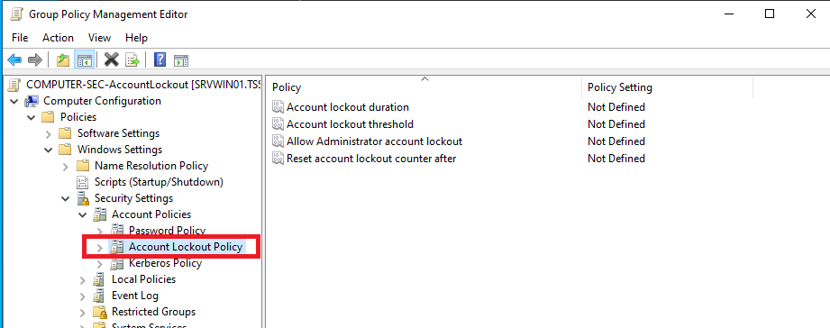

3. Double-clic sur **Account lockout threshold**
   - Entrer : 5
   - Cliquer sur **OK**

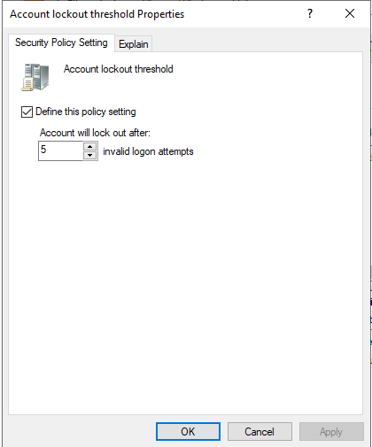

4. Les autres paramètres se configurent automatiquement (10 minutes)
5. Fermer l'éditeur de GPO

#### Étape 3 : Configurer le Security Filtering

1. Cliquer sur **COMPUTER-SEC-AccountLockout**
2. Dans **Security Filtering**, sélectionner **Authenticated Users** → **Remove**
3. Cliquer sur **Add** → Entrer : **Domain Computers** → **OK**
4. Aller dans l'onglet **Delegation**
5. Vérifier que **Domain Computers** a les permissions **Read** et **Apply Group Policy**

#### Étape 4 : Lier la GPO

1. Clic droit sur **tssr.lan** (racine du domaine)
2. Cliquer sur **Link an Existing GPO**
3. Sélectionner **COMPUTER-SEC-AccountLockout**
4. Cliquer sur **OK**

**Note :** Les politiques de verrouillage de compte doivent être liées à la racine du domaine pour s'appliquer.

---

### GPO 3 : Blocage panneau de configuration (USER-ControlPanel-Deny)

#### Étape 1 : Créer la GPO

1. Dans Group Policy Management
2. Développer **Forest** → **Domains** → **tssr.lan**
3. Clic droit sur **Group Policy Objects**
4. Cliquer sur **New**
   - **Name** : USER-ControlPanel-Deny
   - Cliquer sur **OK**

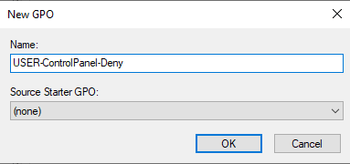

#### Étape 2 : Configurer la GPO

1. Clic droit sur **USER-ControlPanel-Deny**
2. Cliquer sur **Edit**
3. Aller dans **User Configuration** → **Policies** → **Administrative Templates** → **Control Panel**
4. Double-clic sur **Prohibit access to Control Panel and PC settings**
   - Sélectionner **Enabled**
   - Cliquer sur **OK**

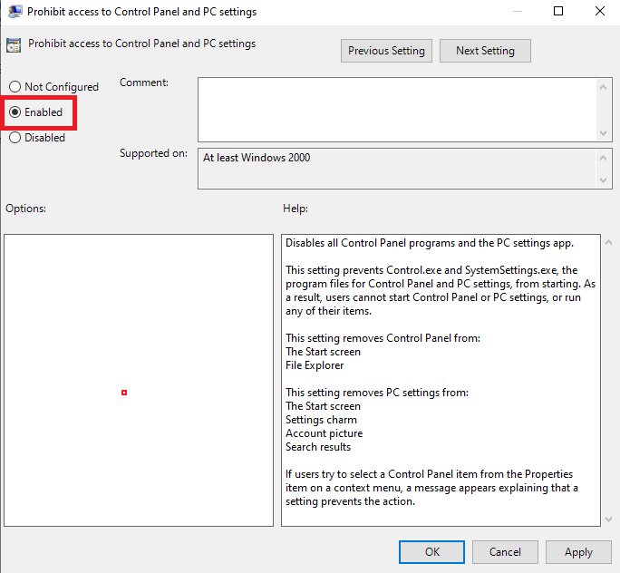

5. Fermer l'éditeur de GPO

#### Étape 3 : Configurer le Security Filtering

1. Dans Group Policy Management, cliquer sur **USER-ControlPanel-Deny**
2. Dans le volet de droite, onglet **Scope**
3. Dans **Security Filtering**, sélectionner **Authenticated Users**
4. Cliquer sur **Remove** → **OK**
5. Cliquer sur **Add** et ajouter les 8 groupes suivants (un par un) :
   - Grp_Communication
   - Grp_Direction_Financiere
   - Grp_Direction_Marketing
   - Grp_RD
   - Grp_RH
   - Grp_Services_Generaux
   - Grp_Service_Juridique
   - Grp_Ventes_et_Developpement_Commercial

**Note :** Ne PAS ajouter Grp_DSI et Grp_Direction_Generale (exemptés du blocage)

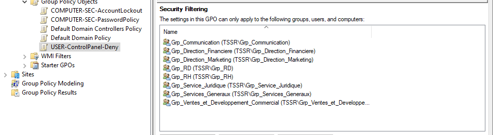

6. Aller dans l'onglet **Delegation**
7. Cliquer sur **Add**
8. Entrer : **Domain Computers**
9. Sélectionner **Read** dans les permissions
10. Cliquer sur **OK**

#### Étape 4 : Lier la GPO aux OU

1. Clic droit sur l'OU **Communication**
2. Cliquer sur **Link an Existing GPO**
3. Sélectionner **USER-ControlPanel-Deny**
4. Cliquer sur **OK**

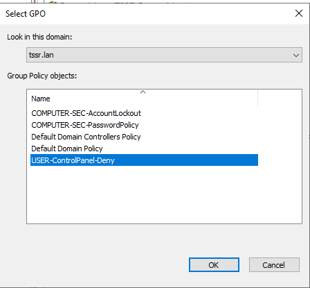

5. Répéter pour les OU suivantes (sauf DSI et Direction_Generale) :
   - Direction_Financiere
   - Direction_Marketing
   - RD
   - RH
   - Services_Generaux
   - Service_Juridique
   - Ventes_et_Developpement_Commercial

---

### GPO 4 : Admin local domaine (COMPUTER-SEC-LocalAdmin)

#### Étape 1 : Créer la GPO

1. Dans Group Policy Management
2. Clic droit sur **Group Policy Objects**
3. Cliquer sur **New**
   - **Name** : COMPUTER-SEC-LocalAdmin
   - Cliquer sur **OK**

#### Étape 2 : Configurer la GPO

1. Clic droit sur **COMPUTER-SEC-LocalAdmin** → **Edit**
2. Aller dans **Computer Configuration** → **Policies** → **Windows Settings** → **Security Settings** → **Restricted Groups**
3. Clic droit → **Add Group**
   - Entrer : Administrators
   - Cliquer sur **OK**
4. Dans **Members of this group**, cliquer sur **Add**
   - Entrer : TSSR\Domain Admins
   - Cliquer sur **OK**

#### Étape 3 : Configurer le Security Filtering

1. Cliquer sur **COMPUTER-SEC-LocalAdmin**
2. Dans **Security Filtering**, sélectionner **Authenticated Users** → **Remove**
3. Cliquer sur **Add** → Entrer : **Domain Computers** → **OK**
4. Aller dans l'onglet **Delegation**
5. Vérifier que **Domain Computers** a les permissions **Read** et **Apply Group Policy**

#### Étape 4 : Lier la GPO

1. Clic droit sur **tssr.lan**
2. Cliquer sur **Link an Existing GPO**
3. Sélectionner **COMPUTER-SEC-LocalAdmin**
4. Cliquer sur **OK**

---

### GPO 5 : Sécurité PowerShell (COMPUTER-SEC-PowerShell)

| Paramètre | Valeur |
|-----------|--------|
| Stratégie d'exécution | RemoteSigned |
| Journalisation | Activée |

#### Étape 1 : Créer la GPO

1. Dans Group Policy Management
2. Clic droit sur **Group Policy Objects**
3. Cliquer sur **New**
   - **Name** : COMPUTER-SEC-PowerShell
   - Cliquer sur **OK**

#### Étape 2 : Configurer la GPO

1. Clic droit sur **COMPUTER-SEC-PowerShell** → **Edit**
2. Aller dans **Computer Configuration** → **Policies** → **Administrative Templates** → **Windows Components** → **Windows PowerShell**
3. Double-clic sur **Turn on Script Execution**
   - Sélectionner **Enabled**
   - **Execution Policy** : Allow only signed scripts
   - Cliquer sur **OK**
4. Double-clic sur **Turn on PowerShell Script Block Logging**
   - Sélectionner **Enabled**
   - Cliquer sur **OK**

#### Étape 3 : Configurer le Security Filtering

1. Cliquer sur **COMPUTER-SEC-PowerShell**
2. Dans **Security Filtering**, sélectionner **Authenticated Users** → **Remove**
3. Cliquer sur **Add** → Entrer : **Domain Computers** → **OK**
4. Aller dans l'onglet **Delegation**
5. Vérifier que **Domain Computers** a les permissions **Read** et **Apply Group Policy**

#### Étape 4 : Lier la GPO

1. Clic droit sur **tssr.lan**
2. Cliquer sur **Link an Existing GPO**
3. Sélectionner **COMPUTER-SEC-PowerShell**
4. Cliquer sur **OK**

---

### GPO 6 : Désactiver l'invite de commandes (USER-CMD-Deny)

#### Étape 1 : Créer la GPO

1. Dans Group Policy Management
2. Clic droit sur **Group Policy Objects**
3. Cliquer sur **New**
   - **Name** : USER-CMD-Deny
   - Cliquer sur **OK**

#### Étape 2 : Configurer la GPO

1. Clic droit sur **USER-CMD-Deny** → **Edit**
2. Aller dans **User Configuration** → **Policies** → **Administrative Templates** → **System**
3. Double-clic sur **Prevent access to the command prompt**
   - Sélectionner **Enabled**
   - **Disable the command prompt script processing also?** : No
   - Cliquer sur **OK**

#### Étape 3 : Configurer le Security Filtering

1. Cliquer sur **USER-CMD-Deny**
2. Dans **Security Filtering**, sélectionner **Authenticated Users** → **Remove**
3. Cliquer sur **Add** et ajouter les 9 groupes suivants (un par un) :
   - Grp_Communication
   - Grp_Direction_Financiere
   - Grp_Direction_Generale
   - Grp_Direction_Marketing
   - Grp_RD
   - Grp_RH
   - Grp_Services_Generaux
   - Grp_Service_Juridique
   - Grp_Ventes_et_Developpement_Commercial

**Note :** Ne PAS ajouter Grp_DSI (exemptés du blocage CMD)

4. Aller dans l'onglet **Delegation**
5. Cliquer sur **Add** → Entrer : **Domain Computers**
6. Sélectionner **Read** dans les permissions → **OK**

#### Étape 4 : Lier la GPO aux OU

1. Clic droit sur l'OU **Communication**
2. Cliquer sur **Link an Existing GPO**
3. Sélectionner **USER-CMD-Deny**
4. Cliquer sur **OK**
5. Répéter pour les OU suivantes (sauf DSI) :
   - Direction_Financiere
   - Direction_Generale
   - Direction_Marketing
   - RD
   - RH
   - Services_Generaux
   - Service_Juridique
   - Ventes_et_Developpement_Commercial

---

### GPO 7 : Verrouillage automatique de l'écran (USER-ScreenLock-Enable)

#### Étape 1 : Créer la GPO

1. Dans Group Policy Management
2. Clic droit sur **Group Policy Objects**
3. Cliquer sur **New**
   - **Name** : USER-ScreenLock-Enable
   - Cliquer sur **OK**

#### Étape 2 : Configurer la GPO

1. Clic droit sur **USER-ScreenLock-Enable** → **Edit**
2. Aller dans **User Configuration** → **Policies** → **Administrative Templates** → **Control Panel** → **Personalization**
3. Double-clic sur **Enable screen saver**
   - Sélectionner **Enabled**
   - Cliquer sur **OK**
4. Double-clic sur **Screen saver timeout**
   - Sélectionner **Enabled**
   - **Seconds** : 600 (10 minutes)
   - Cliquer sur **OK**
5. Double-clic sur **Password protect the screen saver**
   - Sélectionner **Enabled**
   - Cliquer sur **OK**

#### Étape 3 : Configurer le Security Filtering

1. Cliquer sur **USER-ScreenLock-Enable**
2. Dans **Security Filtering**, sélectionner **Authenticated Users** → **Remove**
3. Cliquer sur **Add** et ajouter les 10 groupes suivants (un par un) :
   - Grp_Communication
   - Grp_Direction_Financiere
   - Grp_Direction_Generale
   - Grp_Direction_Marketing
   - Grp_DSI
   - Grp_RD
   - Grp_RH
   - Grp_Services_Generaux
   - Grp_Service_Juridique
   - Grp_Ventes_et_Developpement_Commercial
4. Aller dans l'onglet **Delegation**
5. Cliquer sur **Add** → Entrer : **Domain Computers**
6. Sélectionner **Read** dans les permissions → **OK**

#### Étape 4 : Lier la GPO

1. Clic droit sur **tssr.lan**
2. Cliquer sur **Link an Existing GPO**
3. Sélectionner **USER-ScreenLock-Enable**
4. Cliquer sur **OK**

---

## Vérification sur le serveur

1. Ouvrir **PowerShell** en administrateur
2. Exécuter :

    gpupdate /force

3. Exécuter :

    dcdiag

4. Vérifier que tous les tests sont **passed**

---

## Vérification sur les clients

### Prérequis

- CLIWIN01 et CLIWIN02 doivent être joints au domaine tssr.lan
- Exécuter gpupdate /force sur chaque client après connexion

### Test 1 : Utilisateur DSI (rami.sato)

**Résultat attendu :** Panneau de configuration OK, CMD OK (DSI exempté des deux blocages)

1. Se connecter sur **CLIWIN01** avec **TSSR\rami.sato** (mot de passe : Azerty1*)
2. Ouvrir **cmd** et exécuter :

    gpupdate /force
    gpresult /r

3. Vérifier dans gpresult que les GPO suivantes s'appliquent :
   - USER-ScreenLock-Enable
   - COMPUTER-SEC-LocalAdmin
   - COMPUTER-SEC-PowerShell
   - COMPUTER-SEC-PasswordPolicy
   - COMPUTER-SEC-AccountLockout

4. Vérifier que les GPO suivantes ne s'appliquent PAS :
   - USER-ControlPanel-Deny (DSI exempté)
   - USER-CMD-Deny (DSI exempté)

5. Tester le **Panneau de configuration** :
   - Clic droit sur Démarrer → Paramètres
   - **Résultat attendu :** Accès autorisé

6. Tester **cmd** :
   - Clic droit sur Démarrer → Exécuter → cmd
   - **Résultat attendu :** Accès autorisé

---

### Test 2 : Utilisateur Direction_Generale (kian.kowalski)

**Résultat attendu :** Panneau de configuration OK, CMD bloqué

1. Se connecter sur **CLIWIN02** avec **TSSR\kian.kowalski** (mot de passe : Azerty1*)

2. Ouvrir une invite de commandes **en tant qu'administrateur** :
   - **Win + R** → taper cmd
   - Appuyer sur **Ctrl + Shift + Entrée**
   - Entrer les identifiants admin local : .\Administrateur / Azerty1*

3. Exécuter :

    gpupdate /force
    gpresult /r /user:TSSR\kian.kowalski

4. Vérifier dans gpresult que les GPO suivantes s'appliquent :
   - USER-ScreenLock-Enable
   - USER-CMD-Deny

5. Vérifier que la GPO suivante ne s'applique PAS :
   - USER-ControlPanel-Deny (Direction_Generale exempté)

6. Tester le **Panneau de configuration** :
   - Clic droit sur Démarrer → Paramètres
   - **Résultat attendu :** Accès autorisé

7. Tester **cmd** :
   - **Win + R** → cmd → **Entrée** (sans admin)
   - **Résultat attendu :** Message de blocage affiché

---

### Test 3 : Utilisateur standard d'un autre département (Abel Abe - Communication)

#### Étape 1 : Création de l'utilisateur Abel Abe

Sur **SRVWIN01** :

1. Ouvrir **Server Manager** → **Tools** → **Active Directory Users and Computers**
2. Développer **tssr.lan** → Clic droit sur l'OU **Communication** → **New** → **User**
3. Remplir les informations :
   - First name : Abel
   - Last name : ABE
   - User logon name : abel.abe
4. Cliquer **Next**
5. Password : Azerty1*
   - Décocher "User must change password at next logon"
   - Cocher "Password never expires"
6. Cliquer **Next** → **Finish**

---

#### Étape 2 : Ajout au groupe Grp_Communication

1. Dans l'OU **Communication**, double-cliquer sur l'utilisateur **Abel ABE**
2. Onglet **Member Of**
3. Cliquer **Add...**
4. Taper Grp_Communication → **Check Names** → **OK**
5. Cliquer **Apply** → **OK**

---

#### Étape 3 : Vérification de la création

1. Dans l'OU **Communication**, double-cliquer sur **Abel ABE**
2. Vérifier :
   - Onglet **General** : First name et Last name corrects
   - Onglet **Account** : User logon name = abel.abe@tssr.lan
   - Onglet **Member Of** : Domain Users et Grp_Communication présents

---

#### Étape 4 : Test sur le client CLIWIN02

1. Fermer la session en cours (ou redémarrer)
2. Sur l'écran de connexion, cliquer **Other user**
3. Se connecter avec :
   - Utilisateur : TSSR\abel.abe
   - Mot de passe : Azerty1*
4. Ouvrir une invite de commandes **en tant qu'administrateur** :
   - **Win + R** → taper cmd
   - Appuyer sur **Ctrl + Shift + Entrée**
   - Entrer les identifiants admin local : .\Administrateur / Azerty1*
5. Exécuter :

    gpupdate /force
    gpresult /r /user:TSSR\abel.abe

**Résultat attendu dans gpresult :**

- USER-ScreenLock-Enable
- USER-CMD-Deny
- USER-ControlPanel-Deny

#### Étape 5 : Tests fonctionnels

| Test                     | Action                               | Résultat attendu                 |
| ------------------------ | ------------------------------------ | -------------------------------- |
| Panneau de configuration | **Win + R** → control → **Entrée**   | Message de blocage affiché       |
| Invite de commandes      | **Win + R** → cmd → **Entrée**       | Message de blocage affiché       |
| Écran de veille          | Attendre 10 minutes d'inactivité     | Écran verrouillé automatiquement |

---

## FAQ

**Le serveur ne redémarre pas après la promotion**
- Vérifier l'espace disque disponible
- Vérifier les logs dans Event Viewer

**Impossible de créer une OU**
- Vérifier que vous êtes connecté en tant qu'Administrator
- Vérifier que le domaine est bien fonctionnel avec dcdiag

**Les GPO ne s'appliquent pas**
- Exécuter gpupdate /force sur le client
- Vérifier le lien de la GPO sur l'OU
- Vérifier avec gpresult /r sur le client
- Vérifier le Security Filtering (Domain Computers doit avoir Read)

**Le DNS ne résout pas les noms du domaine**
- Vérifier que SRVWIN01 pointe bien vers 127.0.0.1
- Vérifier le forwarder DNS (8.8.8.8) dans DNS Manager
- Tester avec nslookup tssr.lan

**GPO utilisateur ne s'applique pas après suppression Authenticated Users**
- Ajouter Domain Computers avec permission Read dans l'onglet Delegation
- C'est obligatoire depuis la mise à jour MS16-072

**Pourquoi ne pas modifier la Default Domain Policy ?**
- C'est une bonne pratique Microsoft de ne jamais modifier les GPO par défaut
- Cela facilite le dépannage et la restauration en cas de problème
- Créer des GPO séparées permet une meilleure granularité et gestion