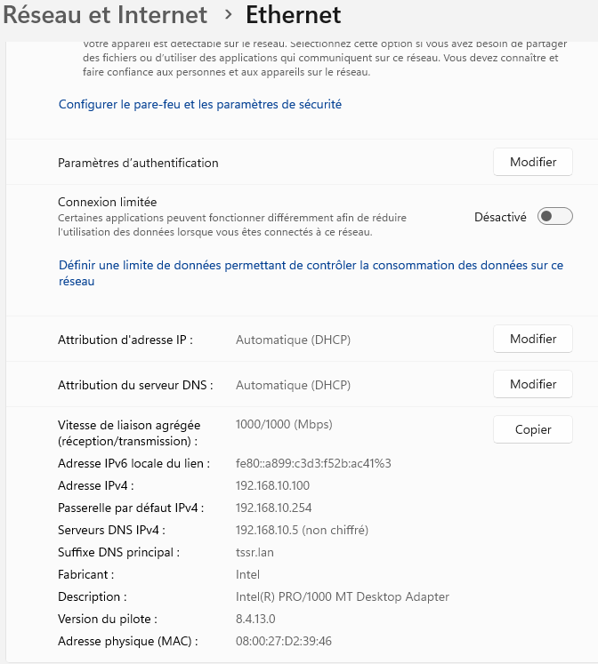
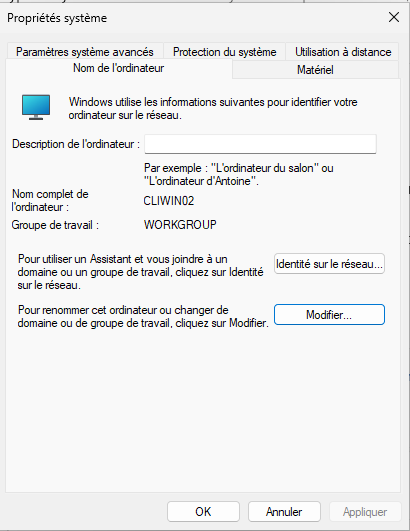
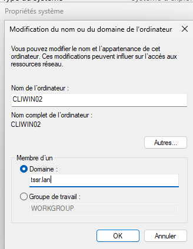
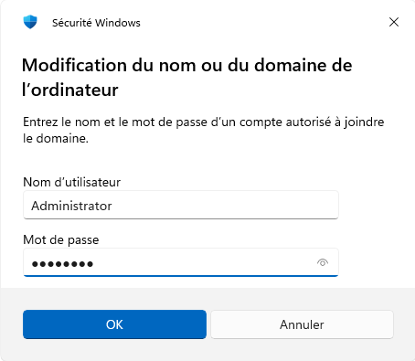
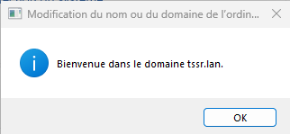

# INSTALL Clients

## Prérequis techniques

### CLIWIN01

| Élément      | Valeur               |
| ------------ | -------------------- |
| Machine      | CLIWIN01             |
| OS           | Windows 10 Pro       |
| RAM          | 4 Go                 |
| CPU          | 2                    |
| Stockage     | 30 Go                |
| Réseau       | LAN (Réseau interne) |
| IP           | DHCP                 |
| Passerelle   | 192.168.10.254       |
| DNS          | 192.168.10.5         |
| Domaine      | tssr.lan             |
| Compte       | wilder1              |
| Mot de passe | Azerty1*             |

### CLIWIN02

| Élément      | Valeur         |
| ------------ | -------------- |
| Machine      | CLIWIN02       |
| OS           | Windows 11 Pro |
| RAM          | 4 Go           |
| CPU          | 2              |
| Stockage     | 30 Go          |
| Réseau       | LAN            |
| IP           | DHCP           |
| Passerelle   | 192.168.10.254 |
| DNS          | 192.168.10.5   |
| Domaine      | tssr.lan       |
| Compte       | wilder2        |
| Mot de passe | Azerty1*       |

---

## Configuration

### Paramètres à configurer

| Paramètre           | CLIWIN01    | CLIWIN02    |
| ------------------- | ----------- | ----------- |
| Nom de l'ordinateur | CLIWIN01    | CLIWIN02    |
| Domaine             | tssr.lan    | tssr.lan    |
| Configuration IP    | DHCP        | DHCP        |
| Softphone           | 3CX         | 3CX         |
| Client mail         | Thunderbird | Thunderbird |

---

## Configuration à faire sur les machines clientes

### Vérification de la configuration réseau (DHCP)

1. Ouvrir **Paramètres** → **Réseau et Internet** → **Ethernet**
2. Vérifier que l'IP est obtenue automatiquement (DHCP)

3. Ouvrir **Invite de commandes**
4. Taper : ipconfig /all
5. Vérifier :
   - **DHCP activé** : Oui
   - **Serveur DHCP** : 192.168.10.5
   - **Passerelle** : 192.168.10.254
   - **Serveur DNS** : 192.168.10.5

---

### Joindre le domaine AD

1. Ouvrir **Paramètres** → **Système** → **À propos de**
2. Cliquer sur **Paramètres avancés du système**
3. Onglet **Nom de l'ordinateur**
4. Cliquer sur **Modifier**

5. Sélectionner **Domaine**
6. Entrer : tssr.lan
7. Cliquer sur **OK**

8. Entrer les identifiants du domaine :
   - Utilisateur : Administrator
   - Mot de passe : Azerty1*
9. Cliquer sur **OK**

10. Message de bienvenue

11. Cliquer sur **OK** puis **Redémarrer maintenant**

---

### Installation des logiciels clients

#### 1. Softphone 3CX (version legacy)

1. Télécharger la version legacy **3CXPhone6.msi** (les versions récentes nécessitent un système 3CX complet et ne fonctionnent pas comme softphone SIP standalone)
2. Installer
3. Configurer (voir INSTALL_VoIP.md)

#### 2. Client mail Thunderbird

1. Télécharger Thunderbird : https://www.thunderbird.net/
2. Installer
3. Configurer (voir INSTALL_Messagerie.md)

---

## Configuration CLIWIN02

Suivre les mêmes étapes que CLIWIN01.

---

## Connexion avec un compte du domaine

1. Sur l'écran de connexion
2. Cliquer sur **Autre utilisateur**
3. Entrer :
   - Utilisateur : petra.rossi@tssr.lan (ou TSSR\petra.rossi)
   - Mot de passe : Azerty1*
4. Le profil utilisateur se crée

---

## Vérification

### Vérifier l'appartenance au domaine

1. Ouvrir **Invite de commandes**
2. Taper : systeminfo | findstr /i "domaine"

---

### Vérifier les GPO appliquées

1. Ouvrir **Invite de commandes**
2. Taper : gpresult /r

---

### Test de connexion aux services

1. Test DNS : nslookup srvwin01.tssr.lan
2. Test GLPI : ouvrir http://192.168.10.25/glpi
3. Test Webmail : ouvrir https://192.168.10.35/mail
4. Test VoIP : appeler une autre extension

---

## FAQ

### Impossible de joindre le domaine
- Vérifier la connectivité réseau : ping 192.168.10.5
- Vérifier le DNS : nslookup tssr.lan
- Vérifier que SRVWIN01 est démarré

### L'utilisateur ne peut pas se connecter
- Vérifier que le compte existe dans AD
- Vérifier le mot de passe
- Vérifier que le compte n'est pas verrouillé

### Les GPO ne s'appliquent pas
- Exécuter gpupdate /force
- Redémarrer le poste
- Vérifier le lien des GPO sur les OU