# INSTALL DHCP

## Prérequis techniques

| Élément      | Valeur               |
| ------------ | -------------------- |
| Machine      | SRVWIN01             |
| OS           | Windows Server 2022  |
| Réseau       | LAN                  |
| IP           | 192.168.10.5/24      |
| Rôle         | DHCP                 |
| Compte       | Administrator        |
| Mot de passe | Azerty1*             |

---

## Configuration

### Paramètres à configurer

| Paramètre        | Valeur         |
| ---------------- | -------------- |
| Nom de l'étendue | LAN_Ekoloclast |
| Plage de début   | 192.168.10.100 |
| Plage de fin     | 192.168.10.200 |
| Masque           | 255.255.255.0  |
| Passerelle       | 192.168.10.254 |
| Serveur DNS      | 192.168.10.5   |
| Durée du bail    | 8 jours        |

---

## Étapes d'installation et configuration

### Installation du rôle DHCP

1. Ouvrir **Server Manager**
2. Cliquer sur **Manage** → **Add Roles and Features**

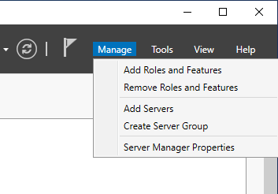

3. Cliquer sur **Next** jusqu'à **Server Roles**
4. Cocher **DHCP Server**
5. Cliquer sur **Add Features** dans la popup
6. Cliquer sur **Next** jusqu'à la fin
7. Cliquer sur **Install**
8. Attendre la fin de l'installation
9. Cliquer sur **Close**

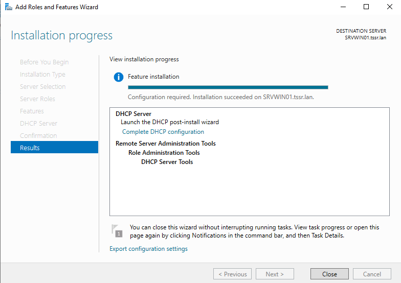

---

### Configuration post-installation

1. Cliquer sur le drapeau jaune en haut du Server Manager
2. Cliquer sur **Complete DHCP configuration**

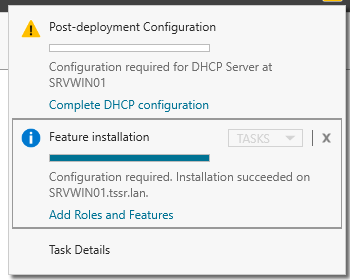

3. Cliquer sur **Next**
4. Cliquer sur **Commit**

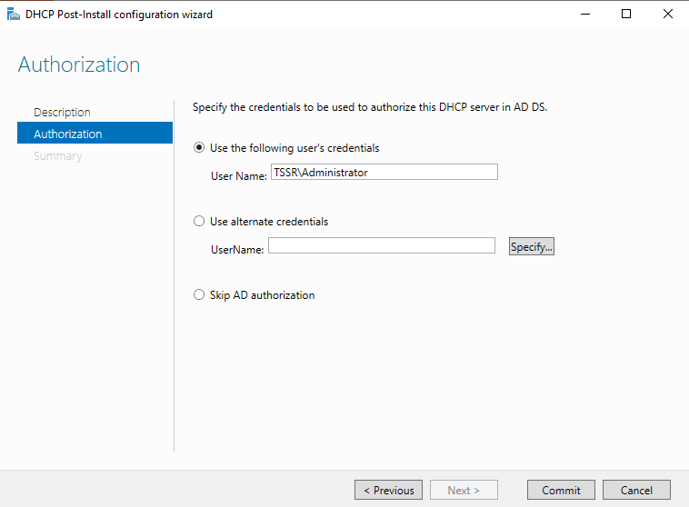

5. Cliquer sur **Close**

---

### Création de l'étendue DHCP

1. Ouvrir **Server Manager**
2. Cliquer sur **Tools** → **DHCP**

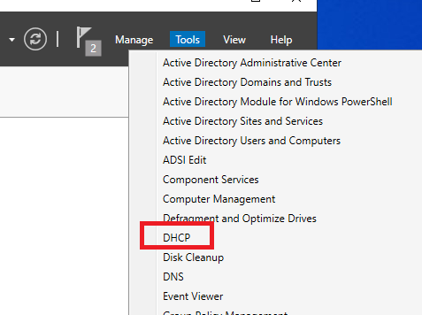

3. Développer **srvwin01.tssr.lan**
4. Clic droit sur **IPv4**
5. Cliquer sur **New Scope**

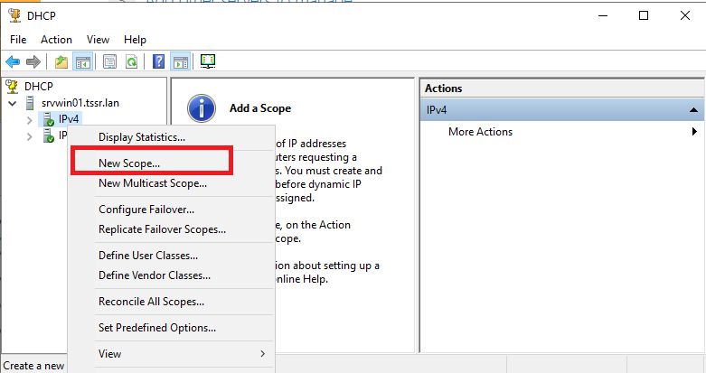

6. Cliquer sur **Next**
7. **Name** : LAN_Ekoloclast
8. **Description** : Plage DHCP pour le réseau LAN
9. Cliquer sur **Next**

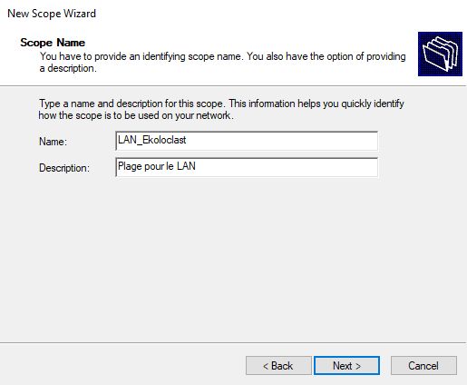

10. **Start IP address** : 192.168.10.100
11. **End IP address** : 192.168.10.200
12. **Length** : 24
13. **Subnet mask** : 255.255.255.0
14. Cliquer sur **Next**

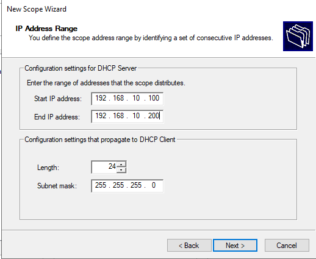

15. Page **Add Exclusions and Delay** : laisser vide
16. Cliquer sur **Next**
17. **Lease Duration** : 8 days
18. Cliquer sur **Next**

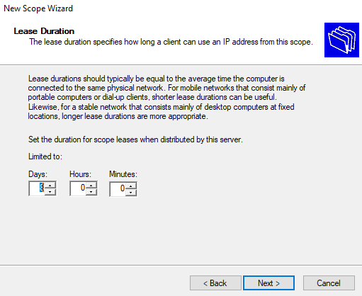

19. Sélectionner **Yes, I want to configure these options now**
20. Cliquer sur **Next**

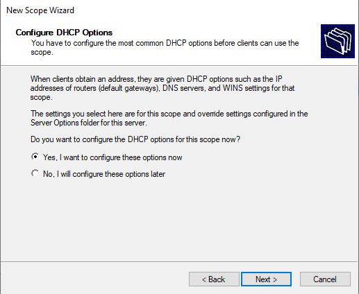

21. **IP address** (Router) : 192.168.10.254
22. Cliquer sur **Add**
23. Cliquer sur **Next**

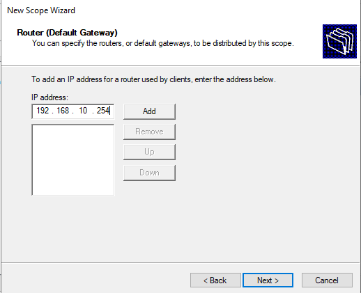

24. **Parent domain** : tssr.lan
25. **Server name** : srvwin01.tssr.lan
26. **IP address** : 192.168.10.5
27. Cliquer sur **Add**
28. Cliquer sur **Next**

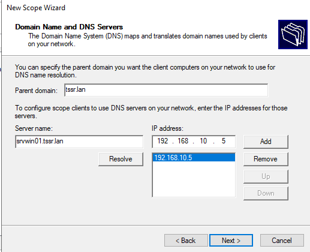

29. Page **WINS Servers** : laisser vide
30. Cliquer sur **Next**

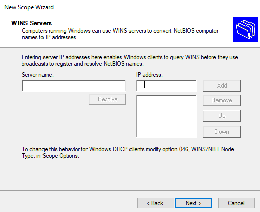

31. Sélectionner **Yes, I want to activate this scope now**
32. Cliquer sur **Next**

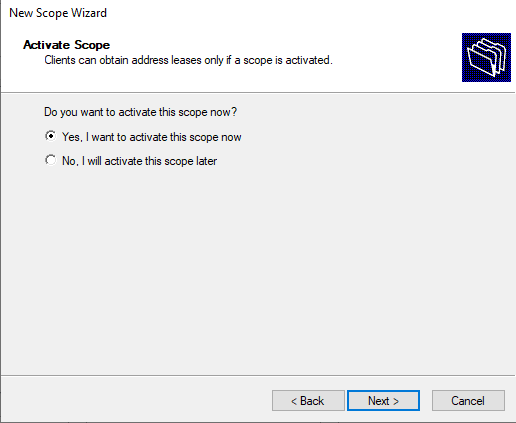

33. Cliquer sur **Finish**

---

### Vérification de l'étendue

1. Dans la console DHCP
2. Développer **IPv4** → **Scope [192.168.10.0] LAN_Ekoloclast**
3. Vérifier les paramètres dans **Scope Options**

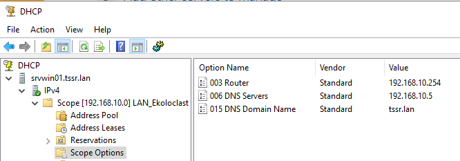

4. Cliquer sur **Address Pool**
5. Vérifier la plage : 192.168.10.100 - 192.168.10.200

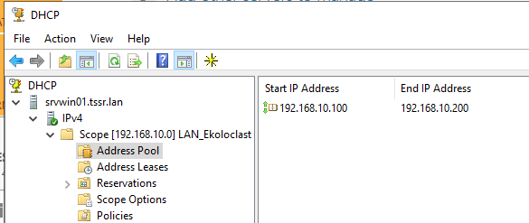

---

## Vérification

### Test sur un client

1. Sur un client Windows (CLIWIN01 ou CLIWIN02)
2. Ouvrir **Command Prompt**
3. Taper : ipconfig /release
4. Taper : ipconfig /renew
5. Taper : ipconfig /all
6. Vérifier :
   - Adresse IP dans la plage 192.168.10.100-200
   - Default Gateway : 192.168.10.254
   - DNS Servers : 192.168.10.5
   - DHCP Server : 192.168.10.5

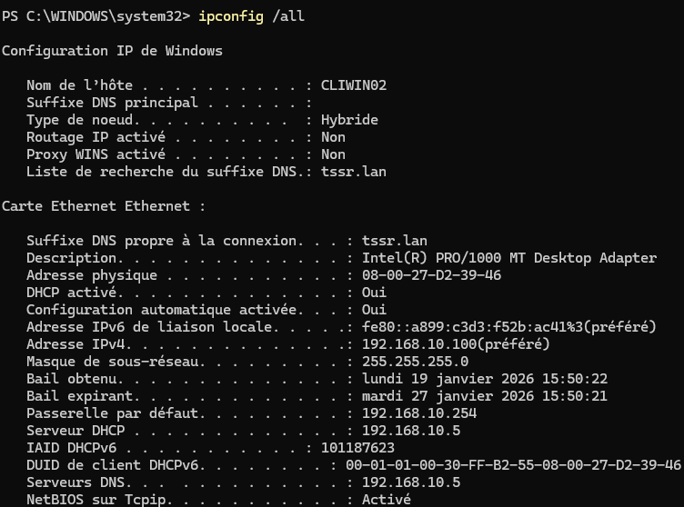

---

### Vérification des baux sur le serveur

1. Dans la console DHCP
2. Développer **IPv4** → **Scope** → **Address Leases**
3. Vérifier que les clients sont bien présents

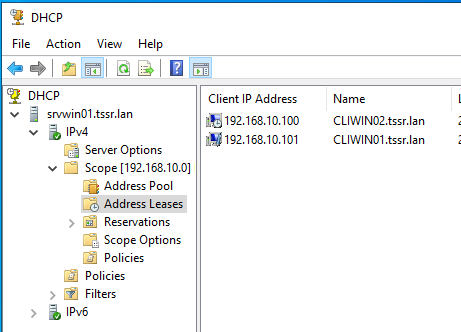

---

## FAQ

### Le client n'obtient pas d'adresse IP
- Vérifier que le service DHCP est démarré sur le serveur
- Vérifier que l'étendue est activée
- Vérifier que le client est sur le même réseau (LAN)
- Exécuter ipconfig /release puis ipconfig /renew

### Le client obtient une adresse en 169.254.x.x
- C'est une adresse APIPA (pas de serveur DHCP trouvé)
- Vérifier la connectivité réseau avec ping 192.168.10.5
- Vérifier les règles pare-feu (ports UDP 67/68)

### Conflit d'adresse IP
- Vérifier qu'aucune machine n'a une IP statique dans la plage DHCP
- Ajouter des exclusions dans l'étendue si nécessaire