# INSTALL DNS

## Prérequis techniques

| Élément      | Valeur                  |
| ------------ | ----------------------- |
| Machine      | SRVWIN01                |
| OS           | Windows Server 2022 GUI |
| Réseau       | LAN                     |
| IP           | 192.168.10.5/24         |
| Rôle         | DNS                     |
| Zone         | tssr.lan (zone directe) |
| Compte       | Administrator           |
| Mot de passe | Azerty1*                |

---

## Configuration

### Paramètres à configurer

| Paramètre      | Valeur                           |
| -------------- | -------------------------------- |
| Zone directe   | tssr.lan                         |
| Type de zone   | Principale                       |
| Réplication    | Tous les serveurs DNS du domaine |
| DNS Forwarders | 8.8.8.8, 8.8.4.4                 |

### Enregistrements A à créer

| Nom      | Type | Adresse IP     |
| -------- | ---- | -------------- |
| srvwin01 | A    | 192.168.10.5   |
| srvwin04 | A    | 192.168.10.20  |
| glpi01   | A    | 192.168.10.25  |
| ipbx01   | A    | 192.168.10.30  |
| srvlx01  | A    | 192.168.10.35  |
| fw01     | A    | 192.168.10.254 |

---

## Étapes d'installation et configuration

### Vérification du rôle DNS

Le rôle DNS est normalement installé lors de la promotion AD DS.

1. Ouvrir **Server Manager**
2. Cliquer sur **Tools** → **DNS**

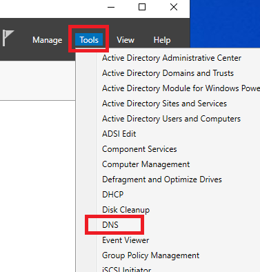

3. Vérifier que SRVWIN01 apparaît dans la liste

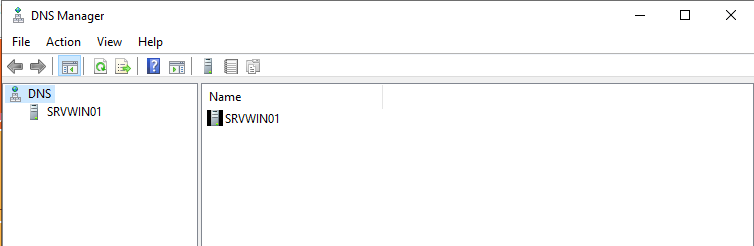

---

### Vérification de la zone directe

1. Dans la console DNS
2. Développer **SRVWIN01** → **Forward Lookup Zones**
3. Vérifier que **tssr.lan** est présent

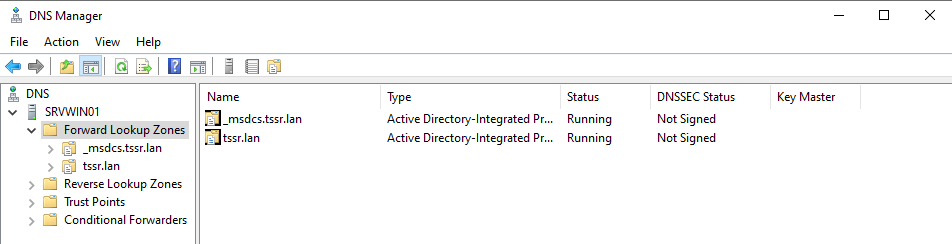

---

### Création des enregistrements A

#### Enregistrement pour SRVWIN04 (WSUS)

1. Clic droit sur la zone **tssr.lan**

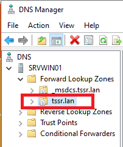

2. Cliquer sur **New Host (A or AAAA)**

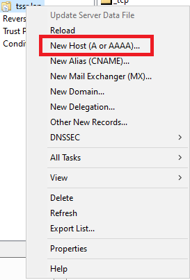

3. **Name** : srvwin04
4. **IP address** : 192.168.10.20
5. Cliquer sur **Add Host**

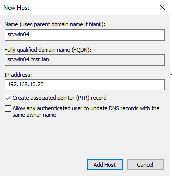

6. Cliquer sur **OK** pour confirmer

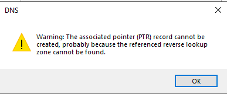

---

#### Enregistrement pour GLPI01

1. Clic droit sur la zone **tssr.lan**
2. Cliquer sur **New Host (A or AAAA)**
3. **Name** : glpi01
4. **IP address** : 192.168.10.25
5. Cliquer sur **Add Host**

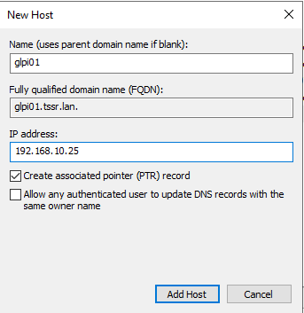

---

#### Enregistrement pour IPBX01

1. Clic droit sur la zone **tssr.lan**
2. Cliquer sur **New Host (A or AAAA)**
3. **Name** : ipbx01
4. **IP address** : 192.168.10.30
5. Cliquer sur **Add Host**

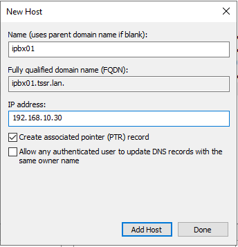

---

#### Enregistrement pour SRVLX01 (Messagerie)

1. Clic droit sur la zone **tssr.lan**
2. Cliquer sur **New Host (A or AAAA)**
3. **Name** : srvlx01
4. **IP address** : 192.168.10.35
5. Cliquer sur **Add Host**

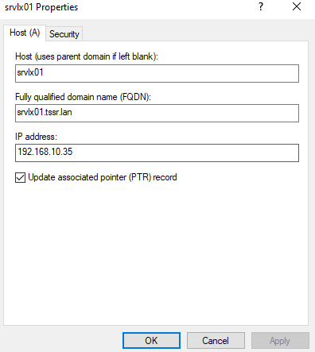

---

#### Enregistrement pour FW01

1. Clic droit sur la zone **tssr.lan**
2. Cliquer sur **New Host (A or AAAA)**
3. **Name** : fw01
4. **IP address** : 192.168.10.254
5. Cliquer sur **Add Host**

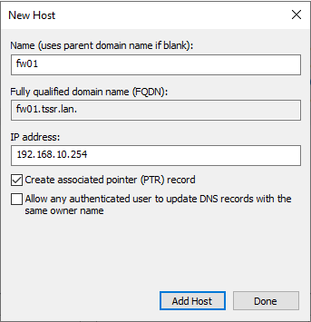

---

### Vérification des enregistrements

1. Dans la console DNS
2. Cliquer sur la zone **tssr.lan**
3. Vérifier que tous les enregistrements sont présents

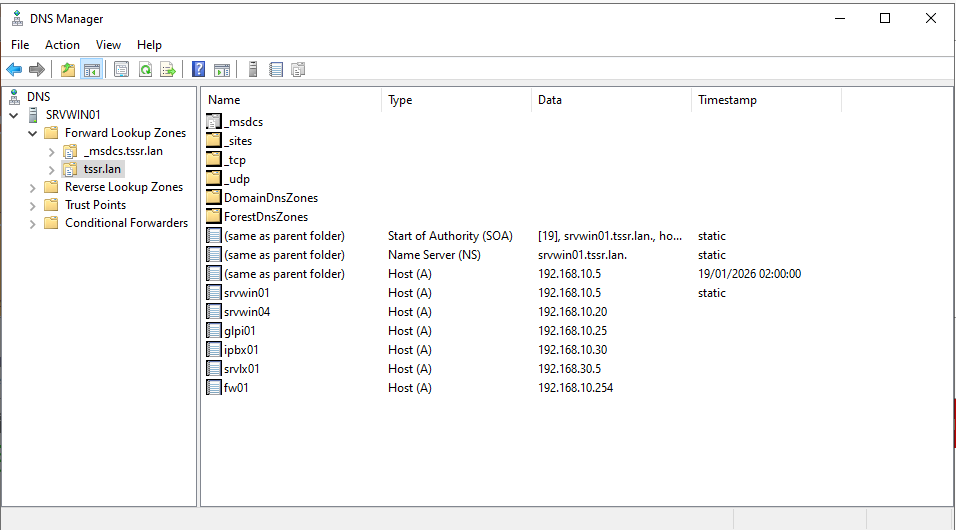

---

### Configuration des DNS Forwarders

1. Dans la console DNS
2. Clic droit sur **SRVWIN01**
3. Cliquer sur **Properties**
4. Aller dans l'onglet **Forwarders**
5. Cliquer sur **Edit**
6. Entrer l'adresse IP : 8.8.8.8
7. Appuyer sur **Entrée**
8. Entrer l'adresse IP : 8.8.4.4
9. Appuyer sur **Entrée**
10. Cliquer sur **OK**

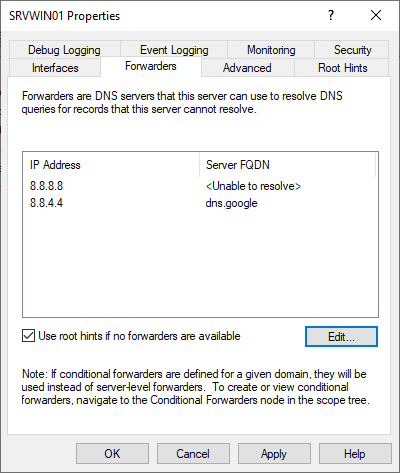

11. Cliquer sur **OK** pour fermer les propriétés

---

## Vérification

### Test de résolution DNS interne

1. Ouvrir **Command Prompt**
2. Taper : nslookup srvwin01.tssr.lan
3. Vérifier que l'adresse IP 192.168.10.5 est retournée

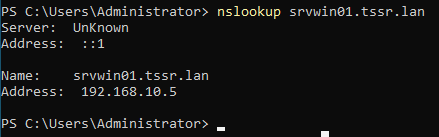

4. Taper : nslookup glpi01.tssr.lan
5. Vérifier que l'adresse IP 192.168.10.25 est retournée

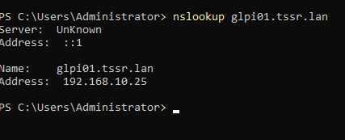

---

### Test de résolution DNS externe

1. Ouvrir **Command Prompt**
2. Taper : nslookup google.com
3. Vérifier qu'une adresse IP est retournée

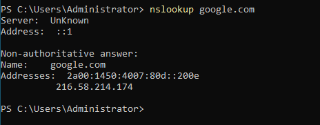

---

## FAQ

### nslookup retourne "Serveur inconnu"
- Vérifier que le DNS du serveur pointe vers lui-même (127.0.0.1 ou 192.168.10.5)
- Vérifier que le service DNS est démarré

### Impossible de résoudre les noms externes
- Vérifier que les forwarders sont configurés (8.8.8.8)
- Vérifier la connexion Internet du serveur
- Vérifier les règles du pare-feu pfSense

### L'enregistrement A n'apparaît pas
- Actualiser la console DNS (F5)
- Vérifier que l'enregistrement a bien été créé
- Vérifier qu'il n'y a pas de conflit d'adresse IP