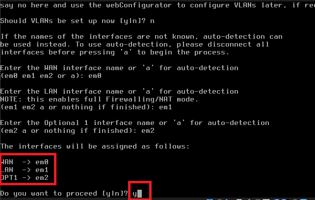
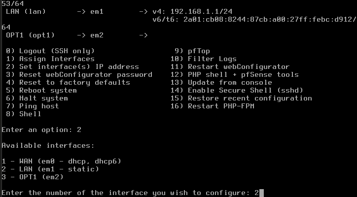
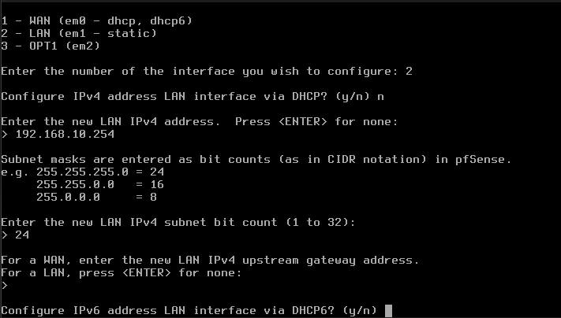
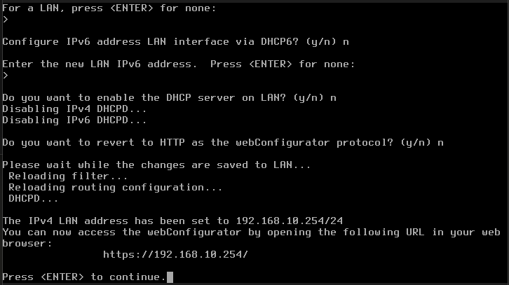
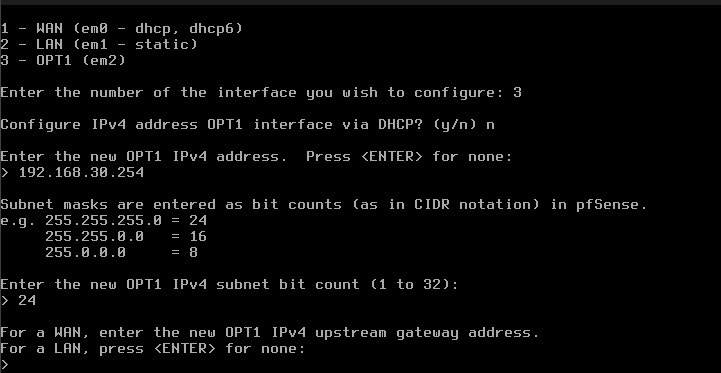
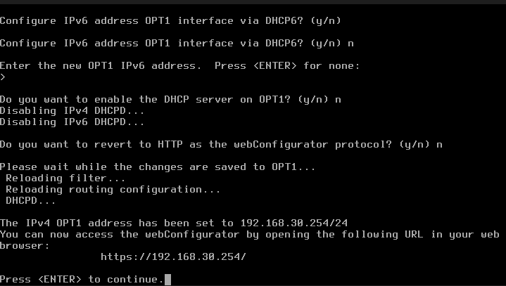

## Prérequis techniques

| Élément      | Valeur            |
| ------------ | ----------------- |
| Machine      | FW01              |
| OS           | pfSense CE 2.7.2  |
| RAM          | 1 Go              |
| CPU          | 1                 |
| Stockage     | 8 Go              |
| Réseau       | WAN / LAN / DMZ   |
| IP WAN       | 192.168.1.250/24  |
| IP LAN       | 192.168.10.254/24 |
| IP DMZ       | 192.168.30.254/24 |
| Compte       | admin             |
| Mot de passe | pfsense           |

## Étapes d'installation et configuration

### Configuration initiale dans VirtualBox

1. Créer une nouvelle VM dans VirtualBox
2. Nom : FW01
3. Type : BSD
4. Version : FreeBSD (64-bit)
5. RAM : 1024 Mo
6. Disque dur : 8 Go
7. Aller dans **Configuration** → **Réseau**
8. **Carte 1** : Mode Accès par pont (WAN )
9. **Carte 2** : Mode Réseau interne, Nom : LAN
10. **Carte 3** : Mode Réseau interne, Nom : DMZ
11. Insérer l'ISO 

### Installation de pfSense

1. Démarrer la VM
2. Attendre le menu de boot
3. Appuyer sur **Entrée** pour démarrer
4. Sélectionner **Install pfSense**
5. Appuyer sur **Entrée**
6. Sélectionner le clavier : **French**
7. Partitionnement : **Auto (ZFS)** ou **Auto (UFS)**
8. Appuyer sur **Entrée**
9. Sélectionner le disque : ada0
10. Confirmer l'installation
11. Attendre la fin de l'installation
12. Sélectionner **Reboot**
13. Retirer l'ISO 
---

## Configuration

### Paramètres à configurer

| Paramètre     | Valeur                  |
| ------------- | ----------------------- |
| Hostname      | FW01                    |
| Domain        | tssr.lan                |
| Interface WAN | em0 (DHCP)              |
| Interface LAN | em1 (192.168.10.254/24) |
| Interface DMZ | em2 (192.168.30.254/24) |
| DNS           | 8.8.8.8, 8.8.4.4       |

---

### Configuration des interfaces (console)

Au premier démarrage après l'installation, pfSense peut proposer automatiquement la configuration des interfaces réseau. Si c'est le cas, suivre les étapes ci-dessous. Si pfSense ne propose pas cette configuration et affiche directement le menu principal, passer à la section suivante pour configurer les interfaces manuellement via l'option 1 (Assign Interfaces) du menu.

1 → **pfSense propose la configuration au démarrage :**

1. **Should VLANs be set up now?** : n
2. **Enter the WAN interface name** : em0
3. **Enter the LAN interface name** : em1
4. **Enter the Optional 1 interface name** : em2
5. Confirmer avec y

6. Attendre le démarrage complet

2 → **pfSense affiche directement le menu principal :**

1. Dans le menu principal, taper 1 pour **Assign Interfaces**
2. **Should VLANs be set up now?** : n
3. **Enter the WAN interface name** : em0
4. **Enter the LAN interface name** : em1
5. **Enter the Optional 1 interface name** : em2
6. Confirmer avec y
7. Attendre le rechargement de la configuration

---

### Configuration de l'interface LAN (console)

1. Dans le menu principal, taper 2 pour **Set interface(s) IP address**

2. Sélectionner l'interface 2 (LAN)
3. Configure IPV4 address LAN via DHCP : entrez n
4. **Enter the new LAN IPv4 address** : 192.168.10.254
5. **Enter the new LAN IPv4 subnet bit count** : 24
6. For a wan, enter the new LAN IPV4 upstream gateway address : Press sur entrez
7. Configure IPV6 address LAN interface via DHCP6 : n

5. **Do you want to enable the DHCP server on LAN?** : n
6. **Do you want to revert to HTTP?** : n

---

### Configuration de l'interface DMZ (console)

1. Dans le menu principal, taper 2 pour **Set interface(s) IP address**
2. Sélectionner l'interface 3 (OPT1/DMZ)
3. Configure IPV4 address OPT1 : entrez n
4. **Enter the new OPT1 IPv4 address** : 192.168.30.254
5. **Enter the new OPT1 IPv4 subnet bit count** : 24
6. Configure IPV6 address OPT1 interface via DHCP6 : n
7. puis appuyez sur enter

5. Laisser les autres options vides ou n

