## Prérequis techniques

| Élément      | Valeur            |
| ------------ | ----------------- |
| Machine      | FW01              |
| OS           | pfSense CE 2.7.2  |
| RAM          | 1 Go              |
| CPU          | 1                 |
| Stockage     | 8 Go              |
| Réseau       | WAN / LAN / DMZ   |
| IP WAN       | DHCP (box FAI)    |
| IP LAN       | 192.168.10.254/24 |
| IP DMZ       | 192.168.30.254/24 |
| Compte       | admin             |
| Mot de passe | pfsense (initial) / Azerty1* (après configuration) |

## Étapes d'installation et configuration

### Configuration initiale dans VirtualBox

1. Créer une nouvelle VM dans VirtualBox
2. Nom : FW01
3. Type : BSD
4. Version : FreeBSD (64-bit)
5. RAM : 1024 Mo
6. Disque dur : 8 Go
7. Aller dans **Configuration** → **Réseau**
8. **Carte 1** : Mode Accès par pont (WAN)
9. **Carte 2** : Mode Réseau interne, Nom : LAN
10. **Carte 3** : Mode Réseau interne, Nom : DMZ
11. Insérer l'ISO pfSense dans le lecteur CD

### Installation de pfSense

1. Démarrer la VM
2. Attendre le menu de boot
3. Appuyer sur **Entrée** pour démarrer
4. Sélectionner **Install pfSense**
5. Appuyer sur **Entrée**
6. Sélectionner le clavier : **French**
7. Partitionnement : **Auto (ZFS)** ou **Auto (UFS)**
8. Appuyer sur **Entrée**
9. Sélectionner le disque : ada0
10. Confirmer l'installation
11. Attendre la fin de l'installation
12. Sélectionner **Reboot**
13. Retirer l'ISO du lecteur CD

---

## Configuration

### Paramètres à configurer

| Paramètre     | Valeur                  |
| ------------- | ----------------------- |
| Hostname      | FW01                    |
| Domain        | tssr.lan                |
| Interface WAN | em0 (DHCP)              |
| Interface LAN | em1 (192.168.10.254/24) |
| Interface DMZ | em2 (192.168.30.254/24) |
| DNS           | 8.8.8.8, 8.8.4.4       |

---

### Configuration des interfaces (console)

Au premier démarrage après l'installation, pfSense peut proposer automatiquement la configuration des interfaces réseau. Si c'est le cas, suivre les étapes ci-dessous. Si pfSense ne propose pas cette configuration et affiche directement le menu principal, passer à la section suivante pour configurer les interfaces manuellement via l'option 1 (Assign Interfaces) du menu.

1 → **pfSense propose la configuration au démarrage :**

1. **Should VLANs be set up now?** : n
2. **Enter the WAN interface name** : em0
3. **Enter the LAN interface name** : em1
4. **Enter the Optional 1 interface name** : em2
5. Confirmer avec y

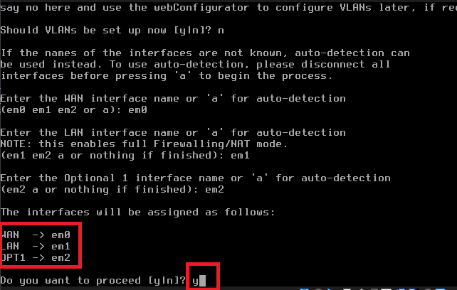

6. Attendre le démarrage complet

2 → **pfSense affiche directement le menu principal :**

1. Dans le menu principal, taper 1 pour **Assign Interfaces**
2. **Should VLANs be set up now?** : n
3. **Enter the WAN interface name** : em0
4. **Enter the LAN interface name** : em1
5. **Enter the Optional 1 interface name** : em2
6. Confirmer avec y
7. Attendre le rechargement de la configuration

---

### Configuration de l'interface LAN (console)

1. Dans le menu principal, taper 2 pour **Set interface(s) IP address**

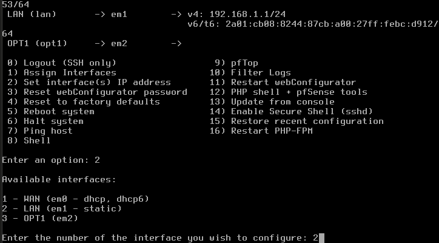

2. Sélectionner l'interface 2 (LAN)
3. Configure IPV4 address LAN via DHCP : entrez n
4. **Enter the new LAN IPv4 address** : 192.168.10.254
5. **Enter the new LAN IPv4 subnet bit count** : 24
6. For a wan, enter the new LAN IPV4 upstream gateway address : appuyer sur Entrée
7. Configure IPV6 address LAN interface via DHCP6 : n

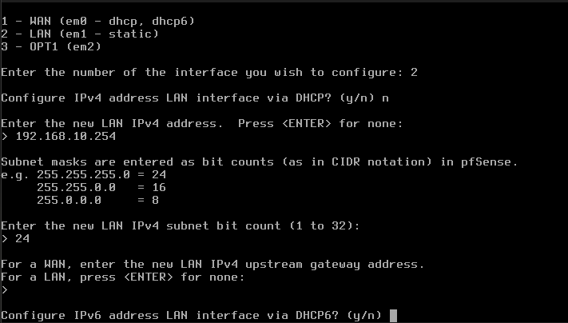

8. **Do you want to enable the DHCP server on LAN?** : n
9. **Do you want to revert to HTTP?** : n

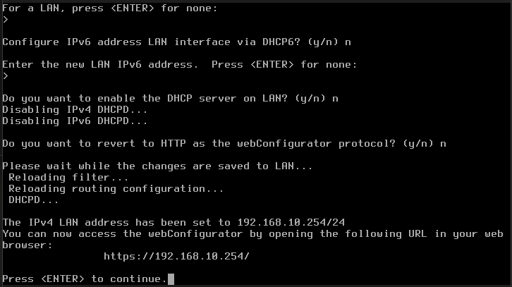

---

### Configuration de l'interface DMZ (console)

1. Dans le menu principal, taper 2 pour **Set interface(s) IP address**
2. Sélectionner l'interface 3 (OPT1/DMZ)
3. Configure IPV4 address OPT1 : entrez n
4. **Enter the new OPT1 IPv4 address** : 192.168.30.254
5. **Enter the new OPT1 IPv4 subnet bit count** : 24
6. Configure IPV6 address OPT1 interface via DHCP6 : n
7. Appuyer sur Entrée

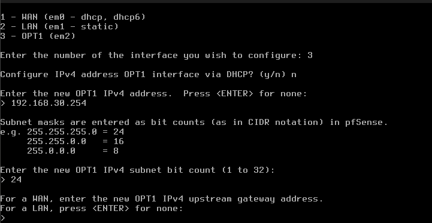

8. Laisser les autres options vides ou n

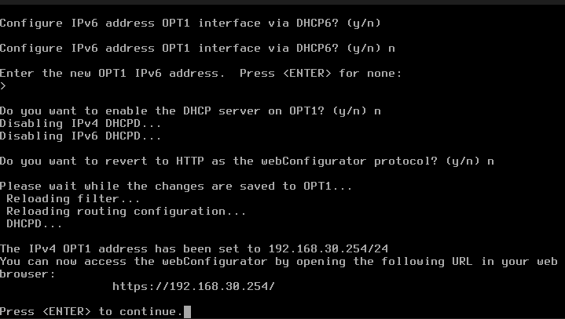

---

**Point important :** Penser à configurer le PC du LAN afin de pouvoir accéder à l'interface web.

### Accès à l'interface Web

1. Sur un PC du LAN (avec IP 192.168.10.x)
2. Ouvrir un navigateur
3. Aller à : https://192.168.10.254
4. Accepter le certificat de sécurité
5. **Username** : admin
6. **Password** : pfsense
7. Cliquer sur **Sign In**

---

### Configuration initiale

1. Cliquer sur **Next**
2. **Hostname** : FW01
3. **Domain** : tssr.lan
4. **Primary DNS** : 8.8.8.8
5. **Secondary DNS** : 8.8.4.4
6. Cliquer sur **Next**

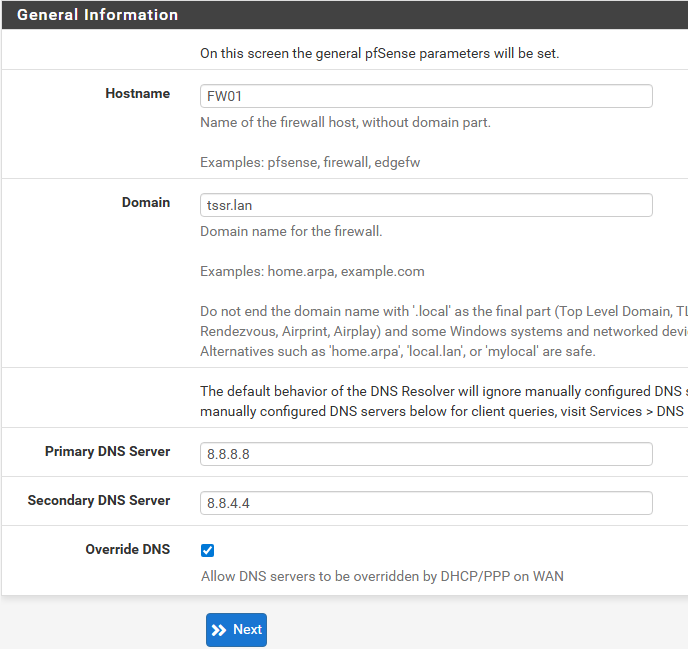

7. **Time server** : laisser par défaut
8. **Timezone** : Europe/Paris
9. Cliquer sur **Next**

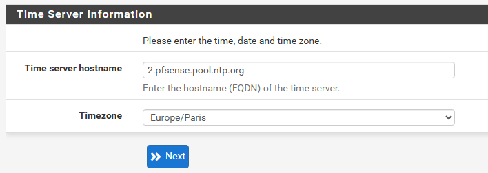

10. Configuration WAN Interface : laisser sur **DHCP**
11. Descendre et cliquer sur **Next**

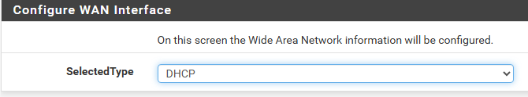

12. Configuration LAN Interface : déjà configuré (192.168.10.254)
13. Cliquer sur **Next**

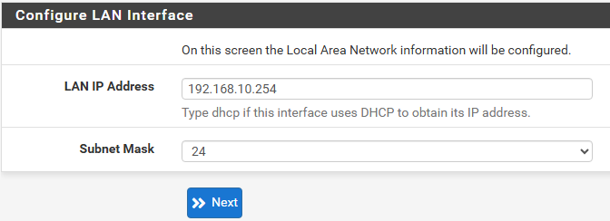

14. Changer le mot de passe admin : Azerty1*

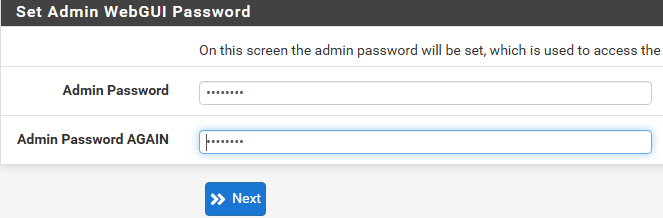

15. Cliquer sur **Next** puis **Reload**
16. Cliquer sur **Finish**

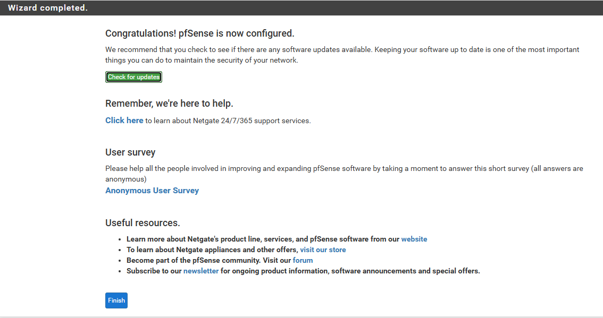

---

### Renommer l'interface OPT1 en DMZ

1. Aller dans **Interfaces** → **OPT1**
2. Cocher **Enable interface**
3. **Description** : DMZ
4. Cliquer sur **Save**

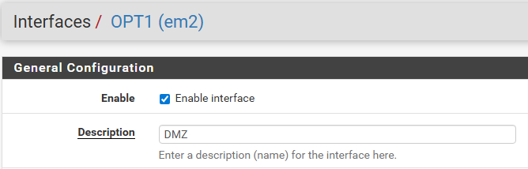

5. Cliquer sur **Apply Changes**

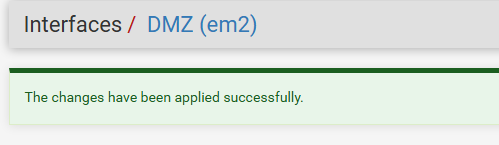

---

### Configuration des règles pare-feu LAN

1. Aller dans **Firewall** → **Rules** → **LAN**

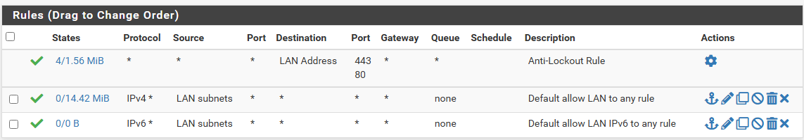

2. La règle par défaut autorise tout depuis le LAN IPV4 et IPV6
3. Vérifier la règle existante :
   - Action : Pass
   - Interface : LAN
   - Source : LAN subnets
   - Destination : Any

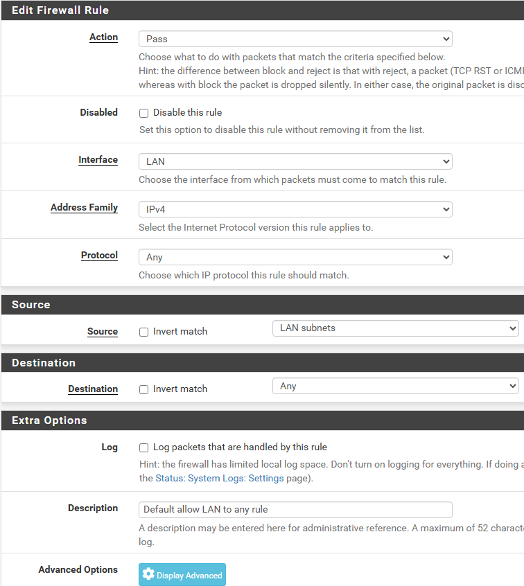

---

### Configuration des règles pare-feu WAN (Deny All)

1. Aller dans **Firewall** → **Rules** → **WAN**
2. Par défaut, tout est bloqué (pas de règles = Deny All)

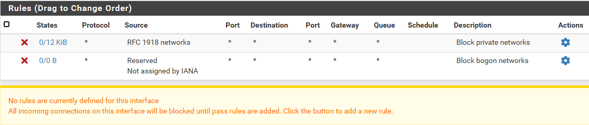

---

### Configuration des règles pare-feu DMZ

1. Aller dans **Firewall** → **Rules** → **DMZ**
2. Par défaut, tout est bloqué (pas de règles = Deny All)

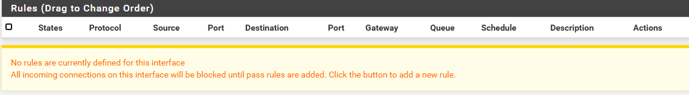

---

## Vérification

### Test de connectivité depuis le LAN

1. Sur un PC du LAN
2. Ouvrir **Invite de commandes**
3. Taper : ping 192.168.10.254
4. Vérifier que le ping fonctionne
5. Taper : ping 8.8.8.8
6. Vérifier que le ping fonctionne (accès Internet)

---

### Vérification du statut des interfaces

1. Dans l'interface web pfSense
2. Aller dans **Status** → **Interfaces**
3. Vérifier que toutes les interfaces sont UP

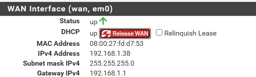

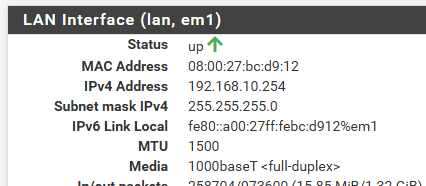

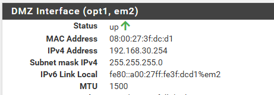

---

## Objectifs secondaires 

Cette section regroupe les règles à configurer pour les objectifs secondaires. 

---

### Objectif secondaire   Serveur web externe (DMZ)

Serveur web en DMZ sur 192.168.30.5. Il faut configurer le NAT et les règles pour autoriser l'accès depuis le WAN et le LAN.

#### Étape 1 : NAT Port Forwarding (WAN → DMZ)

Rediriger le trafic HTTP et HTTPS du WAN vers le serveur web DMZ.

1. Aller dans **Firewall** → **NAT** → **Port Forward**
2. Cliquer sur **Add** (flèche vers le bas)
3. Configurer la règle HTTP :
   - **Interface** : WAN
   - **Protocol** : TCP
   - **Destination** : WAN Address
   - **Destination port range** : HTTP (80)
   - **Redirect target IP** : 192.168.30.5
   - **Redirect target port** : HTTP (80)
   - **Description** : NAT HTTP vers serveur web DMZ
4. Cliquer sur **Save**
5. Répéter pour HTTPS :
   - **Interface** : WAN
   - **Protocol** : TCP
   - **Destination** : WAN Address
   - **Destination port range** : HTTPS (443)
   - **Redirect target IP** : 192.168.30.5
   - **Redirect target port** : HTTPS (443)
   - **Description** : NAT HTTPS vers serveur web DMZ
6. Cliquer sur **Save**
7. Cliquer sur **Apply Changes**

Note : pfSense crée automatiquement les règles firewall WAN associées lors de la création du NAT Port Forward.

#### Étape 2 : Règle DMZ sortante (mises à jour)

Autoriser le serveur DMZ à accéder à Internet pour les mises à jour système.

1. Aller dans **Firewall** → **Rules** → **DMZ**
2. Cliquer sur **Add** (flèche vers le bas)
3. Configurer la règle :
   - **Action** : Pass
   - **Interface** : DMZ
   - **Protocol** : TCP
   - **Source** : 192.168.30.5
   - **Destination** : Any
   - **Destination port range** : HTTP (80)
   - **Description** : Autoriser serveur web DMZ → Internet HTTP
4. Cliquer sur **Save**
5. Répéter pour HTTPS (443) et DNS (53 TCP/UDP)
6. Cliquer sur **Apply Changes**

Règles DMZ à créer au total :

| Action | Source         | Destination | Port     | Protocol | Description                          |
| ------ | ------------- | ----------- | -------- | -------- | ------------------------------------ |
| Pass   | 192.168.30.5  | Any         | 80       | TCP      | Serveur web DMZ → Internet HTTP      |
| Pass   | 192.168.30.5  | Any         | 443      | TCP      | Serveur web DMZ → Internet HTTPS     |
| Pass   | 192.168.30.5  | Any         | 53       | TCP/UDP  | Serveur web DMZ → DNS                |

#### Étape 3 : Accès LAN vers DMZ (optionnel)

Le LAN a déjà une règle pass-all vers Any, donc les clients du LAN peuvent accéder au serveur web DMZ sans règle supplémentaire.

---

## FAQ

### Impossible d'accéder à l'interface web
- Vérifier que le PC est sur le réseau LAN (192.168.10.x)
- Vérifier que la passerelle du PC est 192.168.10.254
- Essayer avec http://192.168.10.254 (sans HTTPS)

### Pas d'accès Internet depuis le LAN
- Vérifier que l'interface WAN a une adresse IP (DHCP)
- Vérifier les règles LAN (autoriser LAN vers Any)
- Vérifier la passerelle WAN dans **Status** → **Gateways**

### L'interface DMZ ne fonctionne pas
- Vérifier que l'interface est activée
- Vérifier la configuration réseau de la carte dans VirtualBox

### Le serveur web DMZ n'est pas accessible depuis Internet
- Vérifier les règles NAT Port Forward dans **Firewall** → **NAT** → **Port Forward**
- Vérifier que le serveur web est bien en 192.168.30.5
- Vérifier que le serveur web écoute sur les ports 80/443