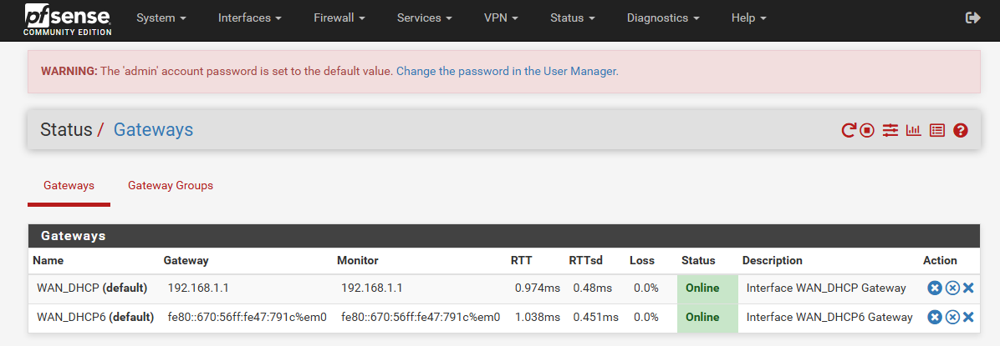
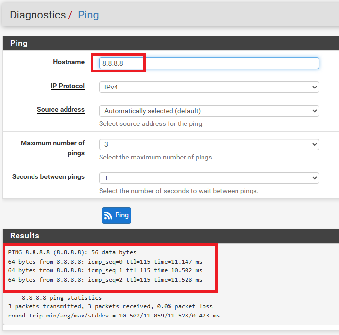
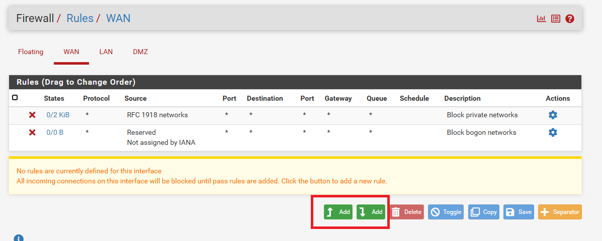
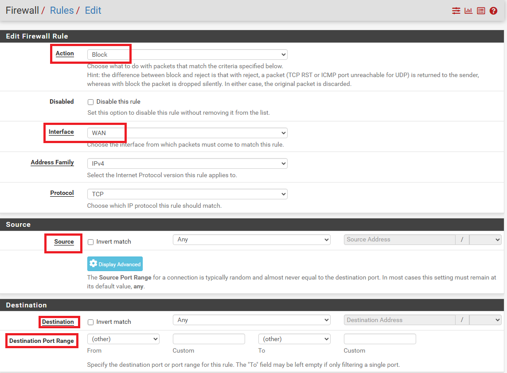
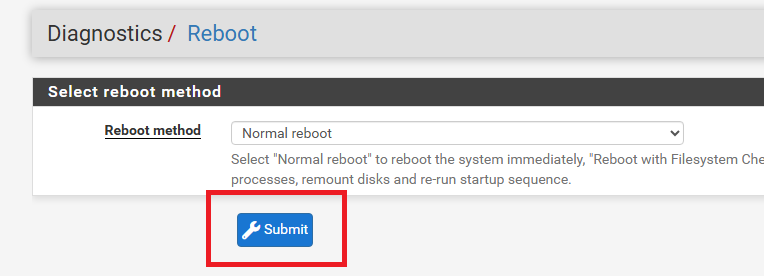
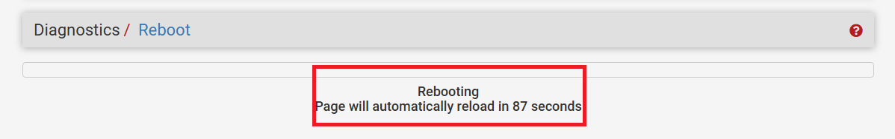

# USER GUIDE Firewall
## Utilisation de base
### Accéder à l'interface d'administration

1. Ouvrir un navigateur web
2. Aller sur  : https://192.168.10.254
3. Accepter le certificat de sécurité
4. Username : admin
5. Password : pfsense
---
### Vérifier le statut du pare-feu

1. Sur le **Dashboard** (page d'accueil)
2. Vérifier les widgets :
   - **System Information** : état général
   - **Interfaces** : statut des interfaces
   - **Gateways** : état des passerelles

---
### Vérifier la connectivité Internet

1. Aller dans **Diagnostics** → **Ping**
2. **Hostname** : 8.8.8.8
3. Cliquer sur **Ping**
4. Vérifier que les pings répondent

---
## Utilisation avancée
### Consulter les logs du pare-feu 
1. Aller dans **Status** → **System Logs** → **Firewall**
2. Voir les connexions bloquées/autorisées

---
### Ajouter une règle pare-feu 
1. Aller dans **Firewall** → **Rules**
2. Sélectionner l'interface (LAN, WAN, DMZ)
3. Cliquer sur **Add** (flèche vers le bas)

4. Configurer la règle :
   - **Action** : Pass ou Block
   - **Interface** : LAN, WAN ou DMZ
   - **Source** : adresse source
   - **Destination** : adresse destination
   - **Port** : port(s) concerné(s)
5. Cliquer sur **Save**
6. Cliquer sur **Apply Changes**

---
### Redémarrer le pare-feu 

1. Aller dans **Diagnostics** → **Reboot**
2. Cliquer sur **Submit**
3. Attendre le redémarrage

---
### Sauvegarder la configuration 
1. Aller dans **Diagnostics** → **Backup & Restore**
2. Cliquer sur **Download configuration as XML**
3. Enregistrer le fichier

---
## FAQ

### Je n'arrive pas à me connecter à l'interface web
- Vérifier l'adresse IP du PC (doit être en 192.168.10.x)
- Vérifier que la passerelle est 192.168.10.254
- Essayer avec http:// au lieu de https://

### Internet ne fonctionne plus

- Vérifier le statut WAN dans **Status** > **Interfaces**
- Vérifier les logs dans **Status** > **System Logs** > **Firewall**
- Contacter l'administrateur

### Une application ne fonctionne pas

- Vérifier si le port est bloqué par le pare-feu
- Consulter les logs pour voir les connexions bloquées
- Contacter l'administrateur pour ajouter une règle