## Prérequis techniques

| Élément      | Valeur           |
| ------------ | ---------------- |
| Machine      | GLPI01           |
| OS           | Debian 13        |
| RAM          | 2 Go             |
| CPU          | 1                |
| Stockage     | 20 Go            |
| Réseau       | LAN              |
| IP           | 192.168.10.25/24 |
| Passerelle   | 192.168.10.254   |
| DNS          | 192.168.10.5     |
| Compte       | root             |
| Mot de passe | Azerty1*         |

---

## Configuration

### Paramètres à configurer

| Paramètre         | Valeur                    |
| ----------------- | ------------------------- |
| URL d'accès       | http://192.168.10.25/glpi |
| Compte admin GLPI | glpi / glpi               |
| Base de données   | glpi                      |
| Utilisateur BDD   | glpi                      |

### Fonctionnalités à configurer

- Gestion de parc (synchronisation avec Active Directory)
- Système de ticketing (helpdesk)

---

## Étapes d'installation et configuration

### Configuration réseau Debian

1. Se connecter en root

2. Éditer le fichier de configuration réseau :

    nano /etc/network/interfaces

3. Configurer l'interface réseau :

    auto enp0s3
    iface enp0s3 inet static
        address 192.168.10.25
        netmask 255.255.255.0
        gateway 192.168.10.254

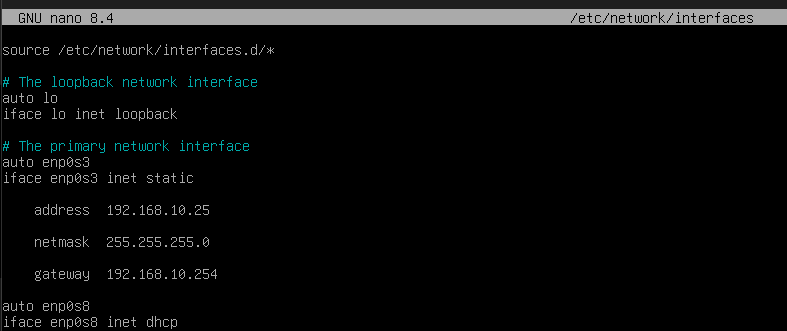

4. Sauvegarder : **Ctrl+O**, **Entrée**, **Ctrl+X**

5. Redémarrer le réseau :

    systemctl restart networking

6. Configurer le DNS :

    echo -e "nameserver 192.168.10.5\nnameserver 8.8.8.8" > /etc/resolv.conf

7. Rendre la configuration DNS persistante :

    chattr +i /etc/resolv.conf

8. Vérifier la configuration :

    ip a

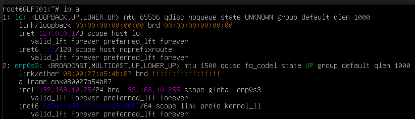

---

### Mise à jour du système

1. Mettre à jour les paquets :

    apt update && apt upgrade -y

---

### Installation des prérequis

1. Installer Apache et MariaDB :

    apt install -y apache2 mariadb-server

2. Installer les outils nécessaires pour le dépôt SURY :

    apt install -y apt-transport-https lsb-release ca-certificates curl gnupg

3. Télécharger la clé GPG du dépôt SURY :

    curl -sSL https://packages.sury.org/php/apt.gpg | gpg --dearmor -o /usr/share/keyrings/sury-php.gpg

4. Ajouter le dépôt SURY :

    echo "deb [signed-by=/usr/share/keyrings/sury-php.gpg] https://packages.sury.org/php/ $(lsb_release -sc) main" > /etc/apt/sources.list.d/sury-php.list

5. Mettre à jour la liste des paquets :

    apt update

6. Installer PHP 8.3 et les modules requis :

    apt install -y php8.3 php8.3-mysql php8.3-curl php8.3-gd php8.3-intl php8.3-ldap php8.3-xml php8.3-mbstring php8.3-zip php8.3-bz2 php8.3-imap libapache2-mod-php8.3

7. Activer PHP 8.3 dans Apache :

    a2enmod php8.3

8. Redémarrer Apache :

    systemctl restart apache2

9. Vérification :

- systemctl status apache2 :

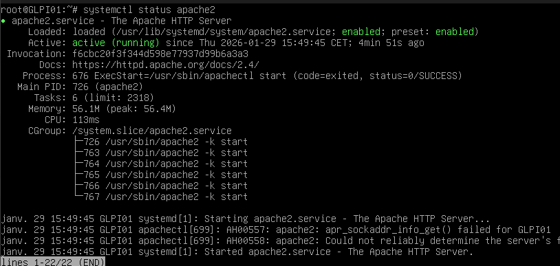

- systemctl status mariadb :

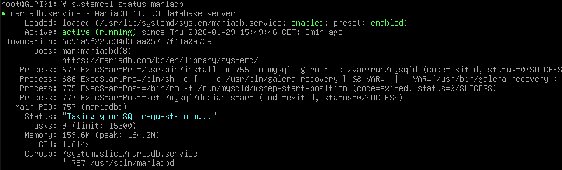

- php -v :

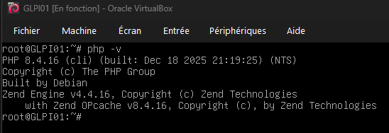

**Note** : PHP doit afficher la version 8.3.x

---

### Configuration de MariaDB

1. Se connecter à MariaDB :

    mysql -u root

2. Exécuter les commandes SQL de sécurisation :

    ALTER USER 'root'@'localhost' IDENTIFIED BY 'Azerty1*';
    DELETE FROM mysql.user WHERE User='';
    DELETE FROM mysql.user WHERE User='root' AND Host NOT IN ('localhost', '127.0.0.1', '::1');
    DROP DATABASE IF EXISTS test;
    FLUSH PRIVILEGES;

3. Créer la base de données GLPI :

    CREATE DATABASE glpi CHARACTER SET utf8mb4 COLLATE utf8mb4_unicode_ci;
    CREATE USER 'glpi'@'localhost' IDENTIFIED BY 'Azerty1*';
    GRANT ALL PRIVILEGES ON glpi.* TO 'glpi'@'localhost';
    FLUSH PRIVILEGES;
    EXIT;

**Note** : Sur Debian 13 avec MariaDB 11.8, la commande mysql_secure_installation n'existe plus. La sécurisation se fait directement en SQL.

---

### Téléchargement de GLPI

1. Se placer dans le répertoire temporaire :

    cd /tmp

2. Télécharger GLPI 10.0.17 :

    wget https://github.com/glpi-project/glpi/releases/download/10.0.17/glpi-10.0.17.tgz

3. Extraire l'archive :

    tar -xvzf glpi-10.0.17.tgz

4. Déplacer vers le répertoire web :

    mv glpi /var/www/html/

5. Attribuer les permissions :

    chown -R www-data:www-data /var/www/html/glpi

6. Définir les droits d'accès :

    chmod -R 755 /var/www/html/glpi

---

### Configuration de PHP

1. Éditer le fichier php.ini :

    nano /etc/php/8.3/apache2/php.ini

2. Modifier les paramètres suivants (utiliser **Ctrl+W** pour rechercher) :

    memory_limit = 256M
    upload_max_filesize = 20M
    post_max_size = 20M
    max_execution_time = 300
    session.cookie_httponly = On

3. Sauvegarder : **Ctrl+O**, **Entrée**, **Ctrl+X**

4. Redémarrer Apache :

    systemctl restart apache2

---

### Installation via l'interface web

1. Depuis un PC client, ouvrir un navigateur

2. Aller à : http://192.168.10.25/glpi

3. Sélectionner la langue : **Français**

4. Cliquer sur **Continuer**

5. Accepter la licence : cliquer sur **Continuer**

6. Cliquer sur **Installer**

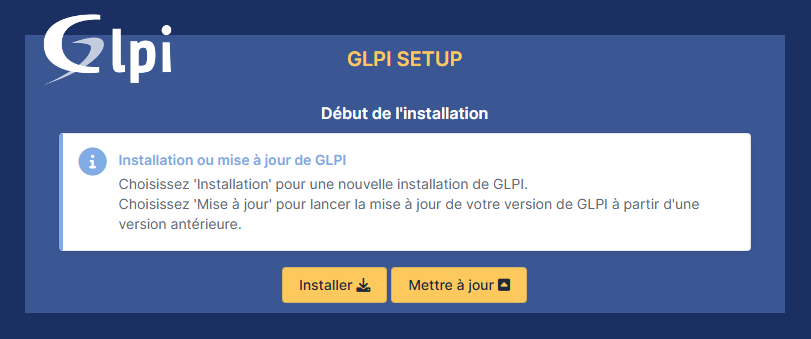

7. Vérifier les prérequis (tous doivent être verts)

8. Cliquer sur **Continuer**

9. Configuration de la base de données :
   - **Serveur SQL** : localhost
   - **Utilisateur SQL** : glpi
   - **Mot de passe SQL** : Azerty1*

10. Cliquer sur **Continuer**

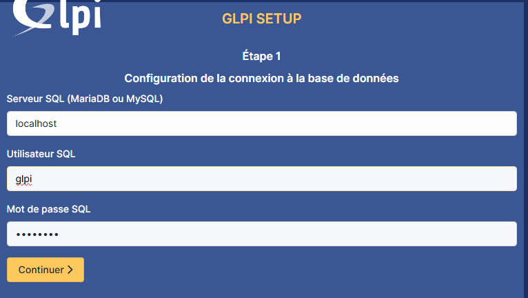

11. Sélectionner la base de données : glpi

12. Cliquer sur **Continuer**

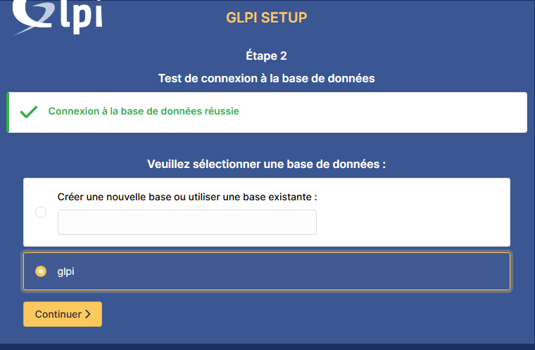

13. Attendre l'initialisation de la base de données

14. Cliquer sur **Continuer** (statistiques d'usage - optionnel)

15. Installation terminée

16. Cliquer sur **Utiliser GLPI**

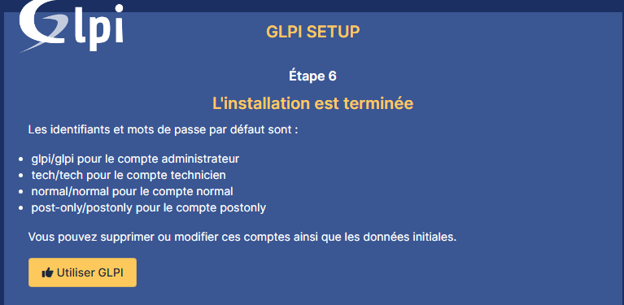

---

### Première connexion

1. **Identifiant** : glpi
2. **Mot de passe** : glpi
3. Cliquer sur **Se connecter**

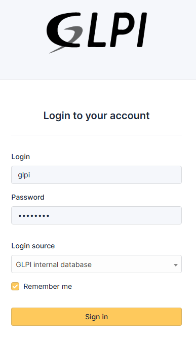

**Comptes par défaut** :
- glpi / glpi (super-admin)
- tech / tech (technicien)
- normal / normal (utilisateur)
- post-only / postonly (lecture seule)

---

### Sécurisation post-installation

1. Supprimer le dossier d'installation :

    rm -rf /var/www/html/glpi/install

2. Changer les mots de passe par défaut dans GLPI :
   - Aller dans **Administration** → **Utilisateurs**
   - Modifier chaque compte par défaut

---

### Synchronisation avec Active Directory

Cette configuration permet d'authentifier les utilisateurs via leurs comptes Active Directory. Les utilisateurs AD sont créés automatiquement dans GLPI lors de leur première connexion.

1. Aller dans **Configuration** → **Authentification** → **Annuaires LDAP**

2. Cliquer sur **+** pour ajouter un annuaire

3. Onglet **Annuaire LDAP** - Remplir les informations :
   - **Nom** : tssr.lan
   - **Serveur par défaut** : Oui
   - **Actif** : Oui
   - **Serveur** : 192.168.10.5
   - **Port** : 389
   - **Filtre de connexion** : (&(objectClass=user)(objectCategory=person))
   - **BaseDN** : DC=tssr,DC=lan
   - **Utiliser bind** : Oui
   - **DN du compte** : CN=Administrator,CN=Users,DC=tssr,DC=lan
   - **Mot de passe** : Azerty1*
   - **Champ de l'identifiant** : samaccountname
   - **Champ de synchronisation** : objectguid

4. Cliquer sur **Ajouter**

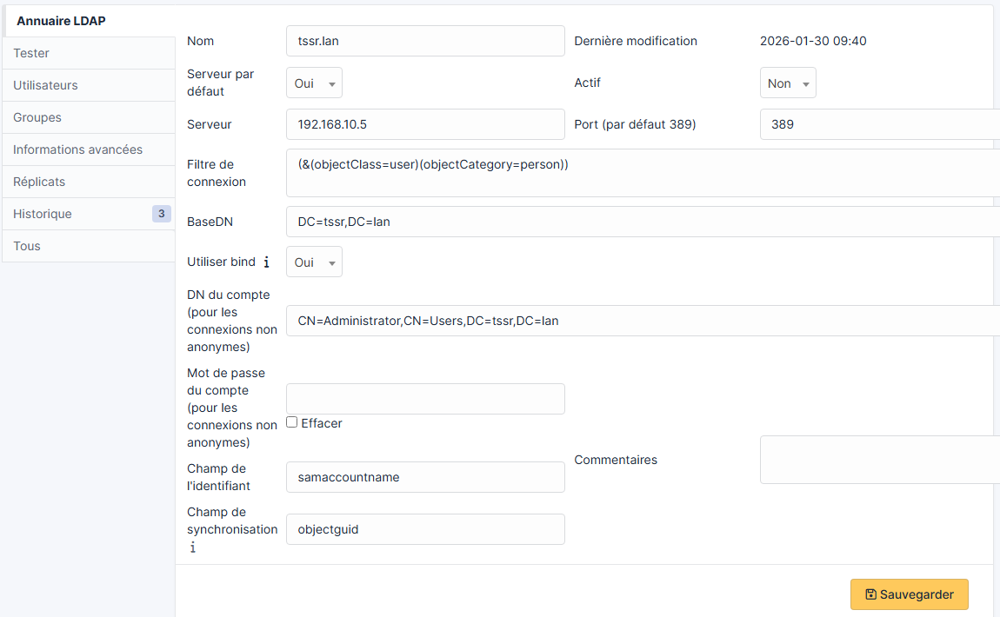

5. Ouvrir l'annuaire créé et aller dans l'onglet **Utilisateurs**

6. Configurer le mapping des attributs :
   - **Nom de famille** : sn
   - **Prénom** : givenname
   - **Courriel** : mail

7. Cliquer sur **Enregistrer**

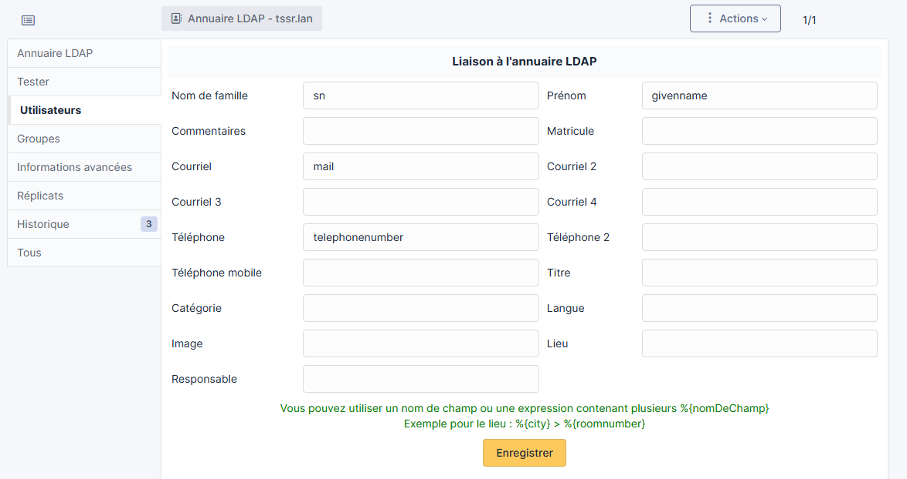

8. Tester la connexion : aller dans l'onglet **Tester** et cliquer sur **Tester**

**Note** : Avec **Serveur par défaut = Oui**, les utilisateurs AD peuvent se connecter directement à GLPI avec leur identifiant AD (ex : abel.abe) et leur mot de passe AD. Leur compte GLPI est créé automatiquement à la première connexion.

---

### Configuration du système de ticketing

**Note** : Cette configuration se fait en tant qu'administrateur (compte glpi).

1. Aller dans **Assistance** → **Tickets**

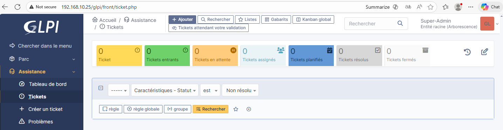

2. Aller dans **Configuration** → **Générale** → **Assistance**

3. Configurer les paramètres de ticketing selon les besoins

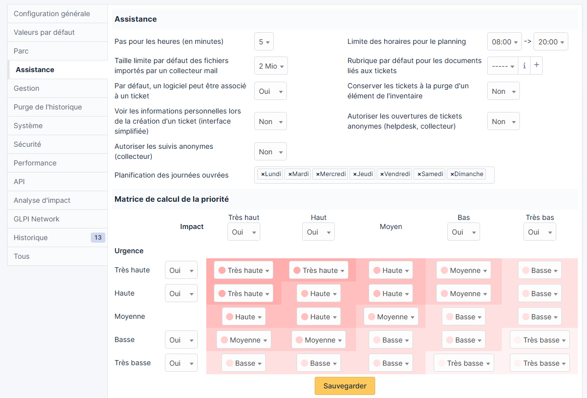

---

### Inventaire automatique des ordinateurs

La synchronisation Active Directory importe uniquement les **utilisateurs** dans GLPI. Pour importer automatiquement les **ordinateurs** (nom, OS, RAM, CPU, disques, logiciels, réseau), il est nécessaire d'installer le **GLPI Agent** sur chaque poste client.

**Note** : Pour l'installation et la configuration de GLPI Agent sur les postes clients, consulter le **USER_GUIDE_GLPI** (section "Installation de GLPI Agent").

---

## Vérification

**Note** : Cette vérification se fait depuis un **PC client** (CLIWIN01 ou CLIWIN02) avec un **compte AD**.

### Test de connexion avec un compte AD

1. Sur un PC client, ouvrir un navigateur

2. Aller à : http://192.168.10.25/glpi

3. Sur la page de connexion, entrer :
   - **Identifiant** : prenom.nom
   - **Mot de passe** : Azerty1*

4. Cliquer sur **Se connecter**

5. L'utilisateur accède à l'interface Self-Service

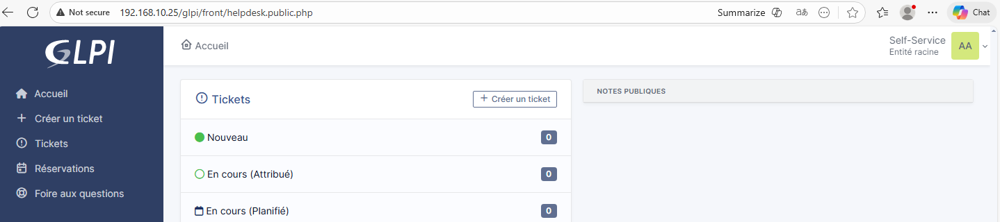

---

### Création d'un ticket de test

1. Toujours connecté en tant qu'un utilisateur standard

2. Cliquer sur **Créer un ticket**

3. Remplir les informations :
   - **Titre** : Test ticket
   - **Description** : Ticket de test

4. Cliquer sur **Soumettre le ticket**

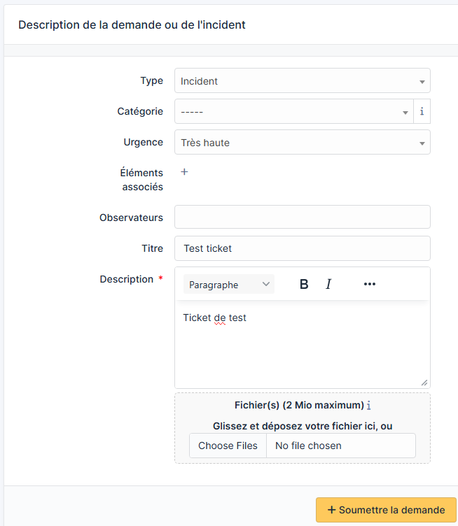

5. Vérifier que le ticket apparaît dans la liste

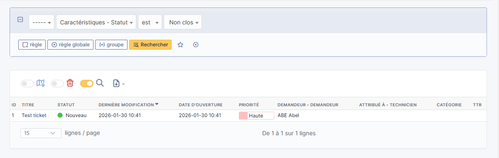

6. Vérification : se connecter en tant qu'admin et voir si le ticket apparaît bien

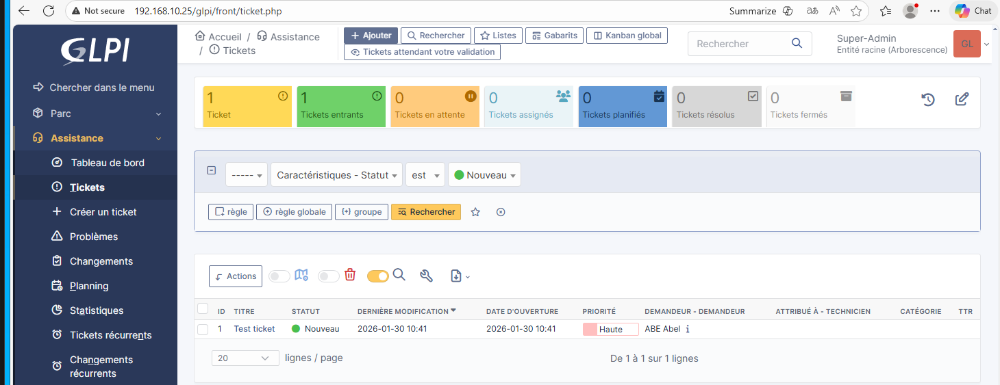

---

## FAQ

### Le DNS se réinitialise après redémarrage
- Utiliser chattr +i /etc/resolv.conf pour verrouiller le fichier
- Pour le modifier : chattr -i /etc/resolv.conf

### PHP 8.4 incompatible avec GLPI
- GLPI 10.0.17 nécessite PHP 7.4 à 8.3 (exclusive)
- Installer PHP 8.3 via le dépôt SURY

### mysql_secure_installation introuvable
- Sur Debian 13 / MariaDB 11.8, cette commande n'existe plus
- Sécuriser directement via les commandes SQL

### Page blanche lors de l'accès à GLPI
- Vérifier les logs Apache : cat /var/log/apache2/error.log
- Vérifier les permissions : chown -R www-data:www-data /var/www/html/glpi

### Erreur de connexion à la base de données
- Vérifier que MariaDB est démarré : systemctl status mariadb
- Vérifier les identifiants de connexion

### Impossible d'accéder depuis un client
- Vérifier que le client peut pinguer 192.168.10.25
- Vérifier que Apache est démarré : systemctl status apache2

### Erreur de connexion LDAP
- Vérifier que SRVWIN01 est accessible : ping 192.168.10.5
- Vérifier le BaseDN : DC=tssr,DC=lan
- Vérifier le compte : CN=Administrator,CN=Users,DC=tssr,DC=lan

### Les utilisateurs AD ne peuvent pas se connecter
- Vérifier que l'annuaire LDAP est **Actif = Oui**
- Vérifier que l'annuaire est **Serveur par défaut = Oui**
- Tester la connexion dans l'onglet **Tester**
- L'identifiant est le samaccountname (ex : abel.abe)