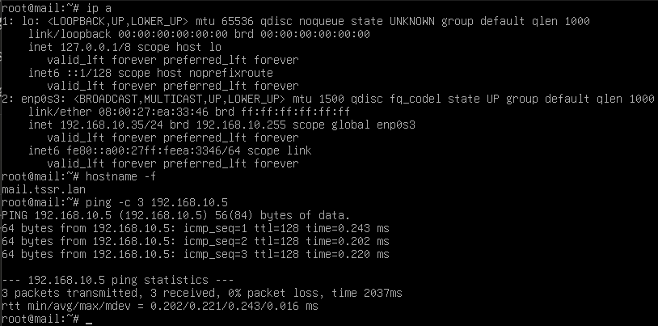
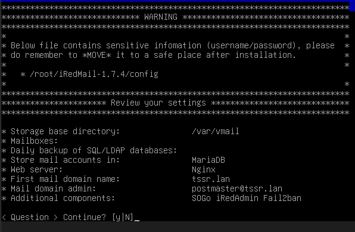
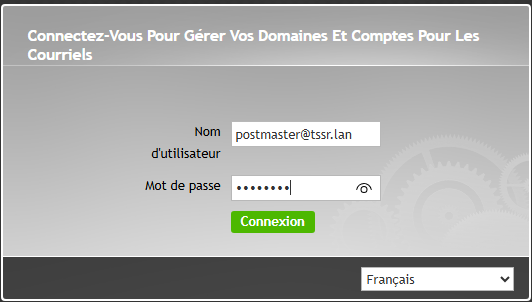
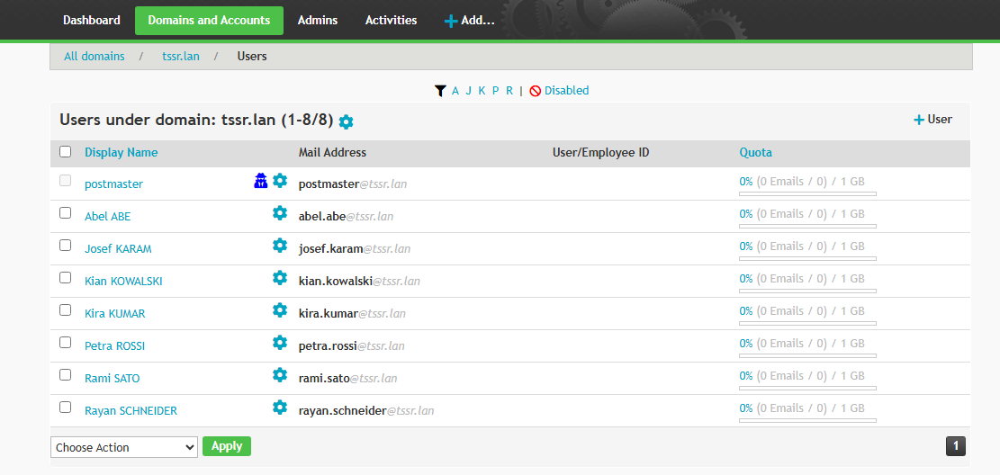
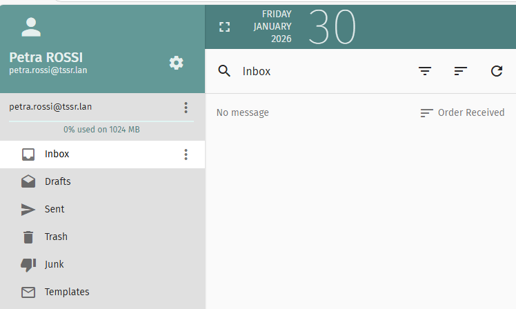
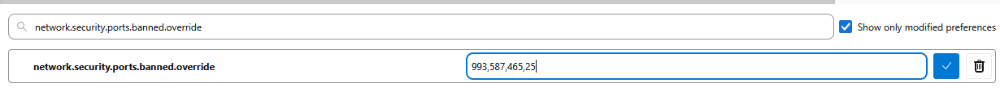
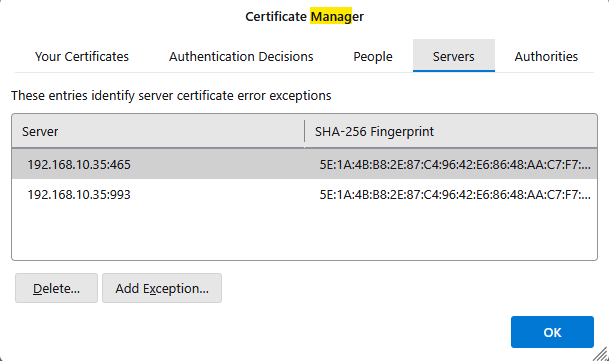
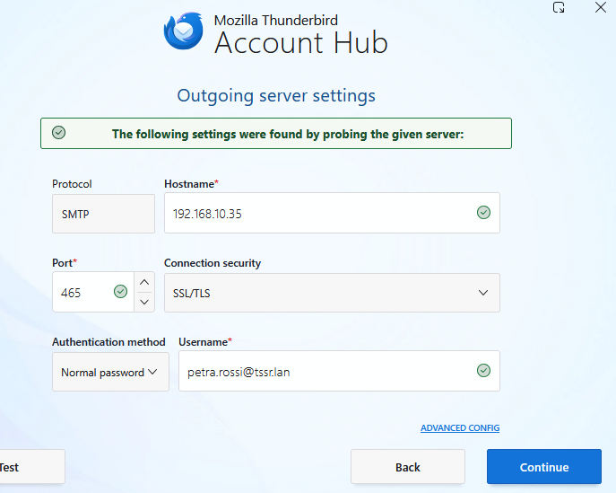
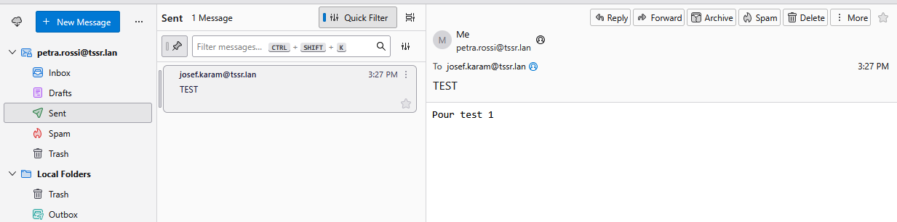
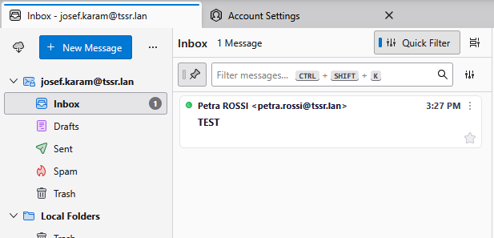

# INSTALL Messagerie

## Prérequis techniques

| Élément      | Valeur             |
| ------------ | ------------------ |
| Machine      | SRVLX01            |
| OS           | Debian 12 Bookworm |
| RAM          | 4 Go               |
| CPU          | 2                  |
| Stockage     | 40 Go              |
| Réseau       | LAN                |
| IP           | 192.168.10.35/24   |
| Passerelle   | 192.168.10.254     |
| DNS          | 192.168.10.5       |
| Hostname     | mail.tssr.lan      |
| Compte       | root               |
| Mot de passe | Azerty1*           |

---

## Configuration

### Paramètres à configurer

| Paramètre        | Valeur                          |
| ---------------- | ------------------------------- |
| Domaine mail     | tssr.lan                        |
| URL iRedAdmin    | https://192.168.10.35/iredadmin |
| URL SOGo Webmail | https://192.168.10.35/SOGo      |
| Compte admin     | postmaster@tssr.lan             |
| Mot de passe     | Azerty1*                        |

### Boîtes mail à créer

Les 7 utilisateurs AD du projet Ekoloclast :

| Adresse email            | Nom affiché     |
| ------------------------ | --------------- |
| petra.rossi@tssr.lan     | Petra ROSSI     |
| josef.karam@tssr.lan     | Josef KARAM     |
| rami.sato@tssr.lan       | Rami SATO       |
| rayan.schneider@tssr.lan | Rayan SCHNEIDER |
| kian.kowalski@tssr.lan   | Kian KOWALSKI   |
| kira.kumar@tssr.lan      | Kira KUMAR      |
| abel.abe@tssr.lan        | Abel ABE        |

---

## Étapes d'installation et configuration

### Création de la VM

1. Ouvrir VirtualBox
2. Cliquer sur **Nouvelle**
3. Configurer :
   - **Nom** : SRVLX01
   - **Type** : Linux
   - **Version** : Debian (64-bit)
   - **RAM** : 4096 Mo
   - **Disque** : 40 Go
4. Aller dans **Configuration** → **Réseau**
5. Adapter 1 : **Réseau interne** → **intnet-lan**

---

### Installation de Debian 12

1. Télécharger l'ISO : https://cdimage.debian.org/cdimage/archive/12.9.0/amd64/iso-cd/debian-12.9.0-amd64-netinst.iso

2. Démarrer la VM et installer avec les paramètres suivants :

| Paramètre              | Valeur                                       |
| ---------------------- | -------------------------------------------- |
| Langue                 | Français                                     |
| Pays                   | France                                       |
| Clavier                | Français                                     |
| Nom de machine         | mail                                         |
| Domaine                | tssr.lan                                     |
| Mot de passe root      | Azerty1*                                     |
| Utilisateur            | wilder                                       |
| Mot de passe           | Azerty1*                                     |
| Partitionnement        | Disque entier avec LVM                       |
| Sélection logiciels    | Serveur SSH + Utilitaires système uniquement |

**ATTENTION** : NE PAS installer d'interface graphique ni de serveur web.

---

### Configuration réseau

1. Éditer le fichier de configuration :

    nano /etc/network/interfaces

2. Contenu :

    auto lo
    iface lo inet loopback

    auto enp0s3
    iface enp0s3 inet static
        address 192.168.10.35
        netmask 255.255.255.0
        gateway 192.168.10.254

3. Configurer le DNS :

    nano /etc/resolv.conf

4. Contenu :

    search tssr.lan
    nameserver 192.168.10.5

5. Protéger le fichier DNS :

    chattr +i /etc/resolv.conf

6. Configurer le hostname :

    hostnamectl set-hostname mail.tssr.lan

7. Éditer le fichier hosts :

    nano /etc/hosts

8. Contenu :

    127.0.0.1       localhost
    192.168.10.35   mail.tssr.lan mail

9. Redémarrer le réseau :

    systemctl restart networking

10. Vérifier :

    ip a
    hostname -f
    ping -c 3 192.168.10.5

---

### Installation d'iRedMail

1. Mettre à jour le système :

    apt update && apt upgrade -y

2. Installer les prérequis :

    apt install -y wget bzip2 gzip

3. Télécharger iRedMail :

    cd /root
    wget https://github.com/iredmail/iRedMail/archive/refs/tags/1.7.4.tar.gz
    tar -xzf 1.7.4.tar.gz
    cd iRedMail-1.7.4

4. Lancer l'installation :

    bash iRedMail.sh

5. Répondre aux questions :

| Étape | Paramètre               | Valeur         |
| ----- | ----------------------- | -------------- |
| 1     | Chemin stockage mails   | /var/vmail     |
| 2     | Serveur web             | Nginx          |
| 3     | Backend de stockage     | MariaDB        |
| 4     | Mot de passe MySQL root | Azerty1*       |
| 5     | Premier domaine mail    | tssr.lan       |
| 6     | Mot de passe admin      | Azerty1*       |
| 7     | Composants optionnels   | SOGo, Fail2ban |

6. Confirmer avec Y et attendre (10-15 minutes)

7. Redémarrer :

    reboot

---

### Vérification des services

1. Vérifier que les services sont actifs :

    systemctl status postfix
    systemctl status dovecot
    systemctl status nginx
    systemctl status mariadb

---

### Accès à iRedAdmin

1. Depuis un client Windows, ouvrir un navigateur
2. Accéder à : https://192.168.10.35/iredadmin/
3. Accepter le certificat auto-signé
4. Se connecter :
   - **Login** : postmaster@tssr.lan
   - **Mot de passe** : Azerty1*

---

### Création des boîtes mail

1. Dans iRedAdmin, cliquer sur **Add** → **User**
2. Remplir :
   - **Mail Address** : prenom.nom@tssr.lan
   - **New password** : Azerty1*
   - **Display name** : Prénom NOM
3. Créer les 7 boîtes mail
4. Vérifier dans **Domains** → **tssr.lan** → **Users**

---

### Test webmail SOGo

1. Accéder à : https://192.168.10.35/SOGo/
2. Se connecter avec un compte utilisateur

---

### Configuration client de messagerie (Thunderbird)

#### Installation de Thunderbird

1. Sur le client Windows, ouvrir un navigateur
2. Télécharger Thunderbird : https://www.thunderbird.net/
3. Installer avec les options par défaut

#### Récupération du certificat SSL

Le serveur iRedMail utilise un certificat auto-signé. Les versions récentes de Thunderbird ne proposent plus automatiquement d'accepter ce type de certificat. Il faut le récupérer et l'importer manuellement.

1. Sur le serveur SRVLX01, afficher le certificat :

    cat /etc/ssl/certs/iRedMail.crt

2. Copier tout le contenu (de -----BEGIN CERTIFICATE----- jusqu'à -----END CERTIFICATE-----)

3. Sur le client Windows, ouvrir le Bloc-notes

4. Coller le contenu du certificat

5. Enregistrer sous : C:\Temp\iRedMail.crt

#### Import du certificat dans Thunderbird

1. Ouvrir Thunderbird
2. Menu ≡ → **Settings**
3. Dans le panneau gauche : **Privacy & Security**
4. Section "Certificates" → **Manage Certificates...**
5. Onglet **Authorities**
6. Cliquer sur **Import...**
7. Sélectionner le fichier C:\Temp\iRedMail.crt
8. Cocher **Trust this CA to identify email users**
9. Cocher **Trust this CA to identify websites**
10. Cliquer sur **OK**

#### Configuration du Config Editor

Les versions récentes de Thunderbird bloquent certains ports par défaut. Il faut les débloquer.

1. Dans Thunderbird : Menu ≡ → **Settings**
2. Dans la barre de recherche en haut, taper : config
3. Cliquer sur **Config Editor...** (ou accéder via about:config)
4. Accepter l'avertissement
5. Dans la barre de recherche, taper : network.security.ports.banned.override
6. Ce paramètre n'existe pas, il faut le créer
7. Sélectionner **String**
8. Cliquer sur le bouton **+**
9. Entrer la valeur : 993,587,465,25
10. Valider avec Entrée

#### Ajout des exceptions de sécurité

1. Retourner dans **Settings** → **Privacy & Security**
2. Section "Certificates" → **Manage Certificates...**
3. Onglet **Servers**
4. Cliquer sur **Add Exception...**
5. Dans "Location", entrer : 192.168.10.35:465
6. Cliquer sur **Get Certificate**
7. Cocher **Permanently store this exception**
8. Cliquer sur **Confirm Security Exception**
9. Répéter pour : 192.168.10.35:993

10. Cliquer sur **OK**
11. **Fermer complètement Thunderbird** et le rouvrir

#### Ajout du compte mail

1. Ouvrir Thunderbird
2. Menu ≡ → **New** → **Existing Mail Account**
3. Remplir les informations :
   - **Your full name** : Petra ROSSI
   - **Email address** : petra.rossi@tssr.lan
   - **Password** : Azerty1*
4. Cliquer sur **Configure manually**

#### Serveur entrant (IMAP)

| Paramètre           | Valeur               |
| ------------------- | -------------------- |
| Protocol            | IMAP                 |
| Hostname            | 192.168.10.35        |
| Port                | 993                  |
| Connection security | SSL/TLS              |
| Authentication      | Normal password      |
| Username            | petra.rossi@tssr.lan |

#### Serveur sortant (SMTP)

| Paramètre           | Valeur               |
| ------------------- | -------------------- |
| Hostname            | 192.168.10.35        |
| Port                | 465                  |
| Connection security | SSL/TLS              |
| Authentication      | Normal password      |
| Username            | petra.rossi@tssr.lan |

5. Cliquer sur **Re-test** puis **Done**

---

### Validation envoi/réception

1. Dans Thunderbird, connecté avec petra.rossi@tssr.lan
2. Cliquer sur **Write** pour composer un nouveau message
3. Destinataire : josef.karam@tssr.lan
4. Objet : Test messagerie
5. Corps du message : Test envoi/réception
6. Cliquer sur **Send**
7. Vérifier la réception :
   - Option A : Via webmail SOGo (https://192.168.10.35/SOGo/) avec josef.karam@tssr.lan
   - Option B : Ajouter un second compte dans Thunderbird pour josef.karam@tssr.lan

---

## FAQ

### Le fichier resolv.conf se réinitialise au redémarrage

Protéger le fichier avec chattr :

    chattr +i /etc/resolv.conf

Pour modifier ultérieurement :

    chattr -i /etc/resolv.conf
    nano /etc/resolv.conf
    chattr +i /etc/resolv.conf

### Certificat non approuvé dans le navigateur

iRedMail utilise un certificat auto-signé. Accepter l'exception de sécurité pour l'environnement lab.

### Impossible de se connecter à iRedAdmin

Vérifier les services :

    systemctl restart nginx
    systemctl restart uwsgi

### Mails non reçus

Vérifier les logs :

    tail -100 /var/log/mail.log | grep -i error

### Erreur "Connection refused" sur les ports mail

Vérifier que les services sont démarrés :

    systemctl status postfix dovecot
    systemctl restart postfix dovecot

### Thunderbird : "The certificate is not trusted because it is self-signed"

Les versions récentes de Thunderbird (102+) ont modifié la gestion des certificats auto-signés. La popup d'acceptation n'apparaît plus automatiquement pour les connexions IMAP/SMTP.

**Solution complète :**

1. **Récupérer le certificat** depuis le serveur :

    cat /etc/ssl/certs/iRedMail.crt

2. **Importer dans Thunderbird** :
   - Settings → Privacy & Security → Manage Certificates → Authorities → Import
   - Cocher les options de confiance

3. **Débloquer les ports dans Config Editor** :
   - Créer le paramètre network.security.ports.banned.override (String)
   - Valeur : 993,587,465,25

4. **Ajouter les exceptions manuellement** :
   - Settings → Privacy & Security → Manage Certificates → Servers → Add Exception
   - Ajouter : 192.168.10.35:465, 192.168.10.35:587, 192.168.10.35:993

5. **Redémarrer Thunderbird** complètement

### Thunderbird : Erreur SSL "sslv3 alert bad certificate" dans les logs serveur

Cette erreur dans /var/log/mail.log indique que Thunderbird rejette le certificat auto-signé :

    SSL_accept() failed: error:14094412:SSL routines:ssl3_read_bytes:sslv3 alert bad certificate: SSL alert number 42

**Cause** : Thunderbird n'a pas les exceptions de certificat configurées.

**Solution** : Suivre la procédure complète d'ajout des exceptions décrite ci-dessus.

### Le client Windows n'a pas accès au serveur mail (ping échoue)

Vérifier que le client est bien sur le bon réseau :

1. Sur le client Windows :

    ipconfig

2. L'adresse IP doit être en 192.168.10.x (LAN), pas en 192.168.1.x (WAN)

3. Si mauvais réseau, dans VirtualBox vérifier que la carte réseau est en **Réseau interne** "intnet-lan"

4. Renouveler l'adresse IP :

    ipconfig /release
    ipconfig /renew