# INSTALL Dossiers Partagés

## Prérequis techniques

| Élément            | Valeur                        |
| ------------------ | ----------------------------- |
| Serveur            | SRVWIN01                      |
| OS                 | Windows Server 2022 GUI       |
| Rôle requis        | AD DS, DNS, DHCP              |
| Domaine            | tssr.lan                      |
| IP serveur         | 192.168.10.5                  |
| Disque additionnel | 2ème disque (20 Go minimum)   |
| Lettre du disque   | E:                            |
| Lettre de mappage  | I:                            |
| Partage            | Individuels$ (partage masqué) |
| Chemin UNC         | \ \SRVWIN01\Individuels$      |
| Compte admin       | Administrator                 |
| Mot de passe       | Azerty1*                      |

### Prérequis à vérifier avant de commencer

- SRVWIN01 opérationnel avec AD DS, DNS, DHCP fonctionnels
- Tous les utilisateurs créés dans leurs OU respectives (Communication, DSI, RH, etc.)
- Les groupes DL_ et Grp_ configurés (méthodologie AGDLP)
- Les clients CLIWIN01 et CLIWIN02 intégrés au domaine tssr.lan

**Note** : La lettre D: est occupée par le lecteur CD/DVD VirtualBox Guest Additions. Le disque de partage utilise donc la lettre E:.

---

## Étapes d'installation et configuration

### Étape 1 : Ajouter un 2ème disque dans VirtualBox

1. Éteindre SRVWIN01
2. Dans VirtualBox, sélectionner SRVWIN01
3. Aller dans **Configuration** → **Stockage**
4. Cliquer sur le **Contrôleur SATA**
5. Cliquer sur l'icône **Ajouter un disque dur** (icône disque avec un +)
6. Cliquer sur **Créer**
7. Format : **VDI**
8. Taille : **20 Go** (dynamiquement alloué)
9. Cliquer sur **Terminer**
10. Démarrer SRVWIN01

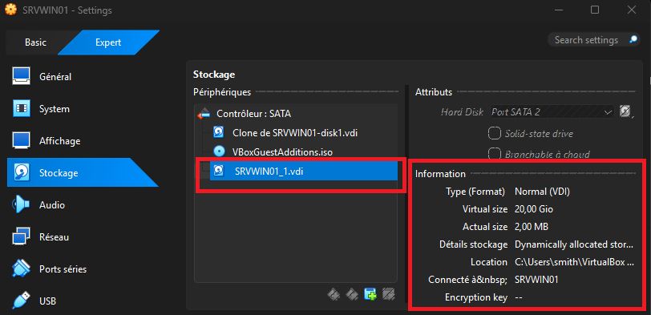

---

### Étape 2 : Initialiser et formater le disque

#### Méthode GUI (Disk Management)

1. Sur SRVWIN01, ouvrir **Disk Management** : appuyer sur **Win+R**, taper **diskmgmt.msc**, cliquer sur **OK**

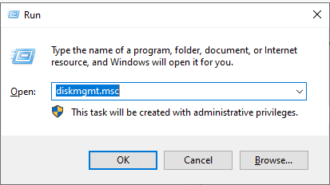

2. Le disque 1 apparaît en bas avec une barre noire **Unallocated**
3. Une fenêtre **Initialize Disk** peut s'ouvrir automatiquement
4. Si elle ne s'ouvre pas, clic droit sur **Disk 1** (à gauche, sur le label) → **Initialize Disk**
5. Sélectionner **GPT (GUID Partition Table)**
6. Cliquer sur **OK**

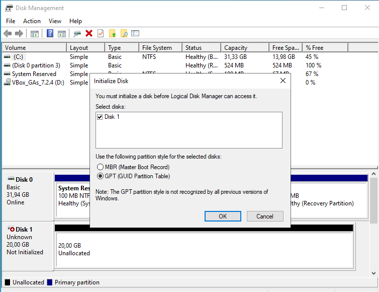

7. Clic droit sur la zone noire **Unallocated** → **New Simple Volume**
8. Cliquer sur **Next**
9. **Volume size** : laisser la taille maximale → **Next**
10. **Assign the following drive letter** : sélectionner **E** → **Next**

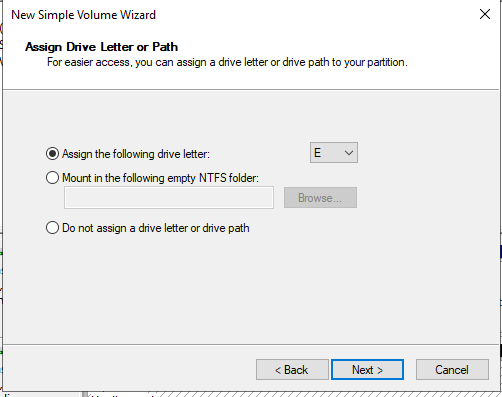

11. **Format this volume** :
    - **File system** : NTFS
    - **Volume label** : Partages
    - Cocher **Perform a quick format**
12. Cliquer sur **Next** → **Finish**

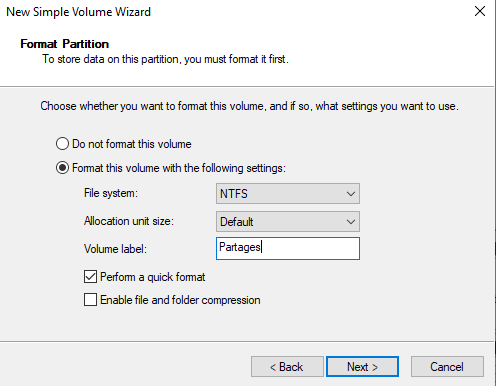

13. Le disque **E: Partages** apparaît dans Disk Management avec une barre bleue

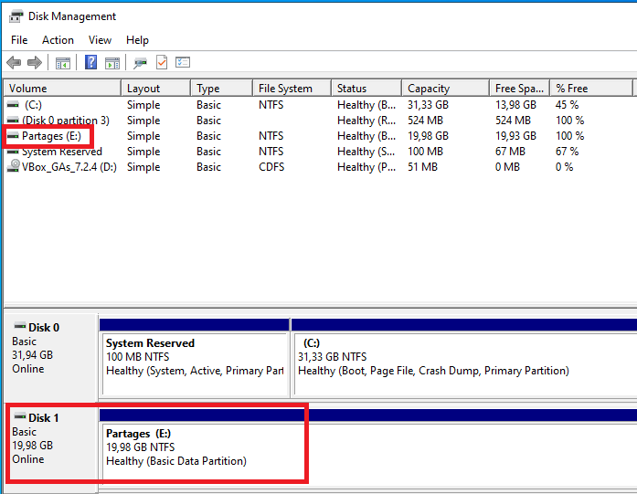

14. Vérifier que le disque **E: Partages** est accessible dans **This PC**

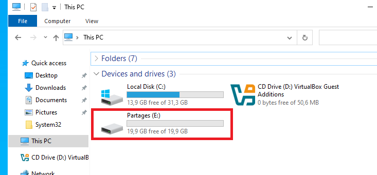

#### Méthode PowerShell

```powershell
Get-Disk
Initialize-Disk -Number 1 -PartitionStyle GPT
New-Partition -DiskNumber 1 -UseMaximumSize -DriveLetter E
Format-Volume -DriveLetter E -FileSystem NTFS -NewFileSystemLabel "Partages"
```

---

### Étape 3 : Créer le dossier racine

#### Méthode GUI

1. Ouvrir **File Explorer**
2. Aller dans **E:\\**
3. Clic droit → **New** → **Folder**
4. Nommer le dossier : **Individuels**

#### Méthode PowerShell

```powershell
New-Item -Path "E:\Individuels" -ItemType Directory
```

---

### Étape 4 : Créer un dossier par utilisateur avec les permissions NTFS

#### Méthode PowerShell (recommandée)

Cette méthode crée automatiquement un dossier par utilisateur AD et applique les permissions NTFS : seul l'utilisateur concerné et les administrateurs ont accès.

```powershell
Import-Module ActiveDirectory
$users = Get-ADUser -Filter * -SearchBase "DC=tssr,DC=lan" | Where-Object {
    $_.DistinguishedName -notlike "*Domain Controllers*" -and
    $_.DistinguishedName -notlike "*Ekoloclast_Computers*" -and
    $_.DistinguishedName -notlike "*Ekoloclast_Servers*" -and
    $_.SamAccountName -ne "Administrator" -and
    $_.SamAccountName -ne "Guest" -and
    $_.SamAccountName -ne "krbtgt"
}

foreach ($user in $users) {
    $path = "E:\Individuels\$($user.SamAccountName)"

    # Créer le dossier
    New-Item -Path $path -ItemType Directory -Force

    # Récupérer l'ACL et désactiver l'héritage
    $acl = Get-Acl $path
    $acl.SetAccessRuleProtection($true, $false)

    # SYSTEM : Contrôle total
    $acl.AddAccessRule((New-Object System.Security.AccessControl.FileSystemAccessRule(
        "SYSTEM","FullControl","ContainerInherit,ObjectInherit","None","Allow")))

    # Domain Admins : Contrôle total
    $acl.AddAccessRule((New-Object System.Security.AccessControl.FileSystemAccessRule(
        "TSSR\Domain Admins","FullControl","ContainerInherit,ObjectInherit","None","Allow")))

    # Utilisateur : Modification
    $acl.AddAccessRule((New-Object System.Security.AccessControl.FileSystemAccessRule(
        "TSSR\$($user.SamAccountName)","Modify","ContainerInherit,ObjectInherit","None","Allow")))

    Set-Acl $path $acl
}
```

Vérification :

```powershell
Get-ChildItem "E:\Individuels" | Select-Object Name
```

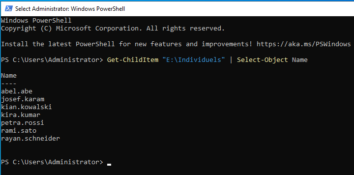

#### Méthode GUI 

Pour comprendre ce que fait le script, voici la procédure manuelle pour un dossier :

1. Dans **E:\Individuels**, créer un dossier portant le nom de login de l'utilisateur (ex: **kian.kowalski**)
2. Clic droit sur le dossier → **Properties** → onglet **Security**
3. Cliquer sur **Advanced**
4. Cliquer sur **Disable inheritance** → **Remove all inherited permissions**

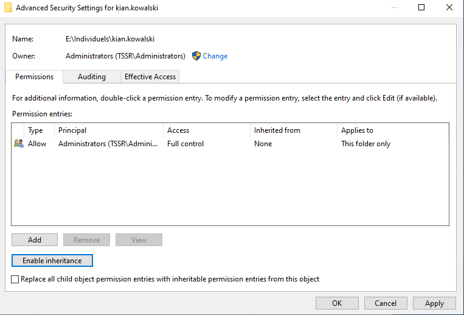

5. Cliquer sur **Add** → **Select a principal**
6. Taper : **SYSTEM** → **Full Control** → **OK**
7. Cliquer sur **Add** → **Select a principal**
8. Taper : **Domain Admins** → **Full Control** → **OK**
9. Cliquer sur **Add** → **Select a principal**
10. Taper le nom de l'utilisateur (ex: **kian.kowalski**) → **Modify** → **OK**
11. Cliquer sur **Apply** → **OK**

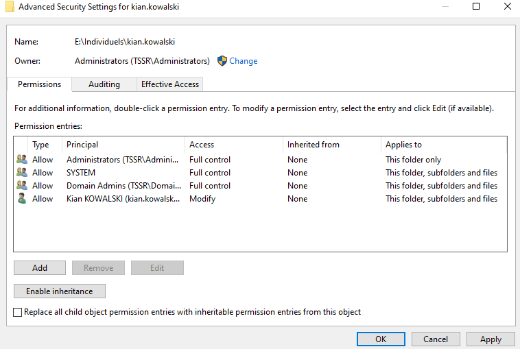

---

### Étape 5 : Créer le partage réseau

#### Méthode GUI

1. Clic droit sur le dossier **E:\Individuels** → **Properties** → onglet **Sharing**
2. Cliquer sur **Advanced Sharing**
3. Cocher **Share this folder**
4. **Share name** : **Individuels$** (le $ rend le partage masqué)

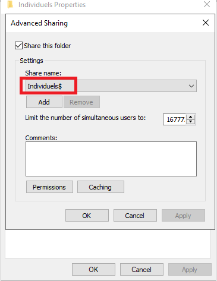

5. Cliquer sur **Permissions**
6. Supprimer **Everyone**
7. Ajouter **Domain Admins** → **Full Control**
8. Ajouter **Domain Users** → **Change** + **Read**

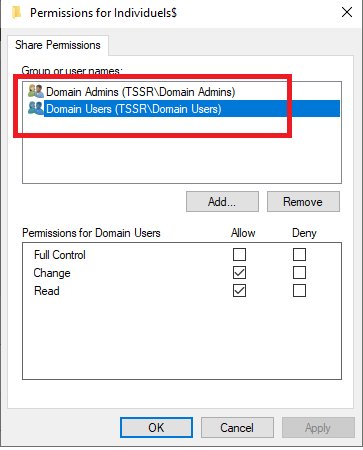

9. Cliquer sur **OK** → **OK** → **Close**

#### Méthode PowerShell

```powershell
New-SmbShare -Name "Individuels$" -Path "E:\Individuels" -FullAccess "TSSR\Domain Admins" -ChangeAccess "TSSR\Domain Users" -Description "Dossiers individuels"
```

Vérification :

```powershell
Get-SmbShare -Name "Individuels$"
```

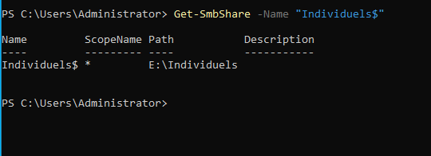

---

### Étape 6 : Créer la GPO de mappage du lecteur I:

#### Créer la GPO

1. Sur SRVWIN01, ouvrir **Group Policy Management** (gpmc.msc)
2. Aller dans **Forest** → **Domains** → **tssr.lan** → **Group Policy Objects**
3. Clic droit → **New**
4. Nom : **USER-DriveMap-Individual**
5. Cliquer sur **OK**

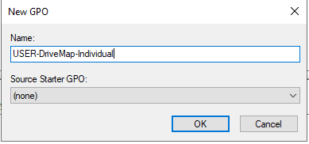

#### Configurer le mappage

6. Clic droit sur **USER-DriveMap-Individual** → **Edit**
7. Aller dans **User Configuration** → **Preferences** → **Windows Settings** → **Drive Maps**
8. Clic droit → **New** → **Mapped Drive**

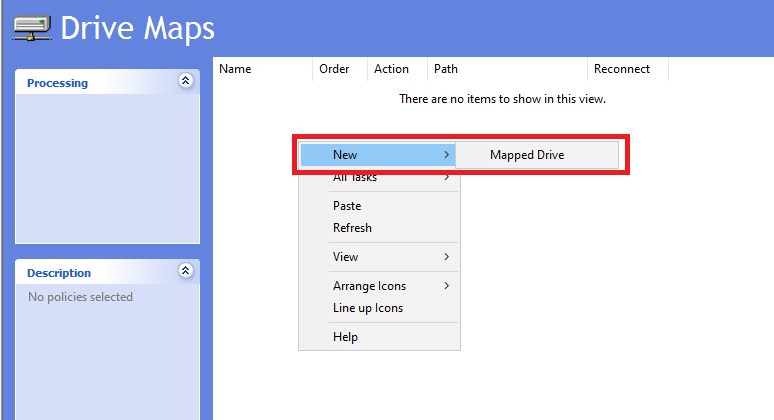

9. Configurer les paramètres :
   - **Action** : Create
   - **Location** : \\\\SRVWIN01\Individuels$\%USERNAME%
   - **Reconnect** : coché
   - **Label as** : Dossier Personnel
   - **Drive Letter** : Use → **I:**

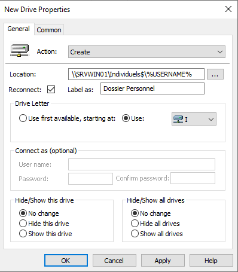

10. Cliquer sur **OK**

#### Configurer le Security Filtering (AGDLP)

11. Fermer l'éditeur de GPO
12. Dans GPMC, sélectionner **USER-DriveMap-Individual**
13. Onglet **Scope** → **Security Filtering**
14. Supprimer **Authenticated Users**
15. Ajouter les 10 groupes DL_ :
    - DL_Communication
    - DL_Direction_Financiere
    - DL_Direction_Generale
    - DL_Direction_Marketing
    - DL_DSI
    - DL_RD
    - DL_RH
    - DL_Services_Generaux
    - DL_Service_Juridique
    - DL_Ventes_et_Developpement_Commercial

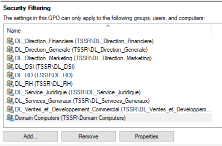

16. Onglet **Delegation** → cliquer sur **Add**
17. Ajouter **Domain Computers** → permission **Read**

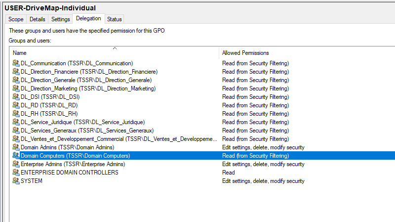

#### Méthode PowerShell (Security Filtering)

```powershell
# Retirer Authenticated Users
Set-GPPermission -Name "USER-DriveMap-Individual" -TargetName "Authenticated Users" -TargetType Group -PermissionLevel None

# Ajouter Domain Computers en Read
Set-GPPermission -Name "USER-DriveMap-Individual" -TargetName "Domain Computers" -TargetType Group -PermissionLevel GpoRead

# Ajouter les 10 DL_ en Apply
"DL_Communication","DL_Direction_Financiere","DL_Direction_Generale","DL_Direction_Marketing","DL_DSI","DL_RD","DL_RH","DL_Services_Generaux","DL_Service_Juridique","DL_Ventes_et_Developpement_Commercial" | ForEach-Object {
    Set-GPPermission -Name "USER-DriveMap-Individual" -TargetName $_ -TargetType Group -PermissionLevel GpoApply
}
```

#### Lier la GPO aux OU

18. Dans GPMC, clic droit sur chaque OU contenant des utilisateurs et cliquer sur **Link an Existing GPO** → sélectionner **USER-DriveMap-Individual** → **OK**

Les OU à lier :
- Communication
- Direction_Financiere
- Direction_Generale
- Direction_Marketing
- DSI
- RD
- RH
- Services_Generaux
- Service_Juridique
- Ventes_et_Developpement_Commercial

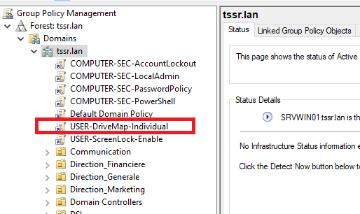

**Alternative** : lier la GPO directement à la racine **tssr.lan** pour couvrir toutes les OU. Le Security Filtering (DL_) empêche l'application aux comptes non ciblés.

---

### Étape 7 : Vérification sur un poste client

1. Se connecter sur **CLIWIN01** ou **CLIWIN02** avec un compte utilisateur du domaine (ex: kian.kowalski)
2. Ouvrir **PowerShell** ou **Invite de commandes** :

```cmd
gpupdate /force
```

3. Fermer la session et se reconnecter (ou redémarrer)
4. Ouvrir **This PC** (Ce PC)
5. Vérifier que le lecteur **I:** apparaît avec le label **Dossier Personnel**

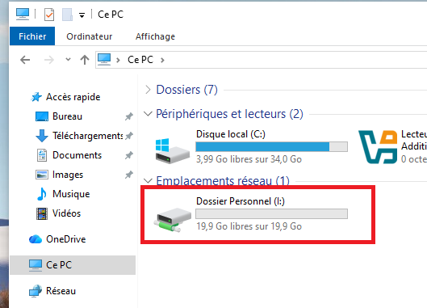

6. Double-cliquer sur **I:** pour vérifier l'accès
7. Créer un fichier test pour confirmer les droits d'écriture

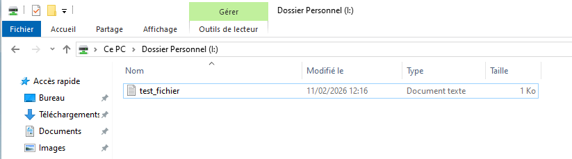

8. Vérifier côté serveur que le fichier est bien dans **E:\Individuels\kian.kowalski\\**

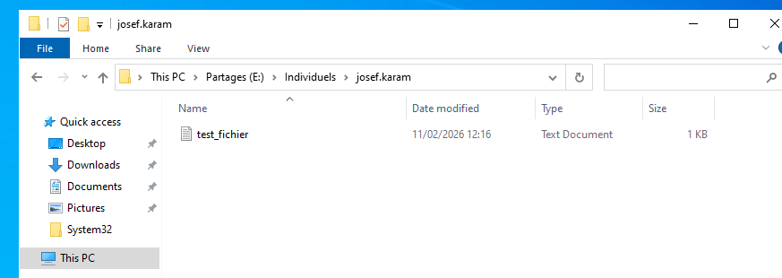

---

## Vérification

### Commandes de vérification

Sur SRVWIN01 :

```powershell
# Vérifier le volume
Get-Volume -DriveLetter E

# Vérifier le partage
Get-SmbShare -Name "Individuels$"

# Vérifier les dossiers créés
Get-ChildItem "E:\Individuels" | Select-Object Name

# Vérifier les permissions d'un dossier
Get-Acl "E:\Individuels\kian.kowalski" | Format-List

# Vérifier la GPO
Get-GPO -Name "USER-DriveMap-Individual"

# Vérifier le security filtering
Get-GPPermission -Name "USER-DriveMap-Individual" -All | Format-Table -AutoSize
```

Sur un poste client (connecté en utilisateur du domaine) :

```cmd
gpresult /r
net use
```

### Résultat attendu

| Élément                  | Attendu                                    |
| ------------------------ | ------------------------------------------ |
| Disque E:                | NTFS, label "Partages", accessible         |
| Dossier E:\Individuels   | Un sous-dossier par utilisateur AD         |
| Partage Individuels$     | Masqué, accessible via \\SRVWIN01           |
| Permissions NTFS         | Utilisateur = Modify, Admins = Full, SYSTEM = Full |
| GPO USER-DriveMap        | Liée aux OU départements, 10 DL_ en Apply |
| Lecteur I: sur client    | Visible, accessible, lecture/écriture OK   |

---

## FAQ

### Le disque n'apparaît pas après l'ajout dans VirtualBox
- Vérifier que la VM était éteinte lors de l'ajout
- Vérifier que le disque est bien sur le contrôleur SATA
- Ouvrir **diskmgmt.msc** et vérifier si le disque est visible en bas de la fenêtre

### La lettre de lecteur n'est pas disponible
- La lettre D: est utilisée par le lecteur CD/DVD VirtualBox Guest Additions
- Utiliser une autre lettre disponible (E:, F:, etc.)
- Vérifier les lettres disponibles avec : Get-Volume

### Le disque perd sa lettre après un redémarrage
- Ouvrir **diskmgmt.msc**
- Clic droit sur la partition → **Change Drive Letter and Paths**
- Cliquer sur **Add** → sélectionner la lettre → **OK**

### Le lecteur I: n'apparaît pas sur le client
- Exécuter gpupdate /force puis se déconnecter/reconnecter
- Vérifier avec gpresult /r que la GPO **USER-DriveMap-Individual** est appliquée
- Vérifier que l'utilisateur est bien membre d'un groupe Grp_ qui est lui-même membre d'un DL_
- Vérifier que Domain Computers a la permission **Read** dans l'onglet Delegation de la GPO

### Accès refusé au lecteur I:
- Vérifier les permissions NTFS du dossier de l'utilisateur sur E:\Individuels
- Vérifier les permissions du partage SMB (Domain Users doit avoir Change + Read)
- Vérifier que le nom du dossier correspond exactement au SamAccountName de l'utilisateur

### Le partage n'est pas visible dans le réseau
- C'est normal : le $ à la fin du nom rend le partage masqué
- Accéder directement via \\\\SRVWIN01\Individuels$ dans la barre d'adresse

### Comment ajouter un nouvel utilisateur après la configuration initiale
- Créer l'utilisateur dans AD (dans l'OU de son département)
- L'ajouter dans son groupe Grp_ (méthodologie AGDLP)
- Créer son dossier individuel et appliquer les permissions :

```powershell
$user = "prenom.nom"
$path = "E:\Individuels\$user"
New-Item -Path $path -ItemType Directory -Force
$acl = Get-Acl $path
$acl.SetAccessRuleProtection($true, $false)
$acl.AddAccessRule((New-Object System.Security.AccessControl.FileSystemAccessRule("SYSTEM","FullControl","ContainerInherit,ObjectInherit","None","Allow")))
$acl.AddAccessRule((New-Object System.Security.AccessControl.FileSystemAccessRule("TSSR\Domain Admins","FullControl","ContainerInherit,ObjectInherit","None","Allow")))
$acl.AddAccessRule((New-Object System.Security.AccessControl.FileSystemAccessRule("TSSR\$user","Modify","ContainerInherit,ObjectInherit","None","Allow")))
Set-Acl $path $acl
```

- Le mappage I: se fera automatiquement via la GPO à la prochaine connexion