## Prérequis techniques

| Élément         | Valeur                  |
| --------------- | ----------------------- |
| Machine         | SRVWIN01                |
| OS              | Windows Server 2022 GUI |
| Réseau          | LAN                     |
| IP              | 192.168.10.5/24         |
| Rôle FSMO       | PDC Emulator            |
| Protocole       | NTP (UDP 123)           |
| Service Windows | W32Time (Windows Time)  |
| Compte          | Administrator           |
| Mot de passe    | Azerty1*                |

---

## Principe de fonctionnement

Dans un domaine Active Directory, la synchronisation du temps suit une hiérarchie stricte :

| Niveau                  | Source de temps                      | Configuration |
| ----------------------- | ------------------------------------ | ------------- |
| PDC Emulator (SRVWIN01) | Serveurs NTP externes (Internet)     | Manuelle      |
| Autres DC (SRVWIN02/03) | PDC Emulator via hiérarchie AD       | Automatique   |
| Serveurs membres        | Contrôleur de domaine le plus proche | Automatique   |
| Postes clients          | Contrôleur de domaine le plus proche | Automatique   |

Seul le PDC Emulator doit être configuré manuellement. Toutes les autres machines du domaine se synchronisent automatiquement via le protocole NT5DS.

---

## Configuration

### Paramètres à configurer

| Paramètre              | Valeur                                                        |
| ---------------------- | ------------------------------------------------------------- |
| Serveurs NTP externes  | 0.fr.pool.ntp.org, 1.fr.pool.ntp.org, 2.fr.pool.ntp.org      |
| Type de synchronisation | NTP (manuel vers source externe)                              |
| Serveur fiable         | Oui (reliable:yes)                                            |
| Port                   | UDP 123 (sortant)                                             |
| Fuseau horaire         | Europe/Paris (Romance Standard Time)                          |

Source : pool de serveurs NTP français (fr.pool.ntp.org), recommandé par IT-Connect pour les infrastructures situées en France.

---

## Étapes de configuration

### Étape 1 : Vérifier le rôle PDC Emulator

Avant de configurer NTP, il faut confirmer que SRVWIN01 détient bien le rôle PDC Emulator.

1. Sur **SRVWIN01**, ouvrir **PowerShell** en tant qu'administrateur
2. Exécuter la commande :

    Get-ADDomain | Select-Object PDCEmulator

3. Vérifier que le résultat affiche bien SRVWIN01 comme PDC Emulator

4. Alternative : ouvrir **Active Directory Users and Computers** → clic droit sur **tssr.lan** → **Operations Masters** → onglet **PDC**

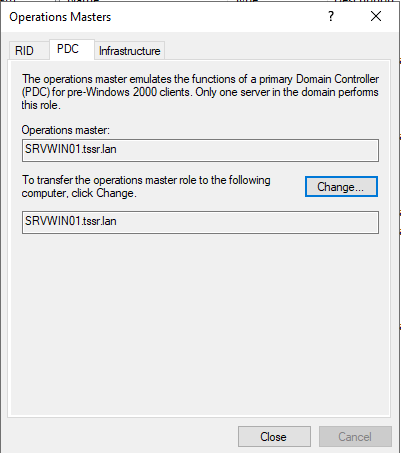

---

### Étape 2 : Vérifier la configuration NTP actuelle

1. Toujours sur **SRVWIN01** en PowerShell administrateur
2. Vérifier la source de temps actuelle :

    w32tm /query /source

3. Si le résultat affiche **Local CMOS Clock**, cela signifie que le serveur utilise son horloge locale (pas de source externe). Continuer les étapes suivantes pour configurer NTP.
4. Si le résultat affiche déjà un serveur NTP (ex : pool.ntp.org ou fr.pool.ntp.org), NTP est déjà configuré. Passer directement à l'étape 6 (GPO) si elle n'est pas encore créée.
5. Vérifier la configuration complète :

    w32tm /query /configuration

6. Vérifier le statut du service :

    w32tm /query /status

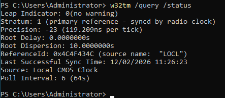

---

### Étape 3 : Vérifier la connectivité NTP (pare-feu)

La règle LAN par défaut de pfSense (LAN subnets → Any = Pass) autorise déjà le trafic sortant UDP 123. Il faut simplement vérifier que la connectivité fonctionne.

1. Sur **SRVWIN01**, tester la connectivité NTP :

    w32tm /stripchart /computer:0.fr.pool.ntp.org /dataonly /samples:3

2. Si le test retourne des valeurs de décalage (offset), la connectivité fonctionne
3. Si le test échoue, vérifier dans pfSense :
   - Aller dans **Firewall** → **Rules** → **LAN**
   - Confirmer que la règle par défaut **LAN subnets → Any → Pass** est active

---

### Étape 4 : Vérifier la synchronisation VirtualBox (optionnel)

Note : Sur les machines virtuelles, VirtualBox peut synchroniser le temps avec l'hôte physique, ce qui peut entrer en conflit avec NTP. Vérifier sur le PC hôte (la machine physique qui exécute VirtualBox) que la synchronisation de l'heure avec l'hôte est bien désactivée pour les VMs de l'infrastructure. Cette vérification se fait depuis une invite de commandes sur le PC hôte, pas depuis les VMs.

---

### Étape 5 : Configurer SRVWIN01 comme serveur NTP autoritaire

1. Sur **SRVWIN01**, ouvrir **PowerShell** en tant qu'administrateur
2. Configurer les serveurs NTP externes français (le service w32time doit être démarré) :

    w32tm /config /manualpeerlist:"0.fr.pool.ntp.org,0x8 1.fr.pool.ntp.org,0x8 2.fr.pool.ntp.org,0x8" /syncfromflags:manual /reliable:yes /update

3. Redémarrer le service Windows Time pour appliquer la configuration :

    net stop w32time
    net start w32time

4. Forcer une synchronisation immédiate :

    w32tm /resync /force

5. Vérifier que la source a changé :

    w32tm /query /source

6. Le résultat doit maintenant afficher un des serveurs NTP français (par exemple : 0.fr.pool.ntp.org)

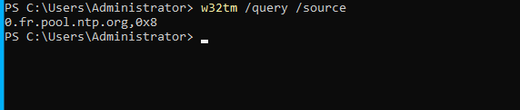

Détail des paramètres :
- **0x8** : mode client, intervalle de synchronisation spécial (SpecialPollInterval)
- **syncfromflags:manual** : le serveur utilise la liste de peers définie manuellement
- **reliable:yes** : annonce ce serveur comme source de temps fiable pour le domaine

---

### Étape 6 : Créer une GPO NTP pour le PDC (bonne pratique)

Cette GPO avec filtre WMI permet que si le rôle PDC Emulator est transféré vers SRVWIN02 ou SRVWIN03, la configuration NTP suive automatiquement le nouveau PDC.

#### 6.1 Créer le filtre WMI

1. Sur **SRVWIN01**, ouvrir **Server Manager** → **Tools** → **Group Policy Management**
2. Développer **Forest: tssr.lan** → **Domains** → **tssr.lan**
3. Clic droit sur **WMI Filters** → **New**
4. **Name** : Filtre PDC Emulator
5. **Description** : Cible uniquement le DC avec le rôle PDC Emulator
6. Cliquer sur **Add**
7. **Namespace** : root\CIMv2
8. **Query** :

    Select * from Win32_ComputerSystem where DomainRole = 5

9. Cliquer sur **OK**
10. Cliquer sur **Save**

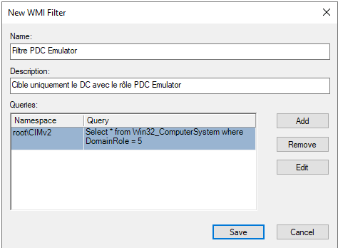

Note : DomainRole = 5 correspond au rôle de contrôleur de domaine principal (PDC Emulator).

#### 6.2 Créer la GPO

1. Dans **Group Policy Management**
2. Développer **Group Policy Objects**
3. Clic droit sur **Group Policy Objects** → **New**
4. **Name** : COMPUTER-NTP-PDCEmulator
5. Cliquer sur **OK**

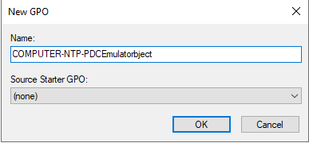

#### 6.3 Configurer la GPO

1. Clic droit sur **COMPUTER-NTP-PDCEmulator** → **Edit**
2. Aller dans **Computer Configuration** → **Policies** → **Administrative Templates** → **System** → **Windows Time Service**
3. Double-cliquer sur **Global Configuration Settings**
4. Sélectionner **Enabled**
5. Modifier **AnnounceFlags** : **5**
6. Cliquer sur **OK**

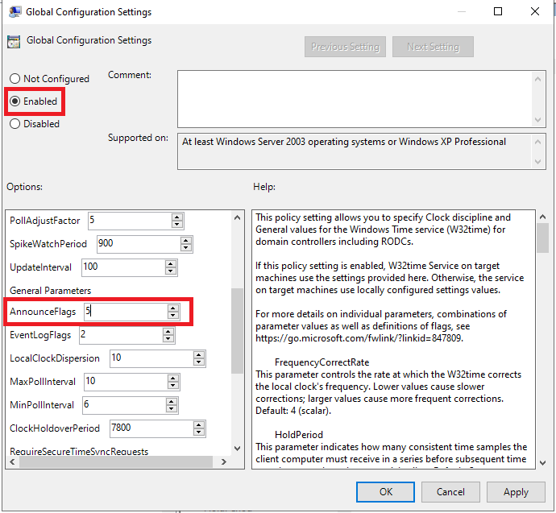

7. Aller dans **Windows Time Service** → **Time Providers**
8. Double-cliquer sur **Configure Windows NTP Client**
9. Sélectionner **Enabled**
10. **NtpServer** : 0.fr.pool.ntp.org,0x8 1.fr.pool.ntp.org,0x8 2.fr.pool.ntp.org,0x8
11. **Type** : NTP
12. **CrossSiteSyncFlags** : 2
13. **ResolvePeerBackoffMinutes** : 15
14. **ResolvePeerBackoffMaxTimes** : 7
15. **SpecialPollInterval** : 3600
16. **EventLogFlags** : 0
17. Cliquer sur **OK**

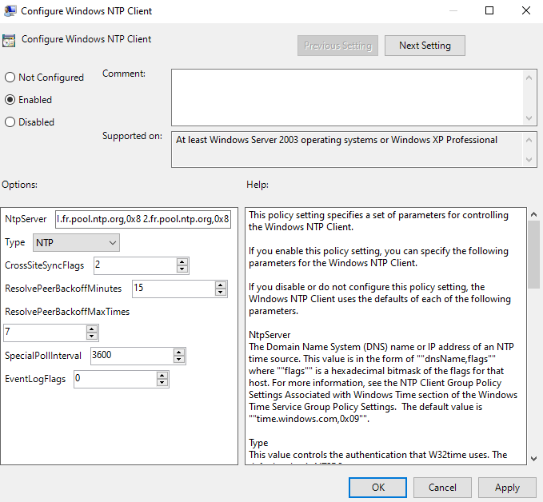

18. Double-cliquer sur **Enable Windows NTP Server**
19. Sélectionner **Enabled**
20. Cliquer sur **OK**

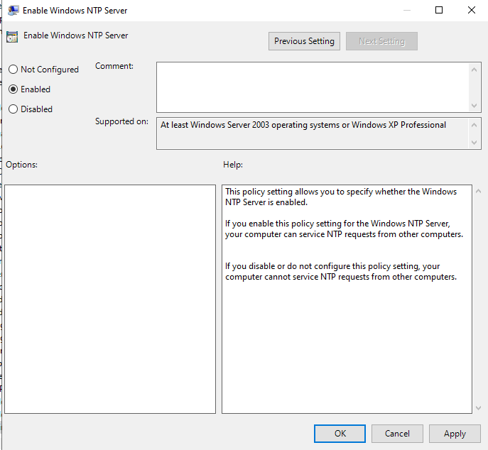

#### 6.4 Appliquer le filtre WMI

1. Fermer l'éditeur de GPO
2. Dans **Group Policy Management**, cliquer sur la GPO **COMPUTER-NTP-PDCEmulator**
3. En bas, dans la section **WMI Filtering**
4. Sélectionner le filtre : **Filtre PDC Emulator**
5. Cliquer sur **Yes** pour confirmer

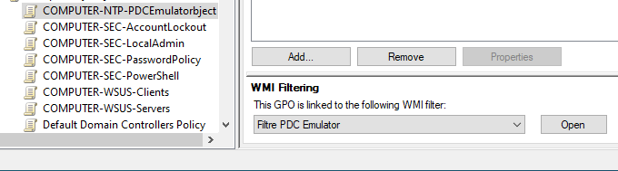

#### 6.5 Configurer le Security Filtering

1. Dans l'onglet **Scope** de la GPO
2. Section **Security Filtering** :
   - Supprimer **Authenticated Users**
   - Cliquer sur **Add** → taper **Domain Controllers** → **OK**
   - Cliquer sur **Add** → taper **Domain Computers** → **OK**
3. Aller dans l'onglet **Delegation** → **Advanced**
4. Sélectionner **Domain Computers** → cocher **Read** dans Allow
5. Cliquer sur **OK**

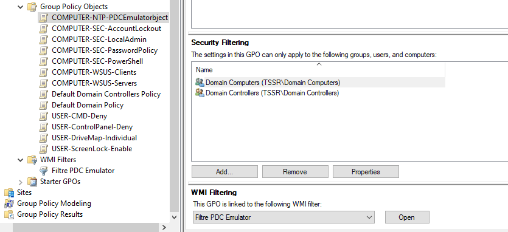

#### 6.6 Lier la GPO à l'OU Domain Controllers

1. Dans **Group Policy Management**
2. Clic droit sur l'OU **Domain Controllers** → **Link an Existing GPO**
3. Sélectionner **COMPUTER-NTP-PDCEmulator**
4. Cliquer sur **OK**

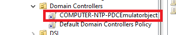

---

## Vérification

### Vérification sur SRVWIN01 (PDC)

1. Ouvrir **PowerShell** en tant qu'administrateur
- Vérifie qu'elle s'applique bien : 
      -gpupdate /force
- Puis :
    -  gpresult /r | findstr "NTP"

2. Vérifier la source de temps :

    w32tm /query /source

3. Résultat attendu : un des serveurs fr.pool.ntp.org

4. Vérifier le statut complet :

    w32tm /query /status

5. Vérifier que **Stratum** affiche 2 ou 3 (synchronisé sur une source externe)

6. Vérifier les peers :

    w32tm /query /peers

7. Les trois serveurs NTP français doivent apparaître

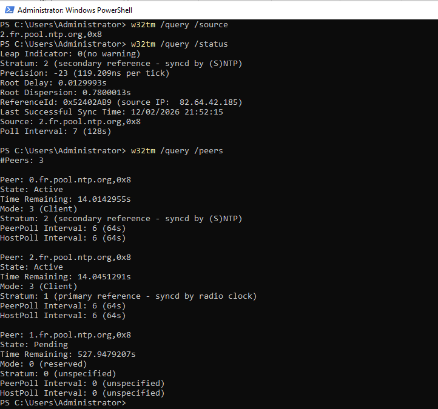

---

### Vérification sur SRVWIN02 / SRVWIN03 (DC secondaires)

1. Se connecter sur **SRVWIN02** (ou SRVWIN03)
2. Ouvrir **PowerShell** en tant qu'administrateur
3. Vérifier la source de temps :

    w32tm /query /source

4. Résultat attendu : **SRVWIN01.tssr.lan** (le PDC Emulator)

5. Vérifier le type de synchronisation :

    w32tm /query /configuration | findstr Type

6. Résultat attendu : **Type: NT5DS (Local)**

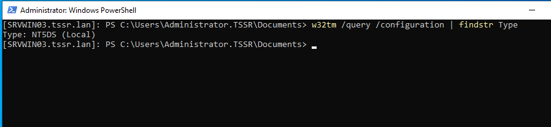

---

### Vérification sur les clients (CLIWIN01 / CLIWIN02)

1. Se connecter sur **CLIWIN01** (ou CLIWIN02)
2. Ouvrir **Invite de commandes** en tant qu'administrateur
3. Vérifier la source de temps :

    w32tm /query /source

4. Résultat attendu : le nom d'un contrôleur de domaine (SRVWIN01.tssr.lan, SRVWIN02.tssr.lan ou SRVWIN03.tssr.lan)

5. Vérifier le type :

    w32tm /query /configuration | findstr Type

6. Résultat attendu : **Type: NT5DS (Local)**

7. Forcer une resynchronisation si besoin :

    w32tm /resync

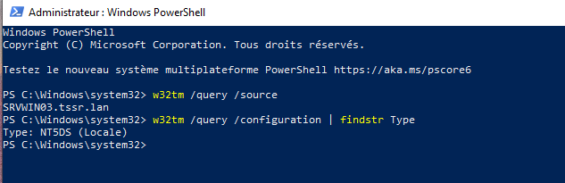

---

### Vérification dans l'Observateur d'événements

1. Sur **SRVWIN01**, ouvrir **Event Viewer**
2. Aller dans **Windows Logs** → **System**
3. Filtrer par source : **Time-Service**
4. Vérifier la présence de l'événement **ID 35** : "The time service is now synchronizing the system time with the time source..."
5. Vérifier l'absence de l'événement **ID 12** : "This machine is configured to use the domain hierarchy... but it is the AD PDC emulator..." (cet événement disparaît après configuration)

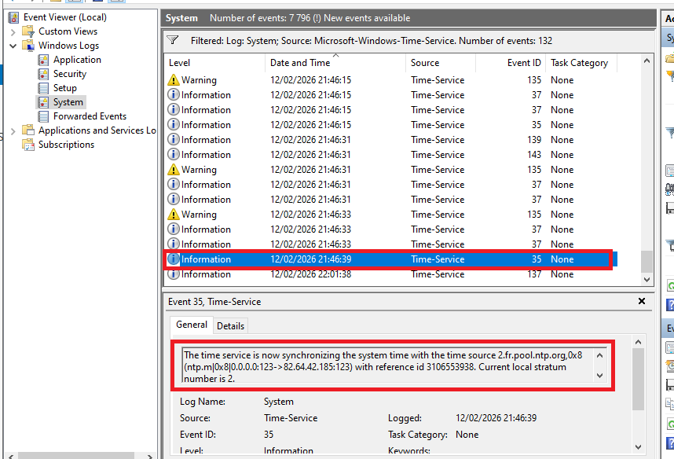

---

## FAQ

### w32tm /query /source retourne "Local CMOS Clock"

Le PDC n'est pas synchronisé avec une source externe. Relancer la configuration :

    w32tm /config /manualpeerlist:"0.fr.pool.ntp.org,0x8 1.fr.pool.ntp.org,0x8 2.fr.pool.ntp.org,0x8" /syncfromflags:manual /reliable:yes /update
    net stop w32time
    net start w32time
    w32tm /resync /force

### w32tm /stripchart retourne "error: 0x800705B4"

Le serveur NTP externe n'est pas joignable. Vérifier :
- La connectivité Internet de SRVWIN01 (ping 8.8.8.8)
- La résolution DNS (nslookup 0.fr.pool.ntp.org)
- Que la règle LAN par défaut de pfSense est active (LAN subnets → Any → Pass)
- Que le port UDP 123 n'est pas bloqué

### w32tm /config retourne "The service has not been started (0x80070426)"

La commande w32tm /config nécessite que le service w32time soit démarré. Lancer d'abord :

    net start w32time

Puis relancer la commande de configuration.

### Le client affiche "VM IC Time Synchronization Provider"

La synchronisation VirtualBox n'a pas été désactivée. Vérifier sur le PC hôte que la synchronisation de l'heure est bien désactivée pour cette VM.

### La GPO NTP ne s'applique pas

- Vérifier que le filtre WMI **Filtre PDC Emulator** est bien associé à la GPO
- Vérifier que la GPO est liée à l'OU **Domain Controllers**
- Exécuter sur le DC : gpupdate /force puis gpresult /r pour vérifier l'application
- Vérifier le Security Filtering : Domain Controllers + Domain Computers (read)

### Le Stratum affiche 0 ou "unspecified"

Le service w32time n'est pas correctement configuré. Réinitialiser complètement :

    net stop w32time
    w32tm /unregister
    w32tm /register
    net start w32time
    w32tm /config /manualpeerlist:"0.fr.pool.ntp.org,0x8 1.fr.pool.ntp.org,0x8 2.fr.pool.ntp.org,0x8" /syncfromflags:manual /reliable:yes /update
    w32tm /resync /force

### Décalage horaire important entre les machines

Un décalage supérieur à 5 minutes peut empêcher l'authentification Kerberos. Forcer la resynchronisation sur chaque machine :

    w32tm /resync /force

Si le décalage est très important (plusieurs heures), corriger d'abord l'heure manuellement sur le PDC, puis forcer la synchro sur les autres machines.