## Prérequis techniques

| Élément                | Valeur                                     |
| ---------------------- | ------------------------------------------ |
| DC principal           | SRVWIN01 (192.168.10.5)                    |
| DC redondance 1        | SRVWIN02 (192.168.10.10)                   |
| DC redondance 2        | SRVWIN03 (192.168.10.15)                   |
| OS SRVWIN02/03         | Windows Server 2022 CORE                   |
| Domaine                | tssr.lan                                   |
| Forêt                  | tssr.lan                                   |
| Niveau fonctionnel     | Windows Server 2016 (minimum)              |
| Rôles à installer      | AD DS + DNS                                |
| OU cible               | Ekoloclast_Servers                         |
| Gateway                | 192.168.10.254                             |
| DNS primaire           | 192.168.10.5 (SRVWIN01)                    |
| Masque                 | 255.255.255.0 (/24)                        |
| Compte admin           | Administrator                              |
| Mot de passe           | Azerty1*                                   |
| DSRM password          | Azerty1*                                   |

### Prérequis à vérifier avant de commencer

- SRVWIN01 opérationnel avec AD DS et DNS fonctionnels
- Le domaine tssr.lan est fonctionnel (utilisateurs, GPO, DHCP OK)
- SRVWIN02 et SRVWIN03 sont déjà installés en **Windows Server 2022 Core** (mot de passe Administrator : Azerty1*)
- Réseau des VMs configuré en **Internal Network** (intnet) dans VirtualBox
- Accès console aux 3 serveurs via VirtualBox

**Note** : SRVWIN02 et SRVWIN03 sont en **Server Core** (pas d'interface graphique). La configuration réseau se fait via **sconfig**. L'ajout des rôles se fait **à distance depuis SRVWIN01** via Server Manager.

---

## Étapes d'installation et configuration

### Étape 1 : Configurer le réseau avec sconfig (SRVWIN02)

Se connecter à la console SRVWIN02 via VirtualBox. L'écran sconfig s'ouvre automatiquement. Taper **8** (Network Settings) puis **Enter**.

1. Sélectionner l'interface réseau (généralement **1**) → **Enter**

#### Configurer l'adresse IP statique

2. Taper **1** (Set Network Adapter Address) → **Enter**
3. Taper **S** (Static) → **Enter**
4. **IP Address** : 192.168.10.10 → **Enter**
5. **Subnet mask** : 255.255.255.0 → **Enter**
6. **Default gateway** : 192.168.10.254 → **Enter**

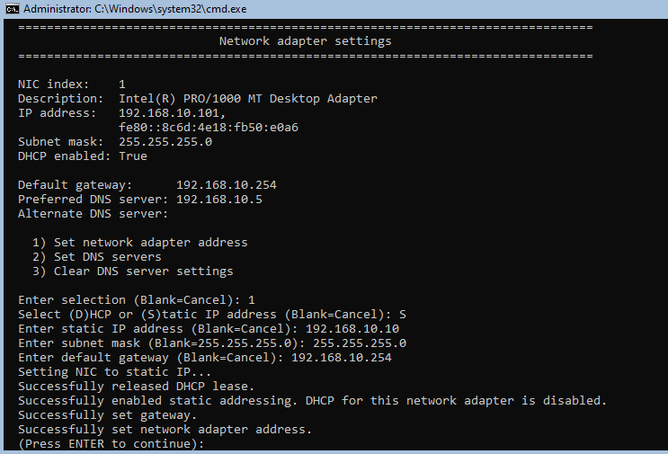

#### Configurer le DNS

7. Taper **2** (Set DNS Servers) → **Enter**
8. **Preferred DNS** : 192.168.10.5 → **Enter**

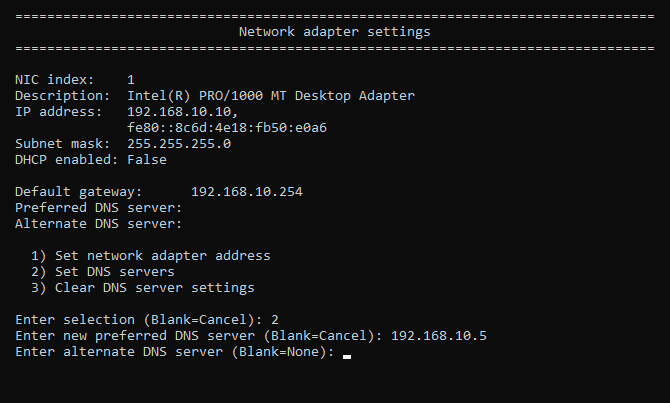

#### Vérification réseau

Quitter sconfig (taper **15** ou fermer la fenêtre) et ouvrir PowerShell :

    powershell

Vérifier la configuration IP :

    Get-NetIPAddress -InterfaceAlias "Ethernet" -AddressFamily IPv4

Tester la connectivité vers SRVWIN01 :

    Test-Connection 192.168.10.5

Tester la résolution DNS :

    Resolve-DnsName tssr.lan
    Resolve-DnsName srvwin01.tssr.lan

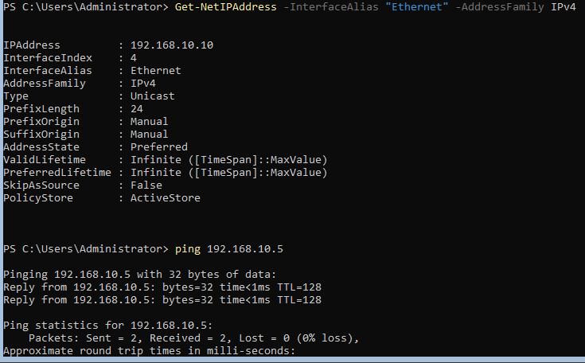

---

### Étape 2 : Renommer le serveur et joindre le domaine (SRVWIN02)

#### Méthode sconfig

1. Dans sconfig, taper **2** (Computer Name) → **Enter**
2. Nouveau nom : SRVWIN02 → **Enter**
3. Ne PAS redémarrer tout de suite → taper **No**

4. Taper **1** (Domain/Workgroup) → **Enter**
5. Taper **D** (Domain) → **Enter**
6. Nom du domaine : tssr.lan → **Enter**
7. Nom d'utilisateur autorisé : TSSR\Administrator → **Enter**
8. Mot de passe : Azerty1* → **Enter**
9. **Redémarrer** quand demandé → taper **Yes**

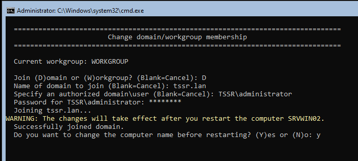

#### Méthode PowerShell (alternative)

    Add-Computer -DomainName "tssr.lan" -NewName "SRVWIN02" -Credential (Get-Credential TSSR\Administrator) -Restart

#### Vérification après redémarrage

Se reconnecter en tant que TSSR\Administrator (mot de passe : Azerty1*).

    powershell

    $env:COMPUTERNAME
    (Get-WmiObject Win32_ComputerSystem).Domain

Résultat attendu : SRVWIN02 et tssr.lan

---

### Étape 3 : Ajouter SRVWIN02 dans Server Manager (depuis SRVWIN01)

Sur **SRVWIN01**, ouvrir **Server Manager**.

1. Cliquer sur **Manage** → **Add Servers**
2. Onglet **Active Directory** → cliquer **Find Now**
3. Sélectionner **SRVWIN02** dans la liste → cliquer **→** (flèche droite) pour l'ajouter
4. Cliquer **OK**

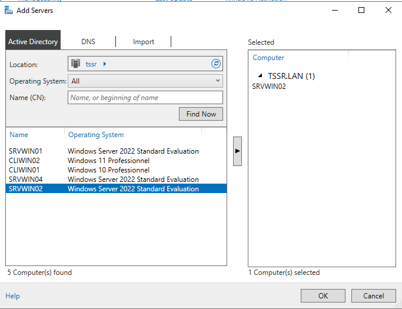

SRVWIN02 apparaît maintenant dans **All Servers** dans le volet gauche de Server Manager.

---

### Étape 4 : Installer les rôles AD DS et DNS sur SRVWIN02 (depuis SRVWIN01)

Toujours sur **SRVWIN01**, dans Server Manager :

1. Cliquer sur **Manage** → **Add Roles and Features**
2. **Before you begin** → **Next**
3. **Installation Type** → **Role-based or feature-based installation** → **Next**
4. **Server Selection** → sélectionner **SRVWIN02.tssr.lan** dans la liste → **Next**

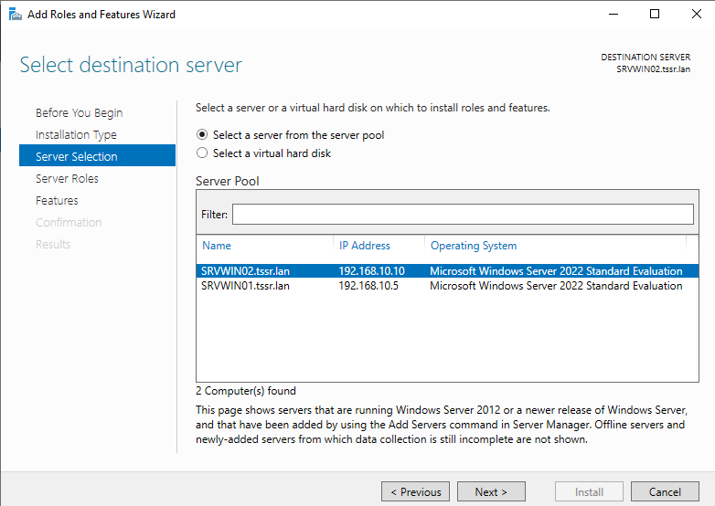

5. **Server Roles** → cocher :
   -  **Active Directory Domain Services** → cliquer **Add Features** quand demandé
   -  **DNS Server** → cliquer **Add Features** quand demandé
5. **Next** → **Next** → **Next** → **Install**
6. Attendre la fin de l'installation (quelques minutes)

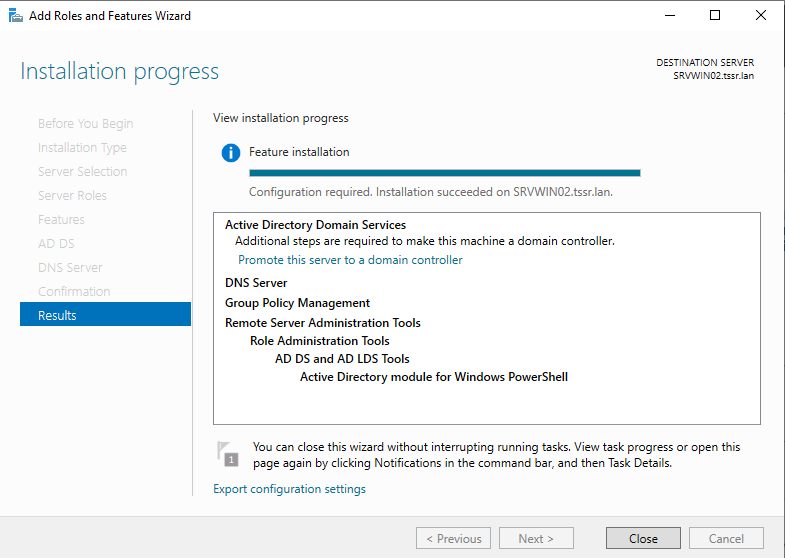

**Note** : Une fois l'installation terminée, un **drapeau jaune** (⚑) apparaît en haut à droite de Server Manager. C'est ce drapeau qui permet de lancer la promotion à l'étape suivante.

---

### Étape 5 : Promouvoir SRVWIN02 en contrôleur de domaine (depuis SRVWIN01)

Toujours sur **SRVWIN01**, dans Server Manager :

1. Cliquer sur le **drapeau jaune** (⚑) en haut à droite de Server Manager
2. Cliquer sur **Promote this server to a domain controller**

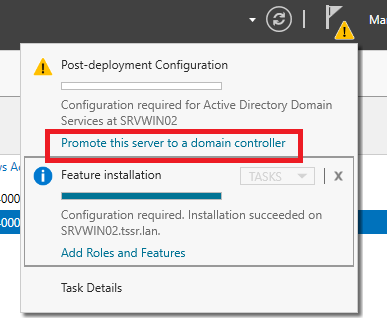

3. **Deployment Configuration** → sélectionner **Add a domain controller to an existing domain**
   - Domain : tssr.lan (déjà rempli)
   - Credentials : cliquer **Change** → TSSR\Administrator / Azerty1*
   - **Next**

4. **Domain Controller Options** :
   -  **Domain Name System (DNS) server** → coché
   -  **Global Catalog (GC)** → coché
   - **Site name** : Default-First-Site-Name
   - **DSRM password** : Azerty1* (taper 2 fois)
   - **Next**

5. **DNS Options** → **Next** (ignorer l'avertissement de délégation)
6. **Additional Options** :
   - **Replicate from** : SRVWIN01.tssr.lan
   - **Next**

7. **Paths** → laisser les chemins par défaut :
   - Database : C:\Windows\NTDS
   - Log files : C:\Windows\NTDS
   - SYSVOL : C:\Windows\SYSVOL
   - **Next**

8. **Review Options** → **Next**
9. **Prerequisites Check** → attendre la validation → **Install**

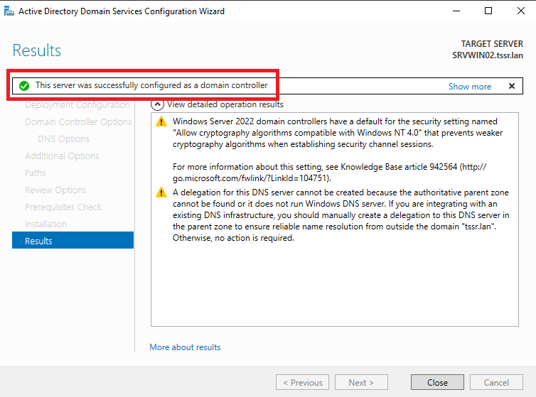

SRVWIN02 redémarre automatiquement après la promotion.

#### Vérification après redémarrage

Attendre quelques minutes que SRVWIN02 redémarre, puis vérifier depuis **SRVWIN01** (PowerShell) :

Vérifier que SRVWIN02 est bien DC :

    Get-ADDomainController -Identity "SRVWIN02"

Vérifier la réplication :

    repadmin /replsummary

Vérifier le DNS :

    Resolve-DnsName srvwin02.tssr.lan

---

### Étape 6 : Configurer le réseau et joindre le domaine (SRVWIN03)

Répéter les étapes 1 et 2 pour SRVWIN03 avec les valeurs suivantes :

| Paramètre       | Valeur SRVWIN03       |
| ---------------- | --------------------- |
| IP Address       | 192.168.10.15         |
| Subnet mask      | 255.255.255.0         |
| Default gateway  | 192.168.10.254        |
| Preferred DNS    | 192.168.10.5          |
| Computer Name    | SRVWIN03              |
| Domain           | tssr.lan              |

#### Méthode sconfig

1. **Étape 1** (réseau) : configurer IP 192.168.10.15, masque 255.255.255.0, gateway 192.168.10.254, DNS 192.168.10.5
2. **Étape 2** (nom + domaine) : renommer en SRVWIN03, joindre tssr.lan avec TSSR\Administrator
3. Redémarrer

#### Méthode PowerShell (alternative, après install OS)

Configurer l'IP :

    New-NetIPAddress -InterfaceAlias "Ethernet" -IPAddress 192.168.10.15 -PrefixLength 24 -DefaultGateway 192.168.10.254
    Set-DnsClientServerAddress -InterfaceAlias "Ethernet" -ServerAddresses 192.168.10.5

Renommer et joindre le domaine :

    Add-Computer -DomainName "tssr.lan" -NewName "SRVWIN03" -Credential (Get-Credential TSSR\Administrator) -Restart

#### Vérification après redémarrage

    powershell
    $env:COMPUTERNAME
    (Get-WmiObject Win32_ComputerSystem).Domain
    Test-Connection 192.168.10.5
    Test-Connection 192.168.10.10

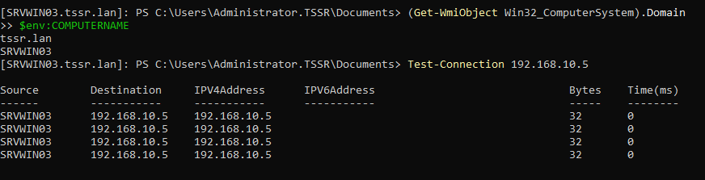

---

### Étape 7 : Ajouter SRVWIN03 dans Server Manager et installer les rôles (depuis SRVWIN01)

Sur **SRVWIN01**, dans Server Manager :

1. **Manage** → **Add Servers** → onglet **Active Directory** → **Find Now**
2. Sélectionner **SRVWIN03** → cliquer **→** → **OK**

Puis installer les rôles à distance :

3. **Manage** → **Add Roles and Features**
4. **Installation Type** → **Role-based or feature-based installation** → **Next**
5. **Server Selection** → sélectionner **SRVWIN03.tssr.lan** → **Next**
6. **Server Roles** → cocher :
   -  **Active Directory Domain Services** → **Add Features**
   -  **DNS Server** → **Add Features**
3. **Next** → **Next** → **Next** → **Install**

### Étape 8 : Promouvoir SRVWIN03 en contrôleur de domaine (depuis SRVWIN01)

Toujours sur **SRVWIN01**, dans Server Manager :

1. Cliquer sur le **drapeau jaune** (⚑) → **Promote this server to a domain controller**

2. **Deployment Configuration** → **Add a domain controller to an existing domain**
   - Domain : tssr.lan
   - Credentials : TSSR\Administrator / Azerty1*
   - **Next**

3. **Domain Controller Options** :
   -  **DNS server** → coché
   -  **Global Catalog (GC)** → coché
   - **Site name** : Default-First-Site-Name
   - **DSRM password** : Azerty1*
   - **Next**

4. **DNS Options** → **Next**
5. **Additional Options** → **Replicate from** : SRVWIN01.tssr.lan → **Next**
6. **Paths** → laisser par défaut → **Next**
7. **Review Options** → **Next**
8. **Prerequisites Check** → **Install**

SRVWIN03 redémarre automatiquement.

#### Vérification après redémarrage

Attendre quelques minutes, puis vérifier depuis **SRVWIN01** (PowerShell) :

Vérifier les 3 DC du domaine :

    Get-ADDomainController -Filter * | Select-Object Name, IPv4Address, OperatingSystem, IsGlobalCatalog | Format-Table -AutoSize

Vérifier la réplication entre les 3 DC :

    repadmin /replsummary

Résultat attendu :

    Name      IPv4Address     OperatingSystem               IsGlobalCatalog
    ----      -----------     ---------------               ---------------
    SRVWIN01  192.168.10.5    Windows Server 2022 Standard  True
    SRVWIN02  192.168.10.10   Windows Server 2022 Standard  True
    SRVWIN03  192.168.10.15   Windows Server 2022 Standard  True

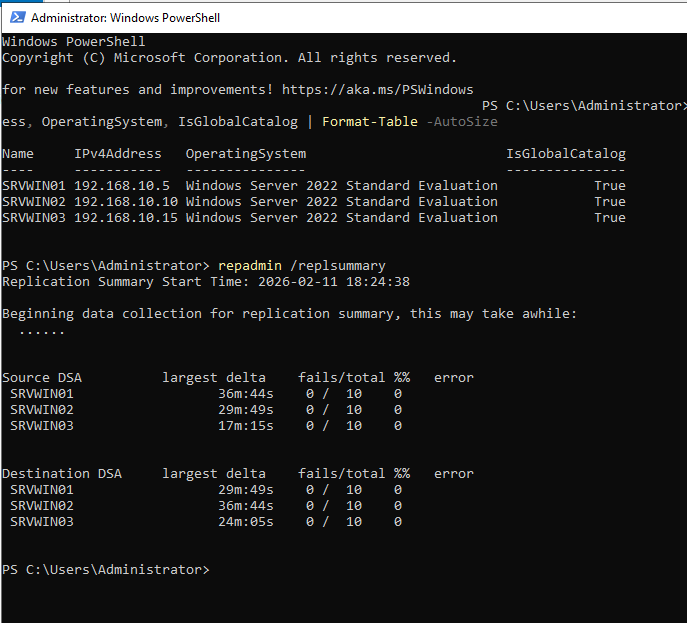

---

### Étape 9 : Configurer les DNS sur les 3 serveurs

Maintenant que SRVWIN02 et SRVWIN03 sont promus DC, chaque serveur doit pointer vers les 3 DNS pour la redondance.

#### SRVWIN01 — Méthode GUI

1. Sur **SRVWIN01**, ouvrir **ncpa.cpl** (Network Connections)
2. Clic droit sur **Ethernet** → **Properties**
3. Double-cliquer sur **Internet Protocol Version 4 (TCP/IPv4)**
4. Cliquer sur **Advanced** → onglet **DNS**
5. Ajouter les 3 adresses DNS dans l'ordre :
   - 192.168.10.5 (lui-même)
   - 192.168.10.10 (SRVWIN02)
   - 192.168.10.15 (SRVWIN03)
6. **OK** → **OK** → **Close**

#### SRVWIN02 — Méthode sconfig

Sur la console **SRVWIN02** (via VirtualBox), dans sconfig :

1. Taper **8** (Network Settings) → **Enter**
2. Sélectionner l'interface (généralement **1**) → **Enter**
3. Taper **2** (Set DNS Servers) → **Enter**
4. **Preferred DNS** : 192.168.10.10 (lui-même) → **Enter**
5. **Alternate DNS** : 192.168.10.5 → **Enter**

**Note** : sconfig ne permet d'ajouter que 2 DNS (Preferred + Alternate). Pour ajouter le 3ème DNS (192.168.10.15), exécuter dans PowerShell sur SRVWIN02 :

    Set-DnsClientServerAddress -InterfaceAlias "Ethernet" -ServerAddresses 192.168.10.10, 192.168.10.5, 192.168.10.15

#### SRVWIN03 — Méthode sconfig

Sur la console **SRVWIN03** (via VirtualBox), dans sconfig :

1. Taper **8** (Network Settings) → **Enter**
2. Sélectionner l'interface (généralement **1**) → **Enter**
3. Taper **2** (Set DNS Servers) → **Enter**
4. **Preferred DNS** : 192.168.10.15 (lui-même) → **Enter**
5. **Alternate DNS** : 192.168.10.5 → **Enter**

**Note** : Pour ajouter le 3ème DNS (192.168.10.10), exécuter dans PowerShell sur SRVWIN03 :

    Set-DnsClientServerAddress -InterfaceAlias "Ethernet" -ServerAddresses 192.168.10.15, 192.168.10.5, 192.168.10.10

**Note** : Chaque DC se met en premier dans sa propre liste DNS (best practice Microsoft).

---

### Étape 10 : Vérifier les enregistrements DNS

Sur SRVWIN01 (ou n'importe quel DC), vérifier que les enregistrements A existent pour les 3 serveurs :

    Get-DnsServerResourceRecord -ZoneName "tssr.lan" -RRType A | Where-Object { $_.HostName -like "srvwin*" } | Format-Table -AutoSize

Résultat attendu :

    HostName  RecordType  Timestamp  TimeToLive  RecordData
    --------  ----------  ---------  ----------  ----------
    srvwin01  A           ...        01:00:00    192.168.10.5
    srvwin02  A           ...        01:00:00    192.168.10.10
    srvwin03  A           ...        01:00:00    192.168.10.15

Si les enregistrements de SRVWIN02 ou SRVWIN03 n'existent pas (rare, car la promotion les crée automatiquement), les ajouter manuellement :

    Add-DnsServerResourceRecordA -ZoneName "tssr.lan" -Name "srvwin02" -IPv4Address "192.168.10.10"
    Add-DnsServerResourceRecordA -ZoneName "tssr.lan" -Name "srvwin03" -IPv4Address "192.168.10.15"

Vérification de la résolution :

    Resolve-DnsName srvwin01.tssr.lan
    Resolve-DnsName srvwin02.tssr.lan
    Resolve-DnsName srvwin03.tssr.lan

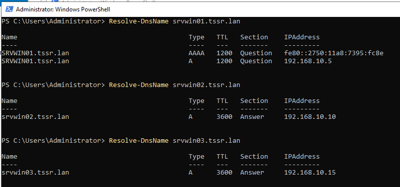

---

### Étape 11 : Vérifier l'emplacement des DC dans Active Directory

Les contrôleurs de domaine sont automatiquement placés dans l'OU **Domain Controllers**. Les objets ordinateur de SRVWIN02 et SRVWIN03 doivent y rester (c'est obligatoire pour les DC), mais nous allons vérifier que tout est correct.

**Important** : Ne PAS déplacer les DC hors de l'OU **Domain Controllers**. Cela casserait les GPO et la réplication. L'OU Ekoloclast_Servers est destinée aux serveurs membres (non-DC) comme SRVWIN04, GLPI01, etc.

    Get-ADDomainController -Filter * | Select-Object Name, ComputerObjectDN | Format-Table -AutoSize

Résultat attendu : les 3 DC sont dans OU=Domain Controllers,DC=tssr,DC=lan

Vérifier les serveurs dans Ekoloclast_Servers (serveurs membres uniquement) :

    Get-ADComputer -Filter * -SearchBase "OU=Ekoloclast_Servers,DC=tssr,DC=lan" | Select-Object Name

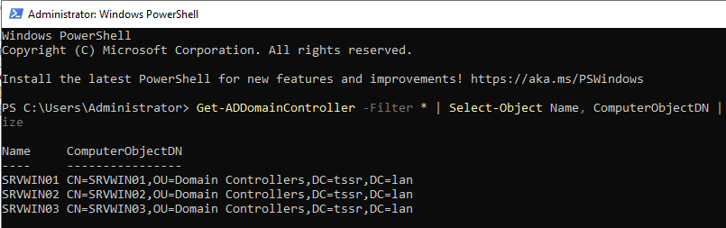

---

### Étape 12 : Répartir les rôles FSMO

Par défaut, les 5 rôles FSMO sont tous sur SRVWIN01. Pour la redondance, on les répartit sur les 3 DC.

#### Vérifier l'état actuel des rôles FSMO

    netdom query fsmo

Résultat initial (tout sur SRVWIN01) :

    Schema master               SRVWIN01.tssr.lan
    Domain naming master        SRVWIN01.tssr.lan
    PDC                         SRVWIN01.tssr.lan
    RID pool manager            SRVWIN01.tssr.lan
    Infrastructure master       SRVWIN01.tssr.lan

#### Plan de répartition FSMO

| Rôle FSMO                    | DC cible   | Justification                              |
| ---------------------------- | ---------- | ------------------------------------------ |
| Schema Master                | SRVWIN01   | Rarement utilisé, reste sur le DC principal |
| Domain Naming Master         | SRVWIN01   | Rarement utilisé, reste sur le DC principal |
| PDC Emulator                 | SRVWIN01   | Authentification, heure, GPO → DC principal |
| RID Pool Manager             | SRVWIN02   | Distribution des RID → réparti             |
| Infrastructure Master        | SRVWIN03   | Références inter-domaines → réparti        |

**Note** : Le Schema Master et le Domain Naming Master sont des rôles de forêt (rarement sollicités). Le PDC Emulator est le rôle le plus critique (authentification, verrouillage de comptes, sync NTP). Le garder sur SRVWIN01 (GUI) facilite le diagnostic.

#### Transférer le RID Pool Manager vers SRVWIN02

##### Méthode GUI

1. Sur **SRVWIN01**, ouvrir **Active Directory Users and Computers** (dsa.msc)
2. Clic droit sur **tssr.lan** → **Change Domain Controller...**
3. Sélectionner **SRVWIN02.tssr.lan** → **OK**
4. Clic droit sur **tssr.lan** → **Operations Masters...**
5. Onglet **RID** → cliquer **Change...** → **Yes** pour confirmer le transfert → **OK**

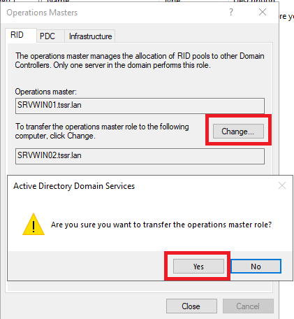

##### Méthode PowerShell

    Move-ADDirectoryServerOperationMasterRole -Identity "SRVWIN02" -OperationMasterRole RIDMaster -Confirm:$false

#### Transférer l'Infrastructure Master vers SRVWIN03

##### Méthode GUI

1. Toujours dans **dsa.msc**, clic droit sur **tssr.lan** → **Change Domain Controller...**
2. Sélectionner **SRVWIN03.tssr.lan** → **OK**
3. Clic droit sur **tssr.lan** → **Operations Masters...**
4. Onglet **Infrastructure** → cliquer **Change...** → **Yes** → **OK**

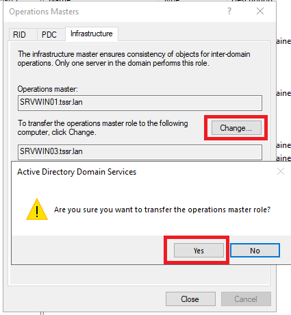

##### Méthode PowerShell

    Move-ADDirectoryServerOperationMasterRole -Identity "SRVWIN03" -OperationMasterRole InfrastructureMaster -Confirm:$false

#### Vérification finale des rôles FSMO

Exécuter sur n'importe quel DC :

    netdom query fsmo

Résultat attendu :

    Schema master               SRVWIN01.tssr.lan
    Domain naming master        SRVWIN01.tssr.lan
    PDC                         SRVWIN01.tssr.lan
    RID pool manager            SRVWIN02.tssr.lan
    Infrastructure master       SRVWIN03.tssr.lan

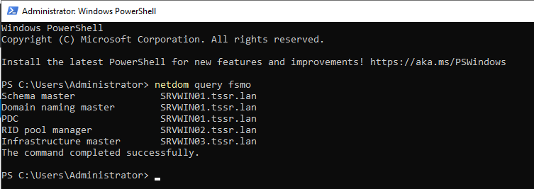

---

### Étape 13 : Mettre à jour le DHCP (DNS secondaires pour les clients)

Pour que les clients bénéficient de la redondance DNS, mettre à jour les options DHCP sur SRVWIN01.

#### Méthode GUI (sur SRVWIN01)

1. Ouvrir **DHCP Manager** (dhcpmgmt.msc)
2. Aller dans **SRVWIN01** → **IPv4** → **Scope [192.168.10.0]** → **Scope Options**
3. Double-cliquer sur **006 DNS Servers**
4. Ajouter les IP des 3 DNS dans l'ordre :
   - 192.168.10.5 (SRVWIN01 - primaire)
   - 192.168.10.10 (SRVWIN02 - secondaire)
   - 192.168.10.15 (SRVWIN03 - tertiaire)
5. Cliquer sur **OK**

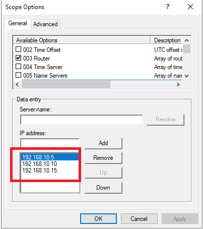

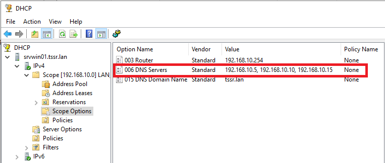

#### Méthode PowerShell

    Set-DhcpServerv4OptionValue -ScopeId 192.168.10.0 -OptionId 6 -Value 192.168.10.5, 192.168.10.10, 192.168.10.15

Vérification :

    Get-DhcpServerv4OptionValue -ScopeId 192.168.10.0 -OptionId 6

**Note** : Les clients existants recevront les nouveaux DNS au prochain renouvellement du bail DHCP, ou immédiatement avec ipconfig /renew.

---

## Vérification

### Commandes de vérification complètes

Sur n'importe quel DC :

1. Lister tous les DC du domaine :

    Get-ADDomainController -Filter * | Select-Object Name, IPv4Address, OperatingSystem, IsGlobalCatalog, Site | Format-Table -AutoSize

2. Vérifier les rôles FSMO :

    netdom query fsmo

3. Vérifier la réplication AD :

    repadmin /replsummary

4. Tester la réplication détaillée :

    repadmin /showrepl

5. Forcer la réplication entre tous les DC :

    repadmin /syncall /AdeP

6. Vérifier les enregistrements DNS :

    Get-DnsServerResourceRecord -ZoneName "tssr.lan" -RRType A | Where-Object { $_.HostName -like "srvwin*" } | Format-Table -AutoSize

7. Vérifier les options DHCP :

    Get-DhcpServerv4OptionValue -ScopeId 192.168.10.0 -OptionId 6

8. Tester la résolution DNS depuis un DC :

    Resolve-DnsName srvwin01.tssr.lan
    Resolve-DnsName srvwin02.tssr.lan
    Resolve-DnsName srvwin03.tssr.lan

Sur un poste client (CLIWIN01 ou CLIWIN02) :

Renouveler le bail DHCP pour récupérer les nouveaux DNS :

    ipconfig /renew

Vérifier les serveurs DNS configurés :

    ipconfig /all

Tester la résolution des 3 DC :

    nslookup srvwin01.tssr.lan
    nslookup srvwin02.tssr.lan
    nslookup srvwin03.tssr.lan

### Résultat attendu

| Élément                          | Attendu                                          |
| -------------------------------- | ------------------------------------------------ |
| SRVWIN02 (192.168.10.10)        | DC + DNS + GC, Server Core, domaine tssr.lan     |
| SRVWIN03 (192.168.10.15)        | DC + DNS + GC, Server Core, domaine tssr.lan     |
| Nombre de DC                     | 3 (SRVWIN01 + SRVWIN02 + SRVWIN03)              |
| Réplication AD                   | 0 failures sur repadmin /replsummary             |
| Schema Master                    | SRVWIN01.tssr.lan                                |
| Domain Naming Master             | SRVWIN01.tssr.lan                                |
| PDC Emulator                     | SRVWIN01.tssr.lan                                |
| RID Pool Manager                 | SRVWIN02.tssr.lan                                |
| Infrastructure Master            | SRVWIN03.tssr.lan                                |
| DNS A records                    | srvwin01/02/03.tssr.lan résolus                  |
| DHCP option 006                  | 3 DNS (192.168.10.5, .10, .15)                   |
| Clients DNS                      | 3 serveurs DNS après ipconfig /renew             |

---

## FAQ

### La promotion échoue avec "The specified domain does not exist"
- Vérifier que le DNS préféré pointe vers SRVWIN01 (192.168.10.5)
- Tester : Resolve-DnsName tssr.lan doit fonctionner
- Vérifier la connectivité : Test-Connection 192.168.10.5

### La promotion échoue avec "Access denied"
- S'assurer d'utiliser le compte TSSR\Administrator (et non le compte local)
- Vérifier le mot de passe : Azerty1*
- Si l'erreur persiste, vérifier que le compte n'est pas verrouillé : Get-ADUser Administrator -Properties LockedOut

### La réplication affiche des erreurs
- Forcer la réplication : repadmin /syncall /AdeP
- Vérifier les erreurs détaillées : repadmin /showrepl
- Vérifier le firewall Windows : Get-NetFirewallRule -DisplayGroup "Active Directory Domain Services" | Select-Object Name, Enabled
- Vérifier les ports AD DS : TCP 389 (LDAP), 636 (LDAPS), 3268 (GC), 88 (Kerberos), 445 (SMB), 135 (RPC)

### Comment se connecter à Server Core ?
- À la console VirtualBox : se connecter avec TSSR\Administrator
- Pour ouvrir sconfig : taper sconfig dans l'invite de commandes
- Pour ouvrir PowerShell : taper powershell dans l'invite de commandes
- Pour gérer à distance depuis SRVWIN01 : utiliser **Server Manager** → **Add Servers** → ajouter SRVWIN02/SRVWIN03

### Le transfert FSMO échoue
- Vérifier que la commande est exécutée sur le DC **cible** (celui qui doit recevoir le rôle)
- Vérifier la réplication : les DC doivent être synchronisés avant le transfert
- Alternative : utiliser ntdsutil pour transférer ou saisir (seize) les rôles

### Comment gérer les DC Core à distance ?
- Depuis **SRVWIN01** (GUI), ouvrir **Server Manager** → **Manage** → **Add Servers**
- Ajouter SRVWIN02 et SRVWIN03 par nom ou IP
- Tous les rôles (AD DS, DNS) apparaissent dans Server Manager et peuvent être gérés à distance

### Comment vérifier si un DC est opérationnel ?

    dcdiag /v /s:SRVWIN02
    dcdiag /v /s:SRVWIN03

### Que se passe-t-il si SRVWIN01 tombe en panne ?
- Les clients utilisent automatiquement SRVWIN02 ou SRVWIN03 pour le DNS
- L'authentification AD continue de fonctionner via les DC de redondance
- Les GPO continuent de s'appliquer (SYSVOL synchronisé)
- **Action requise** : si SRVWIN01 est définitivement hors service, saisir (seize) les rôles FSMO restants (Schema, Domain Naming, PDC) vers SRVWIN02 ou SRVWIN03