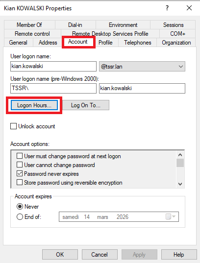
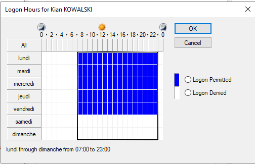
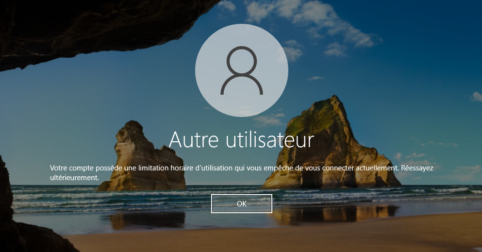

## Prérequis techniques

| Élément      | Valeur                                                                             |
| ------------ | ---------------------------------------------------------------------------------- |
| DC principal | SRVWIN01 (192.168.10.5)                                                            |
| Domaine      | tssr.lan                                                                           |
| Restriction  | Connexion autorisée de 7h00 à 20h00                                                |
| Jours        | Lundi à Samedi                                                                     |
| Dimanche     | Connexion interdite                                                                |
| Cible        | Utilisateurs standards uniquement                                                  |
| Exclus       | Administrator, petra.rossi (Manager DSI), josef.karam (Manager Direction Générale) |

---

## Étape 1 — Ouvrir Active Directory Users and Computers

Sur **SRVWIN01** :

1. Ouvrir **Active Directory Users and Computers** (dsa.msc)

---

## Étape 2 : Configurer les horaires de connexion pour chaque utilisateur standard

La configuration doit être faite **utilisateur par utilisateur**. Il n'existe pas de méthode GUI pour appliquer les horaires en masse ou par groupe.

### Utilisateurs concernés

| OU                   | Utilisateur         | Fonction               | Restriction |
| -------------------- | ------------------- | ---------------------- | ----------- |
| DSI                  | rami.sato           | Développeur            | Oui         |
| DSI                  | rayan.schneider     | Développeur            | Oui         |
| Direction_Generale   | kian.kowalski       | Secrétaire             | Oui         |
| Direction_Generale   | kira.kumar          | Assistant de direction  | Oui         |
| Communication        | abel.abe            | Employé                | Oui         |

### Utilisateurs exclus (managers et admins)

| OU                 | Utilisateur   | Fonction             | Restriction |
| ------------------ | ------------- | -------------------- | ----------- |
| DSI                | petra.rossi   | DSI Manager          | Non         |
| Direction_Generale | josef.karam   | Directeur adjoint    | Non         |

### Procédure pour un utilisateur

1. Dans le volet gauche, naviguer dans l'OU du département (ex : tssr.lan → DSI)
2. Double-cliquer sur l'utilisateur (ex : rami.sato)
3. Aller dans l'onglet **Account**
4. Cliquer sur le bouton **Logon Hours...**

5. Par défaut, toutes les cases sont en **bleu** (connexion autorisée 24h/24, 7j/7)

#### Bloquer le dimanche entièrement

6. Sélectionner toute la ligne **Sunday** :
   - Cliquer sur le label **Sunday** à gauche pour sélectionner toute la ligne
   - Cliquer sur **Logon Denied**
   - Résultat : toute la ligne dimanche est **blanche**

#### Bloquer les heures de 20h00 à 7h00 du lundi au samedi

7. Sélectionner les cases de **20:00 à 23:00** du lundi au samedi :
   - Cliquer sur **20:00** du **Monday**, maintenir **Shift** et cliquer sur **23:00** du **Saturday**
   - Cliquer sur **Logon Denied**
8. Sélectionner les cases de **0:00 à 6:00** du lundi au samedi :
   - Cliquer sur **0:00** du **Monday**, maintenir **Shift** et cliquer sur **6:00** du **Saturday**
   - Cliquer sur **Logon Denied**

9. Vérifier le résultat :
   - **Dimanche** : entièrement **blanc** (interdit)
   - **Lundi à Samedi** : cases **bleues** uniquement de **7:00 à 20:00**
   - **Lundi à Samedi** : cases **blanches** de **20:00 à 7:00**
10. Cliquer **OK** → **Apply** → **OK**

### Répéter pour les 5 utilisateurs standards

Répéter la procédure (étapes 1 à 10) pour :

| #   | OU                 | Utilisateur     |
| --- | ------------------ | --------------- |
| 1   | DSI                | rami.sato       |
| 2   | DSI                | rayan.schneider |
| 3   | Direction_Generale | kian.kowalski   |
| 4   | Direction_Generale | kira.kumar      |
| 5   | Communication      | abel.abe        |

**Ne PAS configurer** : petra.rossi, josef.karam et Administrator (accès 24h/24, 7j/7).

---

## Méthode alternative  Script PowerShell

Un script interactif est disponible pour appliquer les restrictions en masse.

### Prérequis script

- Tous les DCs de réplication (SRVWIN02, SRVWIN03) doivent être **allumés** avant exécution
- Si les DCs de réplication sont éteints, forcer la synchronisation : repadmin /syncall SRVWIN01 /AdeP

### Exécution

1. Copier le script Set-LogonHoursRestriction.ps1 dans C:\Scripts\ sur SRVWIN01
2. Ouvrir PowerShell en administrateur

Commandes :

    Set-ExecutionPolicy -Scope Process -ExecutionPolicy Bypass
    cd C:\Scripts
    .\Set-LogonHoursRestriction.ps1

3. Dans le menu : choisir **[1] Appliquer des restrictions**
4. Ciblage : choisir **[2] Sélectionner des OUs spécifiques**
5. Sélectionner les OUs contenant les utilisateurs standards
6. Configurer : Heure début **7**, Heure fin **20**, Jours **Lundi-Samedi**
7. Confirmer et appliquer

---

## Vérification

### Vérifier via PowerShell

Commande de vérification pour les 7 utilisateurs :

    $users = @("petra.rossi","josef.karam","rami.sato","rayan.schneider","kian.kowalski","kira.kumar","abel.abe")
    foreach ($u in $users) {
        $ad = Get-ADUser $u -Properties logonHours
        $lh = if ($null -eq $ad.logonHours) { "Aucune restriction" } else { "Restriction active" }
        Write-Host "$u : $lh"
    }

### Résultat attendu de la vérification

    petra.rossi : Aucune restriction
    josef.karam : Aucune restriction
    rami.sato : Restriction active
    rayan.schneider : Restriction active
    kian.kowalski : Restriction active
    kira.kumar : Restriction active
    abel.abe : Restriction active

### Vérifier via ADUC (GUI)

1. Dans dsa.msc, double-cliquer sur un utilisateur standard
2. Onglet **Account** → **Logon Hours...**
3. Vérifier :
   - Dimanche : entièrement **blanc**
   - Lundi à Samedi : **bleu** de 7:00 à 20:00 uniquement

### Test fonctionnel

1. Sur CLIWIN01, tenter de se connecter avec un utilisateur standard **en dehors des heures autorisées** (avant 7h, après 20h, ou le dimanche)
2. Résultat attendu : message d'erreur indiquant que le compte est restreint

**Note** : La restriction empêche les **nouvelles connexions** en dehors des horaires. Les sessions déjà ouvertes ne sont pas automatiquement déconnectées sauf si une GPO de déconnexion forcée est configurée (voir FAQ).

---

## Résultat attendu

| Élément                      | Attendu                                    |
| ---------------------------- | ------------------------------------------ |
| Horaires autorisés           | 7h00 à 20h00                               |
| Jours autorisés              | Lundi à Samedi                             |
| Dimanche                     | Connexion interdite                        |
| Utilisateurs standards       | Restriction active (5 utilisateurs)        |
| Managers                     | Aucune restriction (petra.rossi, josef.karam) |
| Administrator                | Aucune restriction (accès 24h/24, 7j/7)   |
| Connexion avant 7h           | Refusée                                    |
| Connexion après 20h          | Refusée                                    |
| Connexion le dimanche        | Refusée                                    |

---

## FAQ

### Comment forcer la déconnexion en dehors des horaires ?

Sur SRVWIN01, ouvrir Group Policy Management (gpmc.msc) :

1. Créer une nouvelle GPO : COMPUTER-SEC-ForceLogoff
2. Edit → Computer Configuration → Policies → Windows Settings → Security Settings → Local Policies → Security Options
3. Network security: Force logoff when logon hours expire → Enabled
4. Lier la GPO aux OUs départementales

### Les horaires sont en UTC ou en heure locale ?

Les logon hours dans AD sont stockés en **UTC**. Windows convertit automatiquement en heure locale du DC. Si le fuseau horaire du DC est correctement configuré (vérifié lors de la configuration NTP), les horaires affichés en GUI correspondent à l'heure locale.

### Comment remettre un utilisateur en accès 24h/24 ?

1. Double-cliquer sur l'utilisateur → onglet Account → Logon Hours...
2. Sélectionner toutes les cases (cliquer sur le coin supérieur gauche)
3. Cliquer sur **Logon Permitted**
4. OK

### Le script ne détecte pas tous les utilisateurs

Si des DCs de réplication (SRVWIN02, SRVWIN03) sont configurés mais **éteints**, les requêtes AD peuvent ne pas trouver certains utilisateurs. Solutions :

- Allumer tous les DCs avant d'exécuter des scripts AD
- Forcer la réplication : repadmin /syncall SRVWIN01 /AdeP