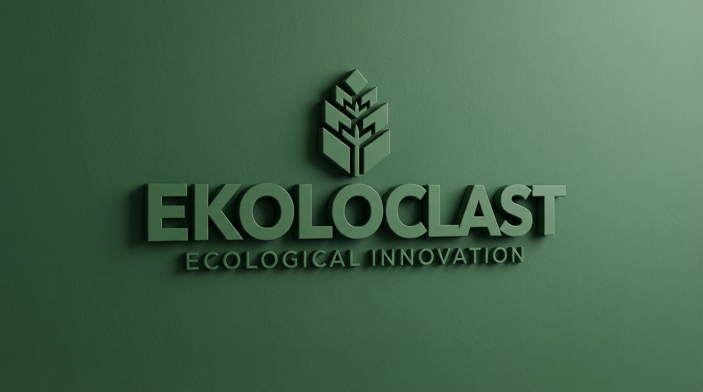

# **Ekoloclast**🌿

## Table des matières 

1. [Présentation du projet](#1-présentation-du-projet) 
2. [Introduction](#2-introduction) 
3. [Choix techniques](#3-choix-techniques) 
4. [Difficultés rencontrées](#4-difficultés-rencontrées) 
5. [Solutions trouvées](#5-solutions-trouvées) 
6. [Améliorations possibles](#6-améliorations-possibles)

## 1. Présentation du projet
## 2. Introduction
## 3. Choix techniques
## 4. Difficultés rencontrées
## 5. Solutions trouvées
## 6. Améliorations possibles