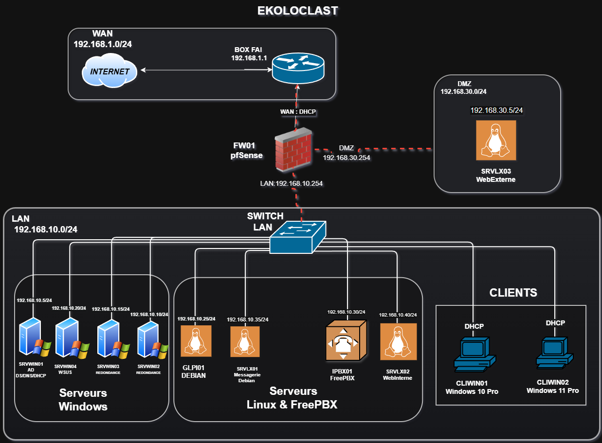

## Schéma actuel 

## Réseaux

| Réseau | Plage | Masque | Passerelle | Usage |
| ------ | ----- | ------ | ---------- | ----- |
| WAN | 192.168.1.0/24 | 255.255.255.0 | 192.168.1.1 | Accès Internet |
| LAN | 192.168.10.0/24 | 255.255.255.0 | 192.168.10.254 | Serveurs, clients, services internes |
| DMZ | 192.168.30.0/24 | 255.255.255.0 | 192.168.30.254 | Serveur web externe |

## Éléments du schéma

| Machine  | IP                                                       | Fonction                        | Réseau          |
| -------- | -------------------------------------------------------- | ------------------------------- | --------------- |
| FW01     | WAN : DHCP / LAN : 192.168.10.254 / DMZ : 192.168.30.254 | Pare-feu (pfSense)              | WAN / LAN / DMZ |
| SRVWIN01 | 192.168.10.5/24                                          | AD DS + DNS + DHCP              | LAN             |
| SRVWIN02 | 192.168.10.10/24                                         | Redondance  (Core)              | LAN             |
| SRVWIN03 | 192.168.10.15/24                                         | Redondance  (Core)              | LAN             |
| SRVWIN04 | 192.168.10.20/24                                         | WSUS                            | LAN             |
| GLPI01   | 192.168.10.25/24                                         | GLPI                            | LAN             |
| IPBX01   | 192.168.10.30/24                                         | VoIP (FreePBX)                  | LAN             |
| SRVLX01  | 192.168.10.35/24                                         | Messagerie (iRedMail)           | LAN             |
| SRVLX02  | 192.168.10.40/24                                         | Serveur web interne (WordPress) | LAN             |
| SRVLX03  | 192.168.30.5/24                                          | Serveur web externe (Apache)    | DMZ             |
| CLIWIN01 | DHCP                                                     | Client Windows 10               | LAN             |
| CLIWIN02 | DHCP                                                     | Client Windows 11               | LAN             |