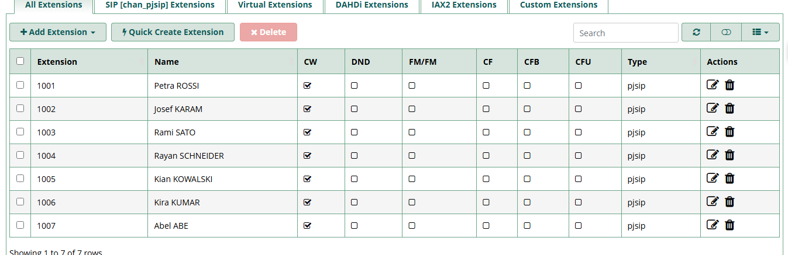
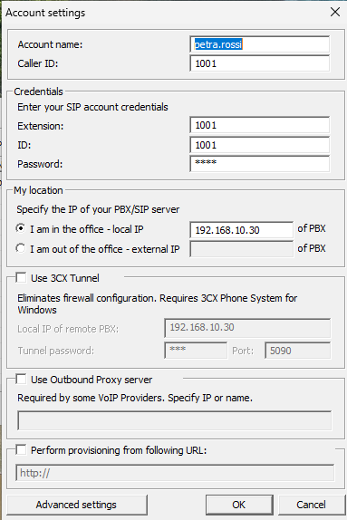
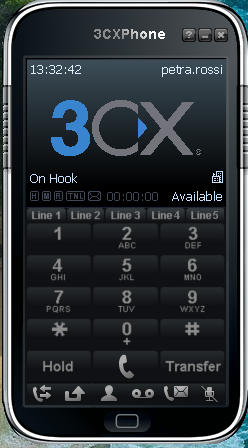
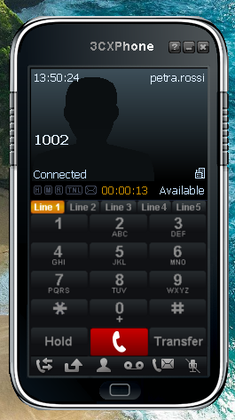
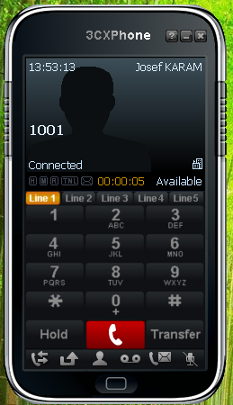
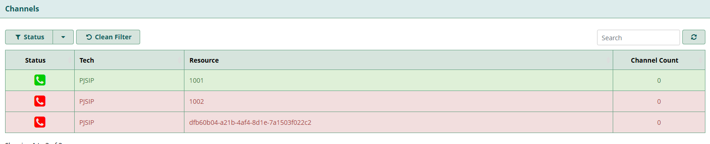
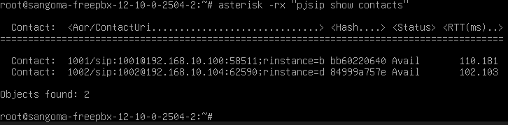

## Prérequis techniques

| Élément      | Valeur           |
| ------------ | ---------------- |
| Machine      | IPBX01           |
| OS           | FreePBX 17       |
| RAM          | 2 Go             |
| CPU          | 1                |
| Stockage     | 30 Go minimum    |
| Réseau       | LAN              |
| IP           | 192.168.10.30/24 |
| Passerelle   | 192.168.10.254   |
| DNS          | 192.168.10.5     |
| Compte       | root / sangoma   |
| Mot de passe | Azerty1*         |

---

## Téléchargement

Télécharger l'ISO FreePBX depuis le site officiel :
- URL : https://www.freepbx.org/downloads/
- Version : FreePBX 17 (basé sur Debian 12)
- Fichier : SNGDEB-PBX17-amd64-12-10-0-2504-1.iso

---

## Configuration

### Paramètres serveur

| Paramètre            | Valeur               |
| -------------------- | -------------------- |
| URL d'accès          | http://192.168.10.30 |
| Compte admin FreePBX | admin / Azerty1*     |
| Email notifications  | admin@tssr.lan       |
| Softphone client     | 3CX Phone (legacy)   |

### Lignes VoIP à créer

| Extension | Nom             | Département        | Secret |
| --------- | --------------- | ------------------ | ------ |
| 1001      | Petra ROSSI     | DSI                | 1001   |
| 1002      | Josef KARAM     | Direction Générale | 1002   |
| 1003      | Rami SATO       | DSI                | 1003   |
| 1004      | Rayan SCHNEIDER | DSI                | 1004   |
| 1005      | Kian KOWALSKI   | Direction Générale | 1005   |
| 1006      | Kira KUMAR      | Direction Générale | 1006   |
| 1007      | Abel ABE        | Communication      | 1007   |

---

## Étapes d'installation et configuration

### 1. Installation de FreePBX

1. Démarrer la VM avec l'ISO FreePBX

2. Au menu de démarrage **Sangoma FreePBX Distro BIOS Installer menu** :
   - Sélectionner **Basic FreePBX 17 install 12.10.0.2504.2**
   - Appuyer sur **Entrée**

3. Au sous-menu :
   - Sélectionner **Auto FreePBX 17 "PUB" install 12.10.0.2504.2**
   - Appuyer sur **Entrée**

4. Confirmation d'effacement du disque :
   - Sélectionner **YES WIPE MY DISKS AND INSTALL "PUB"**
   - Appuyer sur **Entrée**

5. Sélection de la langue :
   - Sélectionner **French**
   - Appuyer sur **Entrée**

6. L'installation se lance automatiquement (15-30 minutes)

7. À la fin, un mot de passe est généré pour l'utilisateur **sangoma** :
   - Noter le mot de passe affiché (exemple : z#P:MC5r2s@BQwpN)

8. Sélectionner **Continuer** pour redémarrer

9. Retirer l'ISO du lecteur CD/DVD

---

### 2. Changement des mots de passe

1. Se connecter avec l'utilisateur **sangoma** et le mot de passe généré

2. Passer en root :

    sudo -i

3. Changer le mot de passe root :

    passwd root

Entrer : Azerty1* (deux fois)

4. Changer le mot de passe sangoma :

    passwd sangoma

Entrer : Azerty1* (deux fois)

---

### 3. Configuration réseau

1. Éditer le fichier de configuration réseau :

    nano /etc/network/interfaces

2. Ajouter ou modifier la configuration de l'interface :

    auto enp0s3
    iface enp0s3 inet static
        address 192.168.10.30
        netmask 255.255.255.0
        gateway 192.168.10.254
        dns-nameservers 192.168.10.5

3. Sauvegarder et quitter : **CTRL+O** puis **Entrée** puis **CTRL+X**

4. Redémarrer le service réseau :

    systemctl restart networking

5. Vérifier la configuration :

    ip a
    ping 192.168.10.254
    ping 192.168.10.5

---

### 4. Configuration initiale via l'interface web

1. Depuis un client Windows (CLIWIN01 ou CLIWIN02), ouvrir un navigateur

2. Accéder à : http://192.168.10.30

3. Remplir le formulaire **Initial Setup** :
   - **Username** : admin
   - **Password** : Azerty1*
   - **Confirm Password** : Azerty1*
   - **Notifications Email address** : admin@tssr.lan
   - **System Identifier** : IPBX01

4. Laisser les options par défaut pour **System Updates** (Enabled)

5. Cliquer sur **Setup System**

6. Configuration de la langue :
   - **Sound Prompts Language** : French (messages vocaux pour les utilisateurs)
   - **System Language** : English (interface admin, la documentation utilise les termes anglais)

7. Questions de sécurité **Sangoma Smart Firewall** :
   - **"Should your current network be trusted?"** (192.168.10.0/24) → Cliquer **Yes**
   - **"Enable Responsive Firewall?"** → Cliquer **Yes** (permet aux softphones de s'enregistrer automatiquement)

8. **Note importante** : Après l'application de la configuration, un message d'erreur XHR ou un timeout peut apparaître. C'est normal car Apache redémarre. Si cela arrive :
   - Sur IPBX01, exécuter : systemctl restart apache2
   - Rafraîchir la page dans le navigateur

9. Sélectionner **FreePBX Administration**

10. Se connecter avec admin / Azerty1*

11. Fermer les popups d'activation (cliquer sur **Skip** ou **Not Now**)

12. Vérifier sur le Dashboard que tous les services sont au vert (Asterisk, MySQL, Web Server, Fail2Ban, etc.)

---

### 5. Création des extensions (lignes VoIP)

**Note** : Dans FreePBX 17, les extensions sont dans le menu **Connectivity** (et non Applications).

1. Aller dans **Connectivity** → **Extensions**

2. Cliquer sur **+ Add Extension**

3. Sélectionner **Add New SIP [chan_pjsip] Extension**

4. Configurer la première extension :
   - **User Extension** : 1001
   - **Display Name** : Petra ROSSI
   - **Secret** : effacer le mot de passe généré et mettre 1001

5. Laisser les autres champs par défaut

6. Cliquer sur **Submit**

7. Répéter pour toutes les extensions :

| Extension | Display Name    | Secret |
| --------- | --------------- | ------ |
| 1001      | Petra ROSSI     | 1001   |
| 1002      | Josef KARAM     | 1002   |
| 1003      | Rami SATO       | 1003   |
| 1004      | Rayan SCHNEIDER | 1004   |
| 1005      | Kian KOWALSKI   | 1005   |
| 1006      | Kira KUMAR      | 1006   |
| 1007      | Abel ABE        | 1007   |

8. Après avoir créé toutes les extensions, cliquer sur **Apply Config** (bouton rouge en haut à droite)

---

### 6. Installation du softphone 3CX sur les clients

#### Téléchargement

Télécharger le client 3CX Phone (version legacy standalone) :
- **Lien direct** : https://downloads.3cx.com/downloads/3CXPhone6.msi

**Note** : C'est la version "legacy softphone" qui fonctionne avec n'importe quel serveur SIP (FreePBX, Asterisk, etc.) sans nécessiter un système 3CX.

#### Sur CLIWIN01 (utilisateur petra.rossi)

1. Télécharger et installer 3CXPhone6.msi

2. Suivre les étapes d'installation par défaut

3. Ouvrir 3CX Phone

4. Au premier lancement, une fenêtre apparaît demandant de configurer un profil SIP :
   - Cliquer sur **Create Profile**

5. Configurer le compte :
   - **Account Name** : Petra ROSSI
   - **Caller ID** : 1001
   - **Extension** : 1001
   - **ID** : 1001
   - **Password** : 1001
   - **PBX/SIP Server** : 192.168.10.30

6. Cliquer sur **OK**

7. Vérifier que le statut passe à **On Hook** (indicateur vert) - cela signifie que le softphone est enregistré sur le serveur

#### Sur CLIWIN02 (utilisateur josef.karam)

1. Répéter l'installation de 3CX Phone

2. Configurer avec l'extension 1002 :
   - **Account Name** : Josef KARAM
   - **Caller ID** : 1002
   - **Extension** : 1002
   - **ID** : 1002
   - **Password** : 1002
   - **PBX/SIP Server** : 192.168.10.30

---

### 7. Test de communication

1. Sur CLIWIN01 (extension 1001 - Petra ROSSI) :
   - Dans 3CX Phone, composer 1002 sur le clavier
   - Cliquer sur l'icône d'appel (téléphone vert)

2. Sur CLIWIN02 (extension 1002 - Josef KARAM) :
   - Répondre à l'appel entrant

3. Vérifier que la communication vocale fonctionne dans les deux sens

4. Raccrocher et tester l'appel inverse (1002 → 1001)

---

## Vérification

1. Aller dans **Reports** → **Asterisk Info**
2. La section **Channels** s'affiche directement
3. Pour chaque extension, une ligne indique :
   - **Tech** : PJSIP
   - **Resources** : numéro de l'extension (ex: 1001)
   - **Channel Count** : 0 (aucun appel en cours)
   - **Status** : icône verte = connecté, icône rouge = déconnecté

### Vérifier via la ligne de commande

Se connecter en SSH ou console sur IPBX01 :

    asterisk -rx "pjsip show endpoints"

Les extensions enregistrées affichent un statut **Avail** (Available).

Pour une vue plus ciblée des softphones connectés avec leur adresse IP :

    asterisk -rx "pjsip show contacts"

---

## FAQ

### Le softphone ne s'enregistre pas

- Vérifier que l'adresse IP du serveur est correcte (192.168.10.30)
- Vérifier que l'extension et le mot de passe correspondent exactement
- Vérifier que le client peut joindre le serveur : ping 192.168.10.30
- Vérifier que le port UDP 5060 n'est pas bloqué par un pare-feu local Windows
- Vérifier que le Responsive Firewall a été activé lors de la configuration initiale

### Pas de son lors des appels

- Vérifier les paramètres audio du softphone 3CX (Settings → Audio)
- Vérifier les paramètres audio de Windows (périphériques de lecture/enregistrement)
- Tester avec un casque audio
- Vérifier que les ports RTP (10000-20000 UDP) ne sont pas bloqués

### L'appel n'aboutit pas

- Vérifier que les deux extensions sont bien enregistrées sur le serveur
- Vérifier les logs dans FreePBX : **Reports** → **CDR Reports**
- Vérifier le numéro composé (format : 4 chiffres, ex: 1002)

### Impossible d'accéder à l'interface web FreePBX

- Vérifier que le serveur est démarré
- Vérifier l'IP : ip a sur IPBX01
- Vérifier la connectivité : ping 192.168.10.30 depuis le client
- Essayer avec http:// et non https://

### Erreur XHR ou timeout après Apply Config

C'est un comportement normal lors de l'application de la configuration du firewall. Apache redémarre et perd temporairement la connexion.

Solution :

    systemctl restart apache2

Puis rafraîchir la page dans le navigateur.

### Message "Extension does not exist"

- Vérifier que l'extension destination a bien été créée dans FreePBX
- Vérifier que **Apply Config** a été cliqué après la création
- Recharger la configuration : asterisk -rx "dialplan reload"

### nmtui n'est pas disponible

FreePBX 17 sur Debian 12 n'inclut pas nmtui. Utiliser l'édition manuelle du fichier :

    nano /etc/network/interfaces

Ajouter :

    auto enp0s3
    iface enp0s3 inet static
        address 192.168.10.30
        netmask 255.255.255.0
        gateway 192.168.10.254
        dns-nameservers 192.168.10.5

Puis redémarrer :

    systemctl restart networking

### Où trouver les extensions dans FreePBX 17 ?

Dans FreePBX 17, les extensions ont été déplacées. Aller dans :
- **Connectivity** → **Extensions** (et non Applications → Extensions)

Un message sur le Dashboard indique : "Extensions now located within 'Connectivity' category"