## Prérequis techniques

| Élément      | Valeur              |
| ------------ | ------------------- |
| Machine      | SRVWIN04            |
| OS           | Windows Server 2022 |
| RAM          | 4 Go                |
| CPU          | 2                   |
| Stockage     | 100 Go              |
| Réseau       | LAN                 |
| IP           | 192.168.10.20/24    |
| Passerelle   | 192.168.10.254      |
| DNS          | 192.168.10.5        |
| Compte       | Administrator       |
| Mot de passe | Azerty1*            |

---

## Configuration

### Paramètres à configurer

| Paramètre              | Valeur                                                 |
| ---------------------- | ------------------------------------------------------ |
| Répertoire de stockage | D:\WSUS (ou C:\WSUS)                                   |
| Serveur de mise à jour | Microsoft Update                                       |
| Produits               | Windows 10, Windows 11, Windows Server 2022            |
| Classifications        | Critical Updates, Security Updates, Definition Updates |
| Langues                | French                                                 |
| Port                   | 8530 (HTTP)                                            |
| Planification sync     | Automatique ( 03:00)                                   |

### Groupes WSUS à créer

| Groupe           | Description                              |
| ---------------- | ---------------------------------------- |
| Clients_Windows  | Postes clients (CLIWIN01, CLIWIN02)      |
| Serveurs         | Serveurs de l'infrastructure             |

### GPO à créer

| GPO                    | Groupe cible     | Lier à                   |
| ---------------------- | ---------------- | ------------------------ |
| COMPUTER-WSUS-Clients  | Clients_Windows  | OU Ekoloclast_Computers  |
| COMPUTER-WSUS-Servers  | Serveurs         | OU Ekoloclast_Servers    |

---

## Étapes d'installation et configuration

### 1. Joindre le serveur au domaine

1. Ouvrir **Settings** → **System** → **About**
2. Cliquer sur **Advanced system settings**
3. Onglet **Computer Name** → cliquer sur **Change...**
4. Sélectionner **Domain** et saisir : tssr.lan
5. Cliquer sur **OK**
6. Entrer les identifiants du domaine :
   - Username : Administrator
   - Password : Azerty1*
7. Un message **Welcome to the tssr.lan domain** confirme la jonction
8. Redémarrer le serveur

---

### 2. Installation du rôle WSUS

1. Ouvrir **Server Manager**
2. Cliquer sur **Manage** → **Add Roles and Features**
3. **Installation Type** : sélectionner **Role-based or feature-based installation** → **Next**
4. **Server Selection** : sélectionner **SRVWIN04** → **Next**
5. **Server Roles** : cocher **Windows Server Update Services**

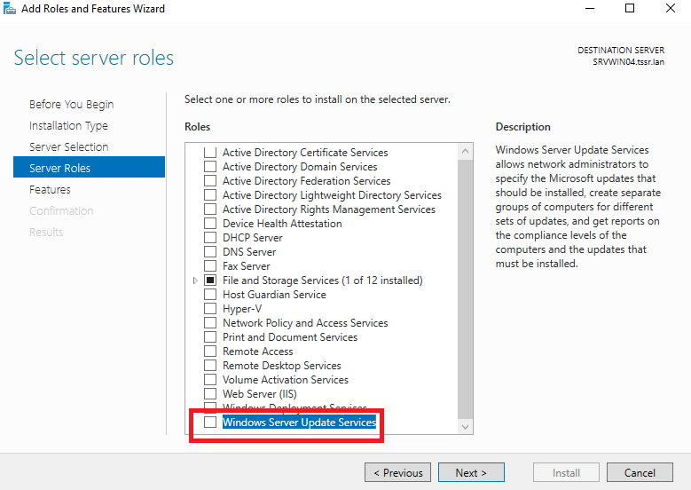

6. Une fenêtre popup apparaît → cliquer sur **Add Features**

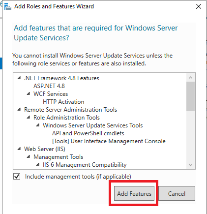

7. Cliquer sur **Next** jusqu'à la page **Role Services**
8. Laisser les options par défaut cochées
9. Cliquer sur **Next**

10. **Content location selection** :
    - Cocher **Store updates in the following location**
    - Chemin : C:\WSUS (ou D:\WSUS si disque supplémentaire disponible)
11. Cliquer sur **Next**

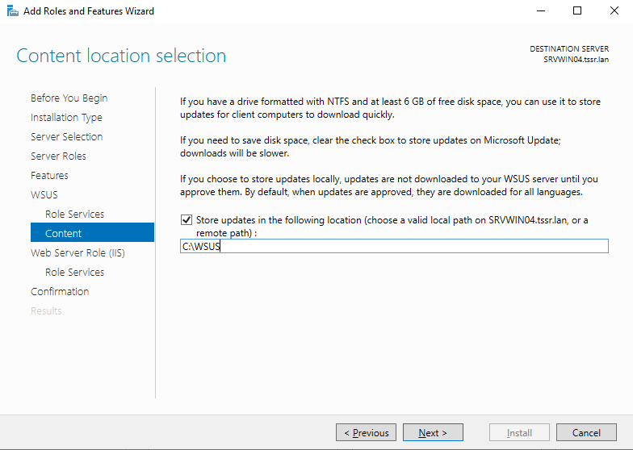

12. Page **Confirmation** : cliquer sur **Install**

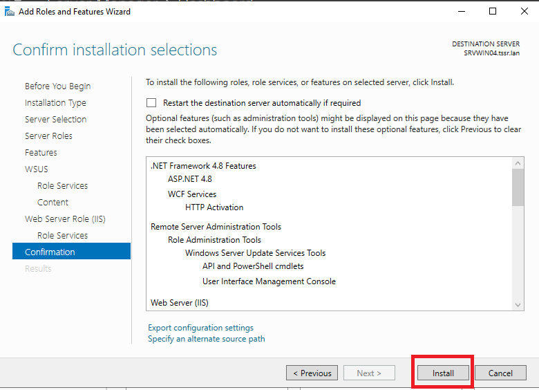

13. Attendre la fin de l'installation (plusieurs minutes)
14. Cliquer sur **Close**

---

### 3. Post-installation

1. Dans **Server Manager**, cliquer sur le **drapeau jaune** en haut
2. Cliquer sur **Launch Post-Installation tasks**
3. Attendre la fin des tâches 

---

### 4. Configuration de WSUS

#### 4.1 Lancer l'assistant de configuration

1. Ouvrir **Server Manager**
2. Cliquer sur **Tools** → **Windows Server Update Services**
3. L'assistant **WSUS Configuration Wizard** s'ouvre automatiquement
4. Cliquer sur **Next**

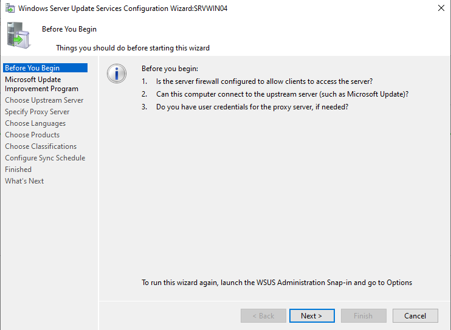

#### 4.2 Microsoft Update Improvement Program

5. Cocher ou décocher selon votre choix 
6. Cliquer sur **Next**

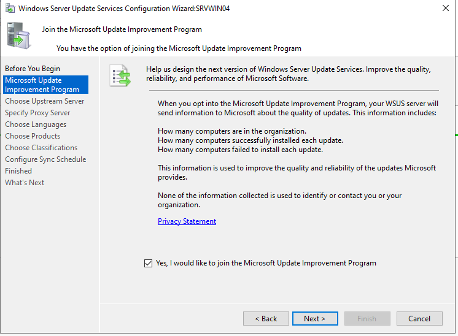

#### 4.3 Serveur en amont (Upstream Server)

7. Sélectionner **Synchronize from Microsoft Update**
8. Cliquer sur **Next**

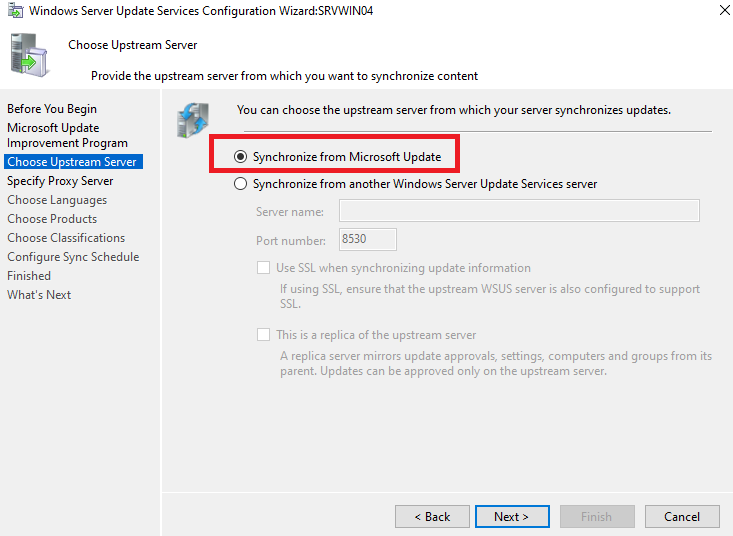

#### 4.4 Proxy

9. Laisser la case **Use a proxy server when synchronizing** décochée
10. Cliquer sur **Next**

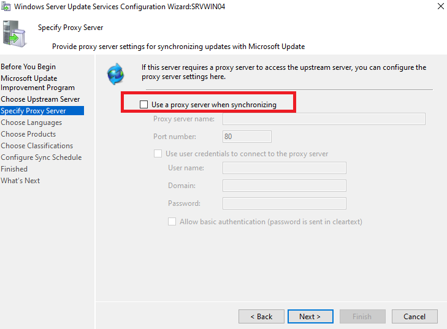

#### 4.5 Connexion au serveur Microsoft

11. Cliquer sur **Start Connecting**
12. Attendre la connexion (peut prendre plusieurs minutes)
13. Une fois terminé, cliquer sur **Next**

#### 4.6 Langues 

14. Sélectionner **Download updates only in these languages**
15. Décocher **English**
16. Cocher **French**
17. Cliquer sur **Next**

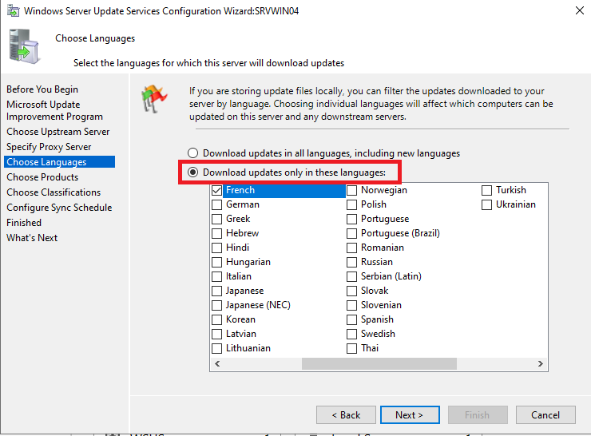

#### 4.7 Produits 

18. Décocher tout, puis cocher uniquement :
    - **Windows 10**
    - **Windows 11**
    - **Windows Server 2022**
19. Cliquer sur **Next**

#### 4.8 Classifications

20. Cocher :
    - **Critical Updates**
    - **Security Updates**
    - **Definition Updates**
21. Cliquer sur **Next**

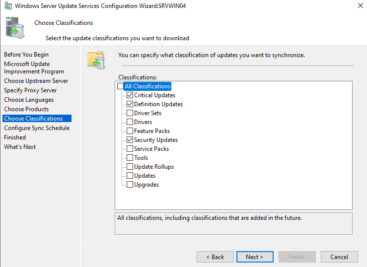

#### 4.9 Planification de synchronisation

22. Sélectionner **Synchronize automatically**
23. **First synchronization** : 03:00:00
24. **Synchronizations per day** : 1
25. Cliquer sur **Next**

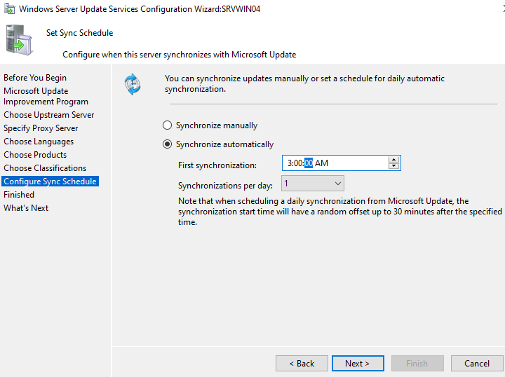

#### 4.10 Synchronisation initiale

26. Cocher **Begin initial synchronization**
27. Cliquer sur **Next**

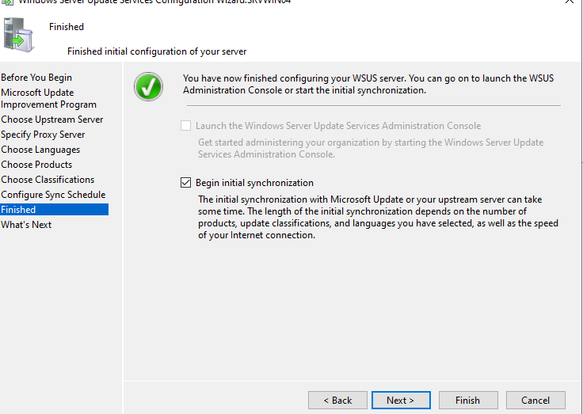

28. Cliquer sur **Finish**

---

### 5. Activer le ciblage par GPO 

**ATTENTION** : Sans cette étape, le ciblage côté client de la GPO ne fonctionnera pas et les machines resteront dans « Unassigned Computers ».

1. Dans la console **Update Services**
2. Cliquer sur **Options** (dans le panneau de gauche, en bas)
3. Cliquer sur **Computers**
4. Sélectionner **Use Group Policy or registry settings on computers**
5. Cliquer sur **OK**

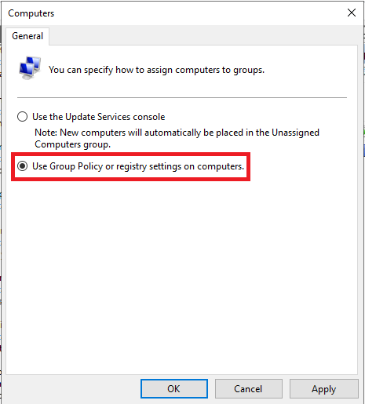

---

### 6. Création des groupes WSUS

1. Dans la console **Update Services**
2. Développer **Computers** → **All Computers**
3. Clic droit sur **All Computers** → **Add Computer Group...**

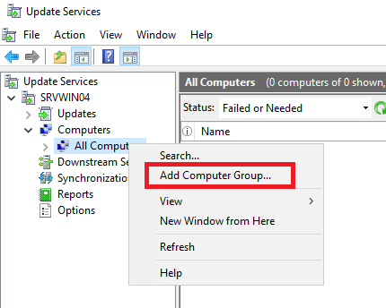

4. Nom : Clients_Windows → cliquer sur **Add**

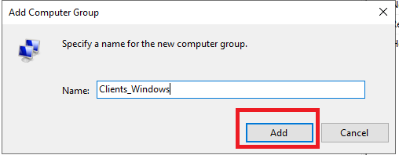

5. Répéter l'opération : clic droit → **Add Computer Group...**
6. Nom : Serveurs → cliquer sur **Add**
7. Vérifier que les deux groupes apparaissent sous **All Computers** :
   - Clients_Windows
   - Serveurs
   - Unassigned Computers (par défaut)

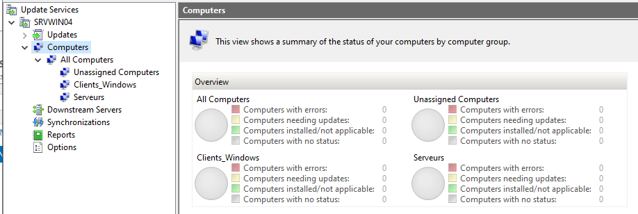

---

### 7. Configuration des GPO pour WSUS

#### 7.1 GPO pour les clients (COMPUTER-WSUS-Clients)

1. Sur **SRVWIN01** (le DC), ouvrir **Server Manager** → **Tools** → **Group Policy Management**
2. Développer **Forest: tssr.lan** → **Domains** → **tssr.lan** → **Group Policy Objects**
3. Clic droit sur **Group Policy Objects** → **New**
4. Nom : COMPUTER-WSUS-Clients → **OK**

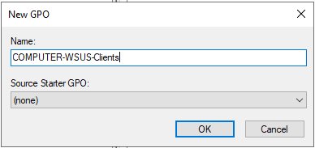

##### Security Filtering (MS16-072)

5. Sélectionner la GPO **COMPUTER-WSUS-Clients** dans le conteneur **Group Policy Objects**
6. Dans l'onglet **Scope**, section **Security Filtering** :
   - Sélectionner **Authenticated Users** → cliquer sur **Remove** → confirmer
   - Cliquer sur **Add...** → saisir **Domain Computers** → **OK**
7. Aller dans l'onglet **Delegation** → cliquer sur **Advanced...**
8. Sélectionner **Domain Computers** dans la liste
9. Vérifier que la permission **Read** est cochée en **Allow** (coché par défaut)
10. Cliquer sur **OK**

##### Éditer la GPO

11. Clic droit sur **COMPUTER-WSUS-Clients** → **Edit...**
12. Naviguer vers :
   **Computer Configuration** → **Policies** → **Administrative Templates** → **Windows Components** → **Windows Update**

##### Paramètre 1 : Emplacement du serveur WSUS

13. Double-clic sur **Specify intranet Microsoft update service location**
14. Sélectionner **Enabled**
15. **Set the intranet update service for detecting updates** : http://SRVWIN04:8530
16. **Set the intranet statistics server** : http://SRVWIN04:8530
17. Cliquer sur **OK**

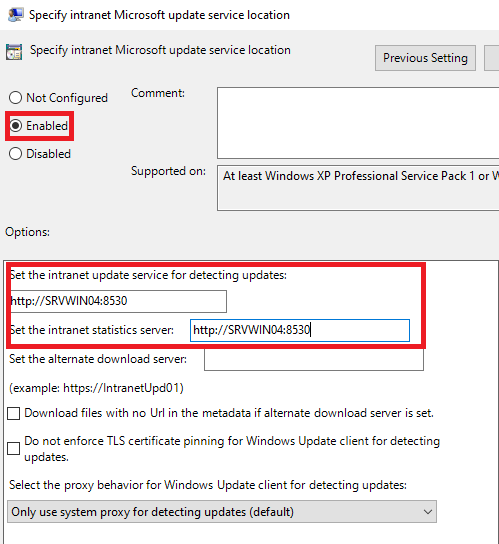

##### Paramètre 2 : Mises à jour automatiques

18. Double-clic sur **Configure Automatic Updates**
19. Sélectionner **Enabled**
20. **Configure automatic updating** : 4 - Auto download and schedule the install
21. **Scheduled install day** : 0 - Every day
22. **Scheduled install time** : 12:00
23. Cliquer sur **OK**

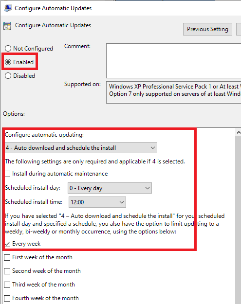

##### Paramètre 3 : Ciblage côté client

24. Double-clic sur **Enable client-side targeting**
25. Sélectionner **Enabled**
26. **Target group name for this computer** : Clients_Windows
27. Cliquer sur **OK**

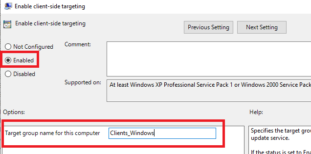

28. Fermer l'éditeur de GPO

##### Lier la GPO à l'OU

29. Développer **tssr.lan** → clic droit sur l'OU **Ekoloclast_Computers** → **Link an Existing GPO...**
30. Sélectionner **COMPUTER-WSUS-Clients** → **OK**

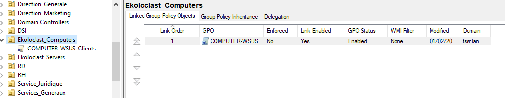

---

#### 7.2 GPO pour les serveurs (COMPUTER-WSUS-Servers)

1. Dans **Group Policy Objects**, clic droit → **New**
2. Nom : COMPUTER-WSUS-Servers → **OK**

##### Security Filtering (MS16-072)

3. Sélectionner la GPO **COMPUTER-WSUS-Servers** dans le conteneur **Group Policy Objects**
4. Dans l'onglet **Scope**, section **Security Filtering** :
   - Sélectionner **Authenticated Users** → cliquer sur **Remove** → confirmer
   - Cliquer sur **Add...** → saisir **Domain Computers** → **OK**
5. Aller dans l'onglet **Delegation** → cliquer sur **Advanced...**
6. Sélectionner **Domain Computers** dans la liste
7. Vérifier que la permission **Read** est cochée en **Allow** (coché par défaut)
8. Cliquer sur **OK**

##### Éditer la GPO

9. Clic droit sur **COMPUTER-WSUS-Servers** → **Edit...**
10. Naviguer vers :
   **Computer Configuration** → **Policies** → **Administrative Templates** → **Windows Components** → **Windows Update**

##### Paramètre 1 : Emplacement du serveur WSUS

11. Double-clic sur **Specify intranet Microsoft update service location**
12. Sélectionner **Enabled**
13. **Set the intranet update service for detecting updates** : http://SRVWIN04:8530
14. **Set the intranet statistics server** : http://SRVWIN04:8530
15. Cliquer sur **OK**

##### Paramètre 2 : Mises à jour automatiques

16. Double-clic sur **Configure Automatic Updates**
17. Sélectionner **Enabled**
18. **Configure automatic updating** : 4 - Auto download and schedule the install
19. **Scheduled install day** : 0 - Every day
20. **Scheduled install time** : 03:00 
21. Cliquer sur **OK**

##### Paramètre 3 : Ciblage côté client

22. Double-clic sur **Enable client-side targeting**
23. Sélectionner **Enabled**
24. **Target group name for this computer** : Serveurs
25. Cliquer sur **OK**
26. Fermer l'éditeur de GPO

##### Lier la GPO à l'OU

27. Clic droit sur l'OU **Ekoloclast_Servers** → **Link an Existing GPO...**
28. Sélectionner **COMPUTER-WSUS-Servers** → **OK**

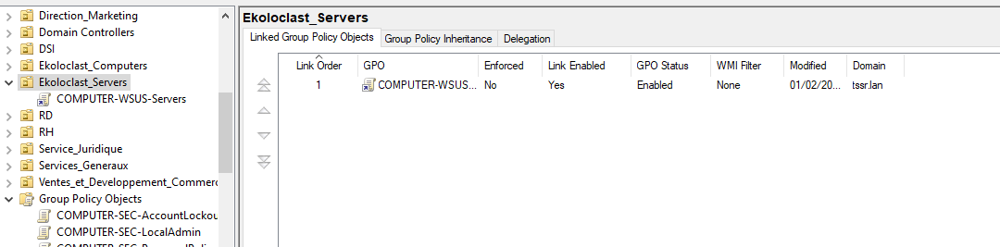

---

### 8. Approbation des mises à jour

1. Dans la console **Update Services** sur SRVWIN04
2. Développer **Updates** → **All Updates**
3. Dans le filtre en haut, sélectionner :
   - **Approval** : Any Except Declined
   - **Status** : Any
4. Cliquer sur **Refresh**
5. Sélectionner les mises à jour à approuver (Ctrl+A pour tout sélectionner)
6. Clic droit → **Approve...**

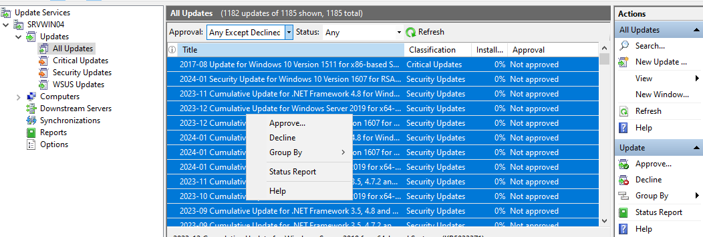

7. Dans la fenêtre d'approbation qui s'ouvre :
   - Cliquer sur la flèche à côté de **Clients_Windows** → **Approved for Install**
   - Cliquer sur la flèche à côté de **Serveurs** → **Approved for Install**
8. Cliquer sur **OK**

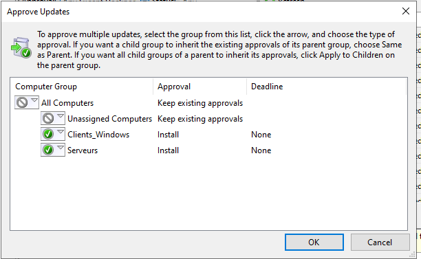

9. Attendre la validation puis cliquer sur **Close**

**IMPORTANT** : WSUS ne distribue aucune mise à jour tant qu'elles n'ont pas été approuvées manuellement. C'est le principe de WSUS : l'administrateur contrôle quelles mises à jour sont déployées vers quels groupes.

---

## Vérification

### Vérifier la synchronisation

1. Dans la console **Update Services**
2. Cliquer sur **Synchronizations** dans le panneau de gauche
3. Vérifier que la dernière synchronisation affiche **Succeeded**

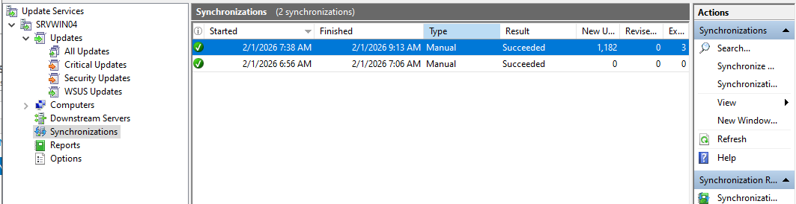

### Vérifier les ordinateurs connectés

1. Dans la console **Update Services**
2. Développer **Computers** → **All Computers**
3. Cliquer sur le groupe **Clients_Windows** ou **Serveurs**
4. Les machines doivent apparaître après application de la GPO et redémarrage
5. Si rien n'apparaît, changer le filtre **Status** en **Any** et cliquer **Refresh**

**Note importante** : Les clients peuvent mettre jusqu'à **22 heures** avant d'apparaître dans la console WSUS. Ce délai correspond au cycle de détection par défaut de Windows Update. Pour accélérer le processus, exécuter sur le client en PowerShell administrateur :

    UsoClient.exe StartScan

Puis dans les 20 minutes suivantes :

    wuauclt /reportnow

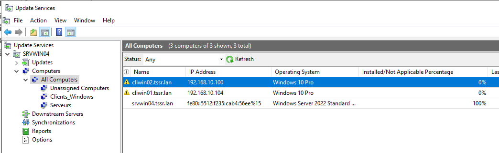

### Test sur un poste client (CLIWIN01 ou CLIWIN02)

1. Ouvrir **Command Prompt** ou **PowerShell** en administrateur
2. Forcer la mise à jour des GPO :

    gpupdate /force

3. Forcer la détection des mises à jour :

    UsoClient.exe StartScan

4. Vérifier que la GPO est bien appliquée :

    gpresult /r

→ Vérifier que **COMPUTER-WSUS-Clients** apparaît dans les GPO appliquées

5. Ouvrir **Settings** → **Windows Update**
6. Cliquer sur **Check for updates**
7. Les mises à jour approuvées doivent être téléchargées depuis SRVWIN04

**Rappel** : Les mises à jour doivent d'abord être **approuvées** dans la console WSUS (voir étape 8) pour apparaître côté client. Si aucune mise à jour n'est approuvée, le client affichera « Votre appareil est à jour » ou « Votre appareil ne dispose pas de correctifs importants ».

---

## FAQ

### Les clients ne s'affichent pas dans la console WSUS

**Vérifications de base :**
- Exécuter gpupdate /force sur le client puis redémarrer
- Vérifier que la GPO est appliquée : gpresult /scope:computer /r → la GPO **COMPUTER-WSUS-Clients** doit apparaître
- Dans la console WSUS sur SRVWIN04, vérifier que **Options → Computers** est bien configuré sur **Use Group Policy or registry settings on computers**
- Vérifier le filtre d'affichage : dans **All Computers**, changer **Status** en **Any** et cliquer **Refresh**

**Vérifications avancées :**
- Vérifier le registre du client :

    reg query "HKLM\SOFTWARE\Policies\Microsoft\Windows\WindowsUpdate"

→ WUServer doit afficher http://SRVWIN04:8530
→ TargetGroup doit afficher Clients_Windows
→ TargetGroupEnabled doit être à 0x1

- Vérifier la sous-clé AU :

    reg query "HKLM\SOFTWARE\Policies\Microsoft\Windows\WindowsUpdate\AU"

→ UseWUServer doit être à 0x1
→ AUOptions doit être à 0x4

- Si WUServer est vide ou absent, la GPO n'est pas correctement appliquée. Vérifier le lien de la GPO vers l'OU et le filtrage de sécurité

**Délai de détection :**
- Le cycle de détection par défaut est de **22 heures**. Après application de la GPO, les clients peuvent mettre jusqu'à 22h avant d'apparaître dans la console WSUS
- Pour accélérer, exécuter sur le client en PowerShell administrateur :

    UsoClient.exe StartScan

Puis dans les 20 minutes suivantes :

    wuauclt /reportnow

**Problème connu — « WSUS server: (null) » dans les logs :**
- Si le log Windows Update du client affiche WSUS server: (null), cela signifie que le client ne voit pas encore la configuration WSUS
- Ce problème se résout après l'application effective de la GPO (qui peut nécessiter un ou plusieurs redémarrages du client)
- Vérifier les logs avec :

    Get-WindowsUpdateLog -LogPath C:\wsus-log.txt
    Select-String -Path C:\wsus-log.txt -Pattern "WSUS server" -AllMatches

→ Les entrées récentes doivent afficher WSUS server: http://SRVWIN04:8530 au lieu de (null)

---

### La commande wuauclt /detectnow ne fonctionne pas

La commande wuauclt /detectnow est **dépréciée** sur Windows 10 et Windows 11. Elle n'a aucun effet sur ces systèmes.

**Remplacement :**
- Utiliser UsoClient.exe StartScan en PowerShell administrateur pour forcer une détection
- La commande wuauclt /reportnow fonctionne encore mais uniquement dans une fenêtre de **20 minutes** après une détection réussie
- Alternative PowerShell :

    (New-Object -ComObject Microsoft.Update.AutoUpdate).DetectNow()

---

### Erreur de connexion au serveur WSUS

**Vérifications réseau :**
- Tester la résolution DNS : nslookup SRVWIN04
- Tester la connectivité : ping SRVWIN04
- Tester l'accès au port WSUS :

    Test-NetConnection SRVWIN04 -Port 8530

- Tester l'accès HTTP au service WSUS :

    Invoke-WebRequest http://SRVWIN04:8530/selfupdate/wuident.cab

→ Le résultat doit afficher StatusCode : 200

**Vérifications côté serveur :**
- Vérifier que le service WSUS est démarré :

    Get-Service WsusService

- Vérifier que le pool IIS **WsusPool** est démarré : ouvrir **IIS Manager** → **Application Pools** → vérifier que **WsusPool** est en état **Started**

---

### Le pool IIS WsusPool s'arrête automatiquement

C'est un problème fréquent causé par une limite de mémoire privée insuffisante.

**Solution :**
1. Ouvrir **IIS Manager** sur SRVWIN04
2. Cliquer sur **Application Pools**
3. Clic droit sur **WsusPool** → **Advanced Settings...**
4. Dans la section **Recycling**, modifier **Private Memory Limit (KB)** :
   - Valeur par défaut : 1843200
   - Nouvelle valeur recommandée : 4000000 (ou 0 pour illimité)
5. Cliquer sur **OK**
6. Clic droit sur **WsusPool** → **Start** (si arrêté)

**Commande alternative :**

    "C:\Program Files\Update Services\Tools\wsusutil.exe" postinstall /servicing

---

### La synchronisation échoue

- Vérifier la connexion Internet du serveur SRVWIN04
- Vérifier que les règles du pare-feu pfSense (FW01) autorisent le trafic HTTP/HTTPS sortant depuis SRVWIN04
- Vérifier les paramètres proxy si nécessaire
- Consulter les logs : C:\Program Files\Update Services\LogFiles\SoftwareDistribution.log
- Relancer une synchronisation manuelle : clic droit sur le serveur → **Synchronize Now**

---

### Les mises à jour n'apparaissent pas côté client

- Vérifier que les mises à jour sont **approuvées** dans la console WSUS pour le bon groupe (**Clients_Windows** ou **Serveurs**)
- Vérifier que les mises à jour approuvées correspondent bien au système du client (Windows 10 pour CLIWIN01, Windows 11 pour CLIWIN02)
- Après approbation, le client doit effectuer un nouveau scan pour voir les mises à jour :

    UsoClient.exe StartScan

- Vérifier dans **Settings → Windows Update** → **Check for updates**

